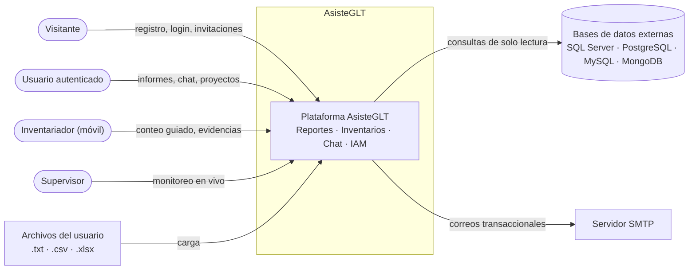
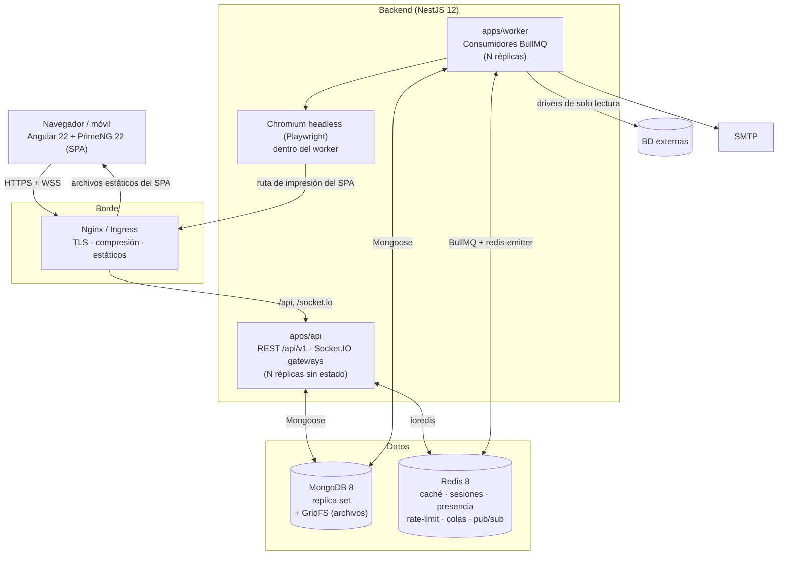
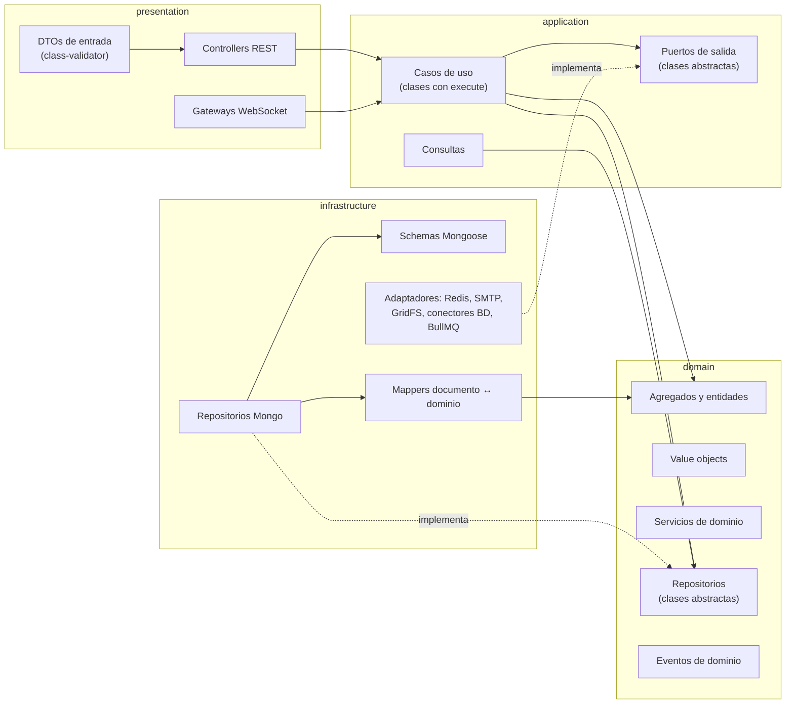
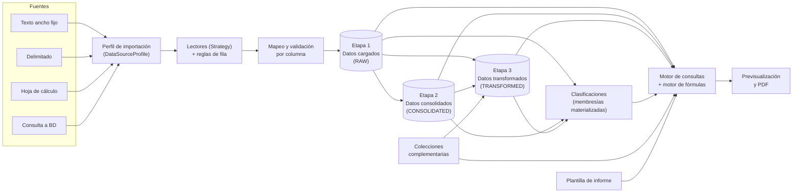
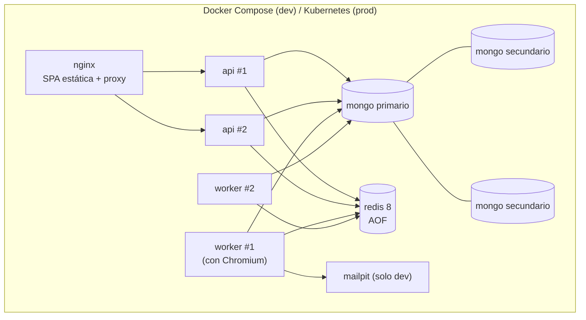

# 02 · Arquitectura

## 1. Estilo arquitectónico

- **Monolito modular** en el backend (NestJS) con **contextos acotados** (DDD) y **arquitectura
  hexagonal** dentro de cada contexto. Permite empezar con un único despliegue y extraer
  servicios después sin reescribir el dominio.
- **Procesos en segundo plano** separados (`apps/worker`) para trabajos pesados: importaciones,
  consolidaciones, operaciones, auto-asignación y generación de PDF (colas **BullMQ** sobre Redis).
- **SPA Angular** con *feature libraries*; cada feature tiene páginas, componentes de presentación
  PrimeNG, *stores* de estado basados en signals y clientes de API tipados.
- **Contratos compartidos** (`libs/shared/contracts`) entre frontend y backend: DTOs, enumeraciones
  y mapas de eventos de tiempo real. Un cambio de contrato rompe la compilación de ambos lados.
- **Tiempo real** con Socket.IO, escalado con `@socket.io/redis-adapter`; los workers emiten
  eventos mediante `@socket.io/redis-emitter`.

## 2. Diagrama de contexto (C4 nivel 1)



## 3. Diagrama de contenedores (C4 nivel 2)



## 4. Estructura del monorepo (Nx)

```text
asisteglt/
├── apps/
│   ├── web/                     # Angular 22 + PrimeNG 22 (SPA, zoneless)
│   ├── api/                     # NestJS 12: REST + WebSockets
│   └── worker/                  # NestJS 12 (application context): colas BullMQ
├── libs/
│   ├── shared/
│   │   ├── kernel/              # Entity, AggregateRoot, ValueObject, Nullable, Optional, Result,
│   │   │                        # DomainError, Decimal/Money, Period, EntityId, Clock
│   │   ├── contracts/           # DTOs, enums, eventos de tiempo real, códigos de error
│   │   └── formula-engine/      # Lexer, parser, AST, evaluador (TypeScript puro)
│   ├── api/                     # Contextos acotados del backend
│   │   ├── iam/                 # usuarios, sesiones, tokens, 2FA, auditoría
│   │   ├── access-control/      # roles, permisos, membresías, vínculos, invitaciones (CASL)
│   │   ├── projects/            # proyectos por módulo
│   │   ├── chat/                # conversaciones, mensajes, presencia
│   │   ├── notifications/       # notificaciones in-app y correo
│   │   ├── files/               # almacenamiento de archivos (GridFS → S3 compatible)
│   │   ├── realtime/            # gateways, publicador de eventos, autenticación de sockets
│   │   ├── data-ingestion/      # perfiles, lectores, conectores, validación (compartido)
│   │   ├── reports/
│   │   │   ├── org-structure/
│   │   │   ├── datasets/
│   │   │   ├── collections/
│   │   │   ├── classifications/
│   │   │   ├── consolidation/
│   │   │   ├── transformations/
│   │   │   ├── templates/
│   │   │   └── rendering/
│   │   └── inventory/
│   └── web/                     # Librerías del frontend
│       ├── core/                # shell, auth, interceptores, guards, cliente realtime, i18n
│       ├── ui/                  # componentes compuestos construidos con PrimeNG
│       ├── feature-auth/
│       ├── feature-profile/
│       ├── feature-chat/
│       ├── feature-projects/
│       ├── feature-reports/
│       └── feature-inventory/
├── tools/eslint-rules/          # reglas propias (p. ej. prohibir imports de UI no PrimeNG)
├── docker/                      # docker-compose: mongo (rs), redis, mailpit
└── docs/
```

Las etiquetas Nx (`scope:web`, `scope:api`, `scope:shared`, `type:domain`, `type:feature`…) y la
regla `@nx/enforce-module-boundaries` impiden, por ejemplo, que `libs/web/*` importe código de
`libs/api/*` o que un dominio dependa de infraestructura.

## 5. Capas dentro de cada contexto del backend



Regla de dependencias: `presentation → application → domain ← infrastructure`. El dominio no
conoce NestJS, Mongoose ni Redis. La inyección de dependencias usa **clases abstractas como
tokens** (`{ provide: UserRepository, useClass: MongoUserRepository }`), lo que mantiene el diseño
orientado a objetos sin recurrir a *tokens* de texto.

## 6. Flujo de datos del módulo de Reportes



## 7. Tiempo real

| Namespace Socket.IO | Salas (rooms) | Eventos principales |
|---|---|---|
| `/chat` | `conversation:{id}`, `user:{id}` | `message.created`, `message.updated`, `typing.changed`, `presence.changed`, `read.updated` |
| `/projects` | `project:{id}` | `member.joined`, `member.updated`, `resource.changed`, `job.progress`, `notification.created` |
| `/reports` | `template:{id}`, `dataset:{projectId}` | `template.changed`, `element.locked`, `element.unlocked`, `preview.invalidated`, `load.completed` |
| `/inventory` | `count:{id}`, `count:{id}:supervisors`, `counter:{countId}:{userId}` | `item.assigned`, `item.locked`, `entry.recorded`, `evidence.added`, `progress.updated`, `round.opened`, `round.closed` |

- **Autenticación del socket**: el *access token* viaja en el `handshake.auth`; un
  `SocketAuthMiddleware` lo valida y adjunta un `AuthenticatedPrincipal` tipado al socket.
- **Autorización por evento**: cada `@SubscribeMessage` pasa por el mismo `PolicyEvaluator` que la
  API REST antes de unir al socket a una sala o aceptar un comando.
- **Tipado**: `Server<ClientToServerEvents, ServerToClientEvents, InterServerEvents, SocketData>` con
  los mapas definidos en `libs/shared/contracts/realtime`. El cliente Angular usa los mismos mapas.
- **Origen de los eventos**: los casos de uso publican **eventos de dominio**; un
  `RealtimeEventPublisher` los traduce a eventos de socket. Los workers publican a través de Redis
  (`redis-emitter`) para que cualquier réplica de la API los entregue.

## 8. Uso de Redis

| Uso | Estructura / clave | TTL |
|---|---|---|
| Familias de refresh token revocadas y `jti` de access tokens revocados | `auth:revoked-jti:{jti}` (string) | vida restante del token |
| Limitación de peticiones (`@nestjs/throttler` con almacenamiento Redis) | `rl:{ruta}:{ip}` / `rl:login:{email}` | ventana |
| Bloqueo progresivo de cuentas | `auth:failures:{userId}` (contador) | 15 min |
| Presencia y "escribiendo…" | `presence:user:{id}` (hash), `typing:{conversationId}` (set) | 60 s renovable |
| Caché de permisos (reglas CASL empaquetadas) | `acl:{projectId}:{userId}` | 10 min, invalidación por evento |
| Caché de resultados de informe | `rpt:{templateId}:{version}:{paramsHash}:{dataVersion}` | 1 h, invalidación por carga |
| Bloqueo de producto en toma | `inv:lock:{roundId}:{itemId}` (`SET NX PX`) | 2 min renovable |
| Progreso en vivo de toma | `inv:progress:{roundId}` (hash por usuario) | duración de la ronda |
| Colas BullMQ | `bull:{queue}:*` | gestionado por BullMQ |
| Adapter Socket.IO | canales pub/sub `socket.io#*` | — |

## 9. Colas de trabajo (BullMQ)

| Cola | Productor | Trabajo | Idempotencia |
|---|---|---|---|
| `ingestion` | API (`StartImportUseCase`) | Leer, validar y persistir una carga | `jobId = importJobId`; reemplazo por versión |
| `consolidation` | API | Ejecutar una definición para un período | `jobId = definitionId:period` |
| `transformation` | API / encadenado | Ejecutar un pipeline | `jobId = pipelineId:period:dataVersion` |
| `classification` | Evento `load.completed` / edición de clasificación | Recalcular membresías | `jobId = classificationId:dataVersion` |
| `report-export` | API | Renderizar PDF con Chromium | `jobId = exportId` |
| `inventory-assignment` | API | Auto-asignación de productos | `jobId = roundId:strategyVersion` |
| `mail` | Cualquier caso de uso | Enviar correo | `jobId = mailId` |

Todos los trabajos reportan progreso (`job.progress`) al proyecto por tiempo real y reintentan con
*backoff* exponencial (3 intentos) antes de marcar el estado `FAILED` con el error tipado.

## 10. Generación de PDF fiel a la previsualización

1. El frontend incluye una ruta de impresión `/print/reports/:templateId` que renderiza **los mismos
   componentes** del visor, sin la interfaz del diseñador.
2. El worker abre esa ruta con Chromium (Playwright) usando un **token de renderizado** firmado, de
   un solo uso y con alcance a esa plantilla y parámetros.
3. La página señala `document.body.dataset['renderState'] = 'complete'` cuando todos los elementos
   terminaron de calcularse; entonces el worker llama `page.pdf()` con el tamaño de página de cada
   `ReportPage` (Carta, Oficio, Legal, A4 o personalizado) mediante CSS `@page`.
4. El PDF se guarda en GridFS y se notifica `export.completed` con el enlace de descarga firmado.

## 11. Despliegue



## 12. Decisiones de arquitectura (ADR resumidos)

| ADR | Decisión | Alternativas descartadas | Motivo |
|---|---|---|---|
| ADR-01 | Monorepo **Nx** con contratos compartidos. | Repos separados. | Un solo cambio de contrato se verifica en front y back a la vez; generadores oficiales para Angular y NestJS; límites de módulos. |
| ADR-02 | **Monolito modular** + workers. | Microservicios desde el inicio. | Menor complejidad operativa; los contextos ya quedan aislados para extraerlos después. |
| ADR-03 | **Socket.IO** + Redis adapter. | WebSocket nativo, SSE. | Salas, reconexión, *acks* y tipado de eventos; escalado horizontal probado. |
| ADR-04 | **CASL** para autorización (backend y frontend). | Guards ad-hoc por rol. | Permisos granulares con condiciones y campos; mismas reglas serializables al SPA para ocultar UI. |
| ADR-05 | **Decimal** en todo cálculo monetario. | `number`. | Evitar errores de punto flotante en saldos y cuadres contables. |
| ADR-06 | **Motor de fórmulas propio** (lexer + parser Pratt + AST + Visitor). | `eval`, librerías genéricas. | Seguridad (sin ejecución de código), tipado total, funciones de dominio (`CLASIF`, `COLECCION`, referencias a celdas y páginas). |
| ADR-07 | **PDF con Chromium** sobre la ruta de impresión del SPA. | pdfmake / generación manual. | La previsualización y el PDF usan el mismo código de renderizado. |
| ADR-08 | **GridFS** como almacenamiento inicial detrás de la abstracción `FileStorage`. | S3 desde el inicio. | Mantiene el stack pedido (MongoDB); se puede cambiar a S3/MinIO sin tocar el dominio. |
| ADR-09 | Membresías de clasificación **materializadas** en los registros. | Evaluar reglas en cada consulta. | Las consultas de informes filtran por índice (`classifications.nodeIds`). |
| ADR-10 | Asignación de inventario por **Strategy** (manual, zonas contiguas, clúster espacial). | Algoritmo único. | Se adapta a almacenes con o sin coordenadas y permite agregar estrategias sin modificar el dominio. |
