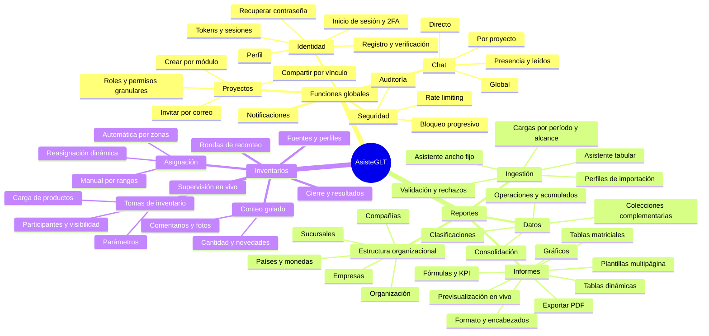
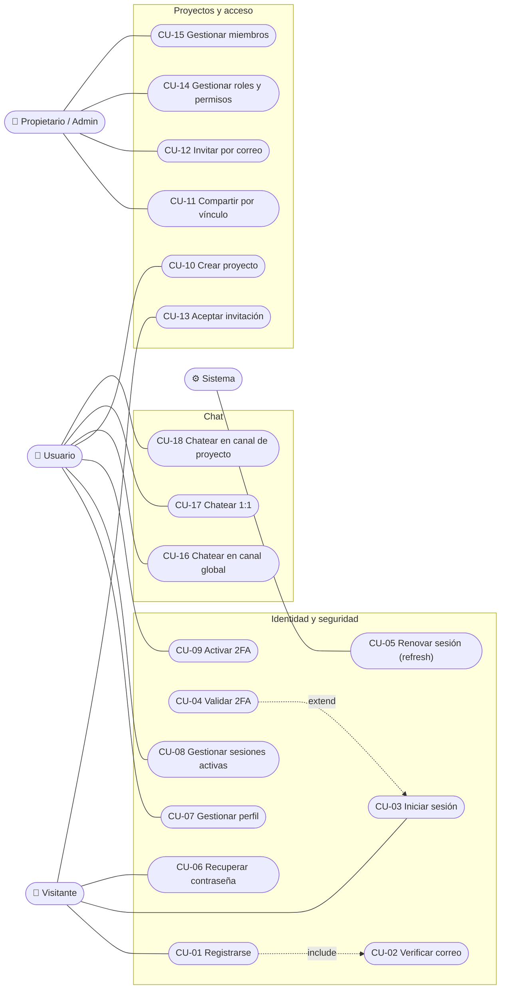
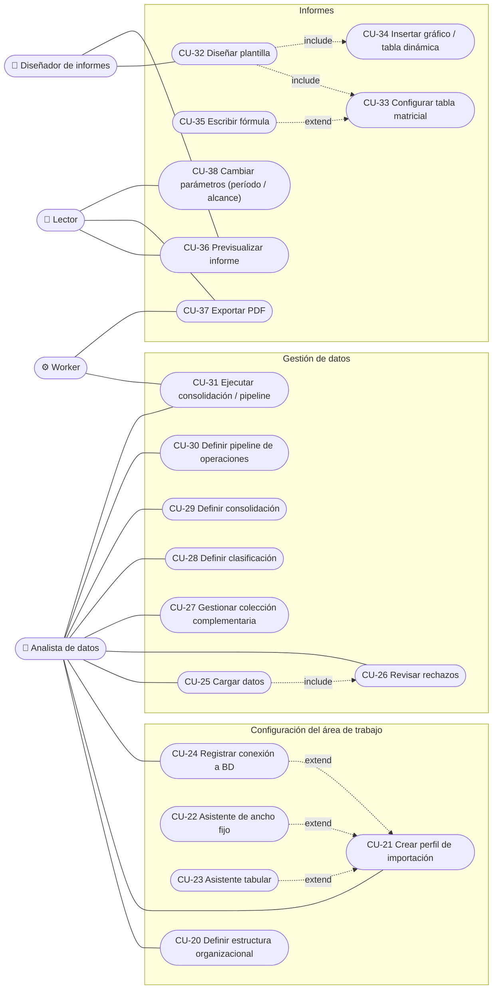
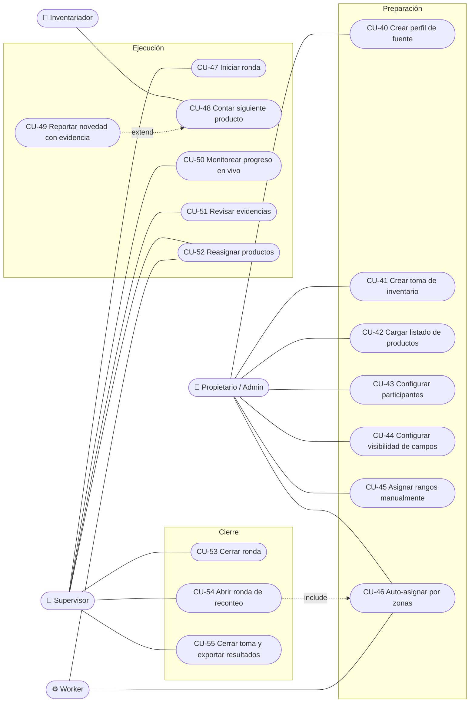

# 03 · Diagramas de funcionalidad y casos de uso

## 1. Mapa funcional (descomposición)

## 2. Casos de uso — Funciones globales

## 3. Casos de uso — Módulo de Reportes

## 4. Casos de uso — Módulo de Inventarios

> Notación UML: `include` apunta del caso base al caso incluido (siempre se ejecuta); `extend`
> apunta del caso extensor al caso base (comportamiento opcional bajo una condición).

## 5. Especificación de casos de uso críticos

### CU-03 · Iniciar sesión

| Campo | Detalle |
|---|---|
| Actor | Visitante |
| Precondición | Cuenta `ACTIVE` con correo verificado. |
| Flujo principal | 1. Ingresa correo y contraseña. 2. El sistema aplica *rate limit* por IP y por cuenta. 3. Verifica la contraseña (argon2id). 4. Si el usuario tiene 2FA, responde `TWO_FACTOR_REQUIRED` con un *challenge token* de 5 min (CU-04). 5. Crea `Session` y familia de refresh tokens. 6. Devuelve *access token* (15 min) en el cuerpo y *refresh token* en cookie `HttpOnly; Secure; SameSite=Strict; Path=/api/v1/auth`. 7. Registra auditoría `LOGIN_SUCCEEDED`. |
| Flujos alternos | 3a. Contraseña inválida → incrementa contador; al 5.º intento bloqueo de 15 min, duplicándose en cada bloqueo; auditoría `LOGIN_FAILED`. 5a. Dispositivo nuevo → correo de alerta. |
| Postcondición | Sesión activa visible en CU-08. |

### CU-22 · Asistente de ancho fijo

| Campo | Detalle |
|---|---|
| Actor | Analista de datos |
| Precondición | Proyecto de reportes con permiso `create:DataSourceProfile`. |
| Flujo principal | 1. Selecciona tipo *Texto de ancho fijo*, extensión y codificación (UTF-8, Windows-1252, ISO-8859-1). 2. Sube un archivo de muestra. 3. El sistema muestra las primeras 200 líneas en fuente monoespaciada con una regla de caracteres. 4. El analista marca cortes (clic en la regla o edición de inicio/longitud en tabla). 5. Por cada columna define nombre, **tipo de dato**, **rol** (código, nombre, id, valor, debe, haber, saldo, atributo, fecha), si es **requerida** y si se **omite**. 6. Define reglas de fila: omitir líneas en blanco, saltos de página (`\f`), líneas que contengan un patrón (p. ej. "Página", "Total"), primeras N líneas. 7. El sistema previsualiza el resultado tipado marcando en rojo las filas que se rechazarían y el motivo. 8. Guarda el perfil. |
| Reglas | Toda columna con rol identificador es **requerida** automáticamente. Las columnas no pueden superponerse. Los números admiten separador decimal/miles configurable y negativos con signo inicial, final, paréntesis o sufijo `CR`. |
| Postcondición | Perfil versionado disponible para CU-25. |

### CU-25 · Cargar datos

| Campo | Detalle |
|---|---|
| Actor | Analista de datos |
| Flujo principal | 1. Elige perfil. 2. Selecciona período (mes/año) y alcance: organización, país, moneda, compañía (requeridos), empresa y sucursal (si existen). 3. Sube archivo (o ejecuta la consulta configurada). 4. El sistema crea `ImportJob` en cola. 5. El worker lee en *streaming*, aplica reglas de fila, mapea y valida columnas, persiste en lotes de 5 000 registros con estado `STAGED`. 6. Al terminar, publica la carga como nueva **versión** del alcance+período (la anterior pasa a `SUPERSEDED`) en una transacción. 7. Notifica `load.completed`; se encolan recálculos de clasificación. |
| Flujos alternos | 5a. Filas rechazadas → se guardan hasta 1 000 incidencias con línea, columna, código y fragmento; si superan el umbral configurado (p. ej. 5 %) la carga queda `FAILED` y no se publica. |

### CU-33 · Configurar tabla matricial

| Campo | Detalle |
|---|---|
| Actor | Diseñador de informes |
| Flujo principal | 1. Inserta una tabla en una página. 2. Elige etapa de datos (cargados / consolidados / transformados) y medida (debe, haber, saldo, valor). 3. Define **filas**: cada fila es un filtro (nodo de clasificación, compañía, moneda…), una fórmula (`=F3-F5`), un total (`SUMA(F1:F4)`) o una etiqueta. 4. Define **columnas** del mismo modo (p. ej. mes del informe, mes anterior, acumulado anual, compañía A, compañía B). 5. La celda = intersección de filtros fila ∩ columna ∩ parámetros del informe. 6. Aplica formato numérico, colores, bordes y formato condicional (negativos en rojo). 7. La previsualización se actualiza en tiempo real. |
| Reglas | Las fórmulas pueden referenciar celdas de otras tablas y páginas (`Pagina2!Balance!C4`) y colecciones (`COLECCION("TipoCambio"; "USD"; PERIODO())`). Se detectan referencias circulares. |

### CU-46 · Auto-asignar por zonas

| Campo | Detalle |
|---|---|
| Actor | Propietario/Admin o Worker |
| Flujo principal | 1. Selecciona estrategia (*zonas contiguas* o *clúster espacial* si hay coordenadas). 2. El sistema ordena los productos por ubicación natural en recorrido serpenteante (pasillo par ascendente, impar descendente). 3. Divide la secuencia en K bloques contiguos (K = inventariadores) con carga balanceada, prefiriendo cortar en límites de pasillo para que dos usuarios no compartan pasillo. 4. Asigna cada bloque a un inventariador y define su ruta. 5. Publica `item.assigned` a cada usuario. |
| Reasignación | Cuando un usuario termina, toma la mitad final de los pendientes del usuario con más carga restante (el extremo más alejado de ese usuario), manteniendo la contigüidad. |

### CU-48 · Contar siguiente producto

| Campo | Detalle |
|---|---|
| Actor | Inventariador |
| Flujo principal | 1. Abre la toma en el móvil. 2. El sistema entrega el siguiente producto de su ruta y lo bloquea (`inv:lock`). 3. Se muestran **solo** los campos visibles para su rol. 4. Ingresa la cantidad (o marca *no encontrado* / *dañado*). 5. Opcional: comentario y fotos (CU-49). 6. Envía; el servidor valida versión y bloqueo, guarda `CountEntry`, libera el bloqueo y emite `entry.recorded` a supervisores y `progress.updated`. 7. Se muestra el siguiente producto. |
| Flujos alternos | 6a. Sin conexión → el envío se encola localmente y se reintenta; el producto sigue bloqueado mientras el bloqueo se renueva. 6b. Bloqueo expirado y tomado por otro usuario → conflicto `ITEM_REASSIGNED`, se descarta localmente. |

### CU-54 · Abrir ronda de reconteo

| Campo | Detalle |
|---|---|
| Actor | Supervisor |
| Precondición | Ronda N cerrada; número de ronda < máximo configurado. |
| Flujo principal | 1. El sistema calcula diferencias (contado − teórico) y las clasifica según la tolerancia (absoluta o %). 2. Muestra los productos fuera de tolerancia, no encontrados y dañados. 3. El supervisor confirma la selección (puede agregar o quitar productos). 4. Opcionalmente exige inventariadores distintos a los de la ronda anterior por producto. 5. Se crea la ronda N+1 y se ejecuta la asignación (CU-46 o CU-45). |
