# 04 · Modelo de dominio (diagramas de clases UML)

Convenciones de los diagramas:

- `<<AggregateRoot>>`, `<<Entity>>`, `<<ValueObject>>`, `<<abstract>>`, `<<interface>>`,
  `<<enumeration>>` indican el estereotipo de cada clase.
- `-` privado, `#` protegido, `+` público; `$` método estático; `*` método abstracto.
- `Nullable~T~` = `T | null` (la **única** forma permitida de ausencia; ver
  [08-convenciones](08-convenciones-tipado-poo.md)). No existen atributos opcionales.
- Todo monto o cantidad usa `Decimal` (nunca `number`).
- Todas las entidades heredan de `Entity~TId~` y los agregados de `AggregateRoot~TId~`; para
  mantener los diagramas legibles la herencia del *kernel* se omite fuera del diagrama 1.
- Los encabezados (Debe, Haber, Saldo, Monto de venta…) tienen nombre libre y se usan por ese
  nombre en todo lo posterior, pero **toda referencia guardada usa su `FieldKey`**, nunca el
  nombre. La fuente de verdad del catálogo (`FieldCatalog`, `CatalogField`, `FieldLabel`,
  `FieldOrigin`, `FieldOperation`, `OperationCompatibility`, `FieldResolver`) es
  [12 §2](12-preconfiguraciones-y-carga-multiple.md#2-catálogo-de-encabezados-lista-previa) y
  [12 §2.8 «Usar los encabezados por su nombre»](12-preconfiguraciones-y-carga-multiple.md#28-usar-los-encabezados-por-su-nombre);
  este documento solo muestra cómo cada contexto los referencia.

## 1. Núcleo compartido (`libs/shared/kernel`)


## 2. Identidad y seguridad (`iam`)


## 3. Proyectos y control de acceso (`projects`, `access-control`)

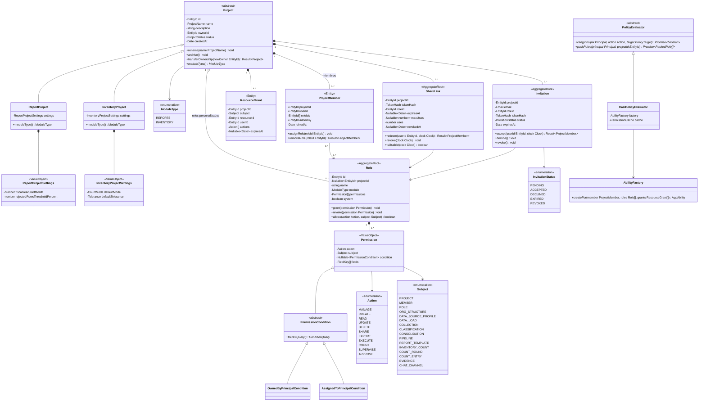

## 4. Chat (`chat`)

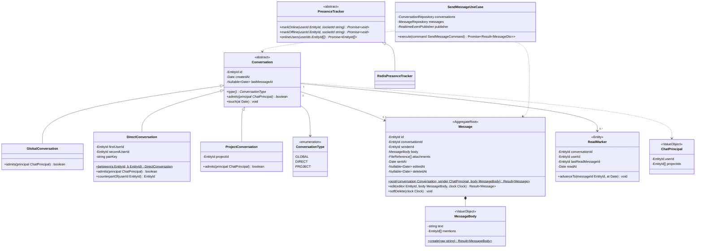

## 5. Estructura organizacional (`reports/org-structure`)

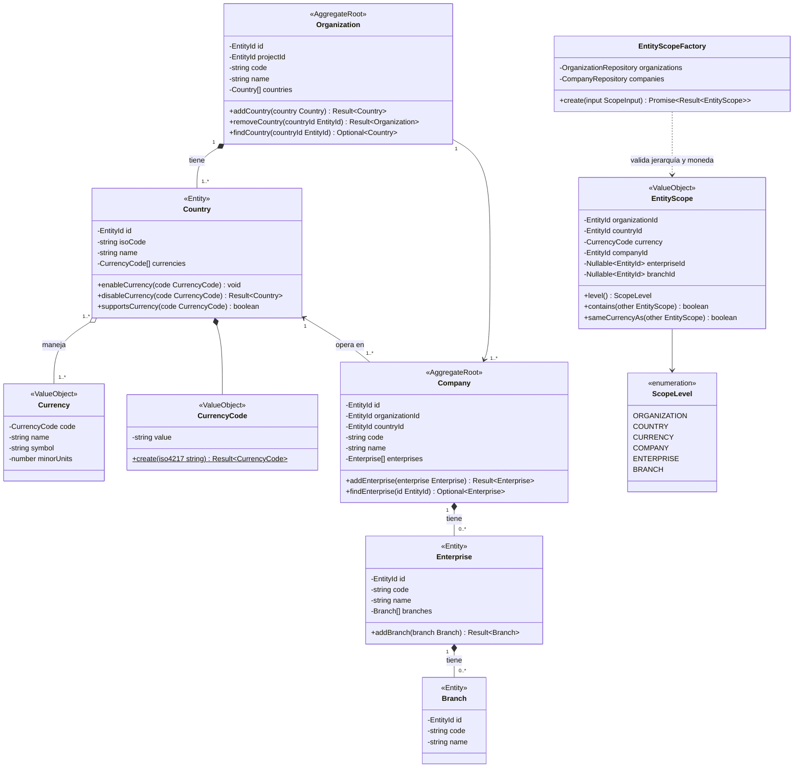

> `EntityScopeFactory` garantiza que la moneda esté habilitada en el país, que la compañía
> pertenezca al país y que la empresa/sucursal pertenezcan a la compañía/empresa indicadas.
> `EntityScope.level()` solo devuelve `COMPANY`, `ENTERPRISE` o `BRANCH`; los niveles
> `ORGANIZATION`, `COUNTRY` y `CURRENCY` se usan para consolidar, agrupar o filtrar
> (`ScopeDimension` en §11).

## 6. Ingestión de datos — configuración (`data-ingestion`)

Motor **compartido** por Reportes e Inventarios (`ProfileTarget`).

> **Catálogo de encabezados.** Cada columna de una preconfiguración se asocia a un encabezado del
> catálogo del proyecto (`FieldCatalog`), elegido por su nombre (p. ej. *Código de cuenta*,
> *Debe*, *Haber*, *Saldo actual*, *Monto de venta*). La definición completa del catálogo
> (nombre único `FieldLabel`, clave interna `FieldKey`, rol, tipo, naturaleza, agregación,
> origen `IMPORTED`/`DERIVED`, usos, desactivar y reemplazar) está en
> [12 §2](12-preconfiguraciones-y-carga-multiple.md#2-catálogo-de-encabezados-lista-previa) y
> [12 §2.8](12-preconfiguraciones-y-carga-multiple.md#28-usar-los-encabezados-por-su-nombre),
> que son la fuente de verdad; aquí solo se modela cómo la preconfiguración lo referencia.

```mermaid
classDiagram
    class DataSourceProfile {
        <<abstract>>
        -EntityId id
        -EntityId projectId
        -ProfileName name
        -ProfileStatus status
        -ProfileTarget target
        -ColumnDefinition[] columns
        -RowRule[] rowRules
        -IdentifierMask[] identifierMasks
        -ProfileBalanceCheck[] balanceChecks
        -DerivedAttribute[] derivedAttributes
        -FileMetadataExtractor[] metadata
        -number version
        +assignField(locator ColumnLocator, field CatalogField) Result~DataSourceProfile~
        +unassign(key FieldKey) void
        +activate(catalog FieldCatalog) Result~DataSourceProfile~
        +validateConfiguration(catalog FieldCatalog) ValidationReport
        +duplicate(name ProfileName) DataSourceProfile
        +archive() void
        +identifierColumns() ColumnDefinition[]
        +sourceKind()* SourceKind
        #validateSpecifics(report ValidationReport)* void
    }
    class FileSourceProfile {
        <<abstract>>
        -FileExtension[] extensions
        -Nullable~FileNamePattern~ fileNamePattern
        -TextEncoding encoding
    }
    class FixedWidthProfile {
        +sourceKind() SourceKind
        #validateSpecifics(report ValidationReport) void
    }
    class DelimitedProfile {
        -Delimiter delimiter
        -Nullable~string~ textQualifier
        -boolean hasHeaderRow
        #validateSpecifics(report ValidationReport) void
    }
    class SpreadsheetProfile {
        -SheetSelector sheet
        -number headerRow
        -number firstDataRow
        #validateSpecifics(report ValidationReport) void
    }
    class DatabaseProfile {
        -EntityId connectionId
        -SelectQuery query
        -QueryParameter[] parameters
        #validateSpecifics(report ValidationReport) void
    }
    class SheetSelector {
        <<abstract>>
        +resolve(sheetNames string[])* Result~string~
    }
    class FirstSheetSelector
    class NamedSheetSelector {
        -string sheetName
    }
    class Delimiter {
        <<ValueObject>>
        -string symbol
        +comma()$ Delimiter
        +semicolon()$ Delimiter
        +pipe()$ Delimiter
        +tab()$ Delimiter
        +custom(symbol string)$ Result~Delimiter~
    }
    class ColumnDefinition {
        <<ValueObject>>
        -FieldKey catalogField
        -ColumnLocator locator
        -ParseOptions parseOptions
        -FieldSnapshot snapshot
        +isIdentifier() boolean
    }
    class FieldSnapshot {
        <<ValueObject>>
        -FieldRole role
        -DataType dataType
        -Nullable~NumericNature~ nature
        -Aggregation defaultAggregation
        -Nullable~FieldKey~ describes
        -EmptyHandling emptyHandling
    }
    class FieldCatalog {
        <<AggregateRoot>>
        -number version
        +find(key FieldKey) Optional~CatalogField~
        +findByLabel(label FieldLabel) Optional~CatalogField~
    }
    class CatalogField {
        <<Entity>>
        -FieldKey key
        -FieldLabel label
        -FieldOrigin origin
    }
    class ColumnLocator {
        <<abstract>>
        +extract(raw RawRecord)* Nullable~string~
    }
    class FixedWidthLocator {
        -number start
        -number length
        +overlaps(other FixedWidthLocator) boolean
    }
    class IndexLocator {
        -number index
    }
    class HeaderLocator {
        -string headerName
    }
    class ParseOptions {
        <<ValueObject>>
        -string decimalSeparator
        -string thousandsSeparator
        -NegativeNumberFormat negativeFormat
        -string datePattern
        -BooleanTokens booleanValues
        -EmptyHandling emptyHandling
        -boolean trim
    }
    class BooleanTokens {
        <<ValueObject>>
        -string[] trueTokens
        -string[] falseTokens
        +parse(raw string) Result~boolean~
    }
    class DataType {
        <<enumeration>>
        TEXT
        INTEGER
        DECIMAL
        DATE
        BOOLEAN
    }
    class FieldRole {
        <<enumeration>>
        IDENTIFIER
        IDENTIFIER_NAME
        DATA
    }
    class NumericNature {
        <<enumeration>>
        AMOUNT
        QUANTITY
        RATE
        UNIT_PRICE
        DESCRIPTIVE
    }
    class Aggregation {
        <<enumeration>>
        SUM
        AVERAGE
        WEIGHTED_AVERAGE
        MIN
        MAX
        LAST
        COUNT
        NONE
    }
    class EmptyHandling {
        <<enumeration>>
        ZERO
        NO_VALUE
    }
    class IdentifierMask {
        <<ValueObject>>
        -FieldKey field
        -TextMask mask
    }
    class ProfileBalanceCheck {
        <<ValueObject>>
        -CheckScope scope
        -CompiledFormula left
        -CompiledFormula right
        -Decimal tolerance
    }
    class CheckScope {
        <<enumeration>>
        TOTAL
        PER_LINE
    }
    class DerivedAttribute {
        <<ValueObject>>
        -FieldKey source
        -FieldKey target
        -DerivedAttributeCalculator calculator
    }
    class DerivedAttributeCalculator {
        <<abstract>>
        +derive(source FieldValue, context DerivationContext)* FieldValue
    }
    class CodeSegmentsLevel {
        -string separator
    }
    class IndentationLevel {
        -number spacesPerLevel
    }
    class LeafFlag
    class FileMetadataExtractor {
        <<ValueObject>>
        -FileRegion region
        -MetadataTarget target
    }
    class MetadataTarget {
        <<abstract>>
    }
    class RowRule {
        <<abstract>>
        +shouldSkip(line RawLine)* boolean
        +describe()* string
    }
    class SkipBlankLinesRule
    class SkipPageBreaksRule
    class SkipLeadingLinesRule {
        -number count
    }
    class SkipMatchingTextRule {
        -TextOperator operator
        -string text
    }
    class PageHeaderBlockRule {
        -TextMask[] headerLines
    }
    class DatabaseConnection {
        <<AggregateRoot>>
        -EntityId projectId
        -DatabaseEngine engine
        -string host
        -number port
        -string database
        -string username
        -EncryptedSecret secret
        -number timeoutMs
    }
    class DatabaseEngine {
        <<enumeration>>
        SQL_SERVER
        POSTGRESQL
        MYSQL
        MONGODB
        ORACLE
    }
    class ProfileTarget {
        <<enumeration>>
        REPORT_DATASET
        INVENTORY_ITEMS
    }

    DataSourceProfile <|-- FileSourceProfile
    DataSourceProfile <|-- DatabaseProfile
    FileSourceProfile <|-- FixedWidthProfile
    FileSourceProfile <|-- DelimitedProfile
    FileSourceProfile <|-- SpreadsheetProfile
    DataSourceProfile --> ProfileTarget
    DataSourceProfile "1" *-- "1..*" ColumnDefinition
    DataSourceProfile "1" *-- "0..*" RowRule
    ColumnDefinition *-- ColumnLocator
    ColumnDefinition *-- ParseOptions
    ColumnDefinition *-- FieldSnapshot
    ColumnDefinition ..> CatalogField : encabezado del catálogo
    ParseOptions *-- BooleanTokens
    FieldSnapshot --> FieldRole
    FieldSnapshot --> DataType
    FieldSnapshot --> NumericNature
    FieldSnapshot --> Aggregation
    FieldSnapshot --> EmptyHandling
    FieldCatalog "1" *-- "0..*" CatalogField
    DataSourceProfile ..> FieldCatalog : valida y toma instantáneas
    DataSourceProfile "1" *-- "0..*" IdentifierMask
    DataSourceProfile "1" *-- "0..*" ProfileBalanceCheck
    DataSourceProfile "1" *-- "0..*" DerivedAttribute
    DataSourceProfile "1" *-- "0..*" FileMetadataExtractor
    ProfileBalanceCheck --> CheckScope
    DerivedAttribute *-- DerivedAttributeCalculator
    DerivedAttributeCalculator <|-- CodeSegmentsLevel
    DerivedAttributeCalculator <|-- IndentationLevel
    DerivedAttributeCalculator <|-- LeafFlag
    FileMetadataExtractor *-- MetadataTarget
    ColumnLocator <|-- FixedWidthLocator
    ColumnLocator <|-- IndexLocator
    ColumnLocator <|-- HeaderLocator
    RowRule <|-- SkipBlankLinesRule
    RowRule <|-- SkipPageBreaksRule
    RowRule <|-- SkipLeadingLinesRule
    RowRule <|-- SkipMatchingTextRule
    RowRule <|-- PageHeaderBlockRule
    SpreadsheetProfile *-- SheetSelector
    SheetSelector <|-- FirstSheetSelector
    SheetSelector <|-- NamedSheetSelector
    DelimitedProfile *-- Delimiter
    DatabaseProfile --> DatabaseConnection
    DatabaseConnection --> DatabaseEngine
```

> Las columnas toman su encabezado, **rol** (`IDENTIFIER`, `IDENTIFIER_NAME`, `DATA`), tipo de
> dato y naturaleza numérica del **catálogo de encabezados** del proyecto (instantánea al activar la versión). Catálogo, preconfiguraciones con
> nombre y lotes de carga múltiple se detallan en
> [12-preconfiguraciones-y-carga-multiple](12-preconfiguraciones-y-carga-multiple.md).

Reglas de la preconfiguración respecto del catálogo:

- **La columna no guarda el nombre del encabezado**, solo su `FieldKey`; la interfaz siempre lo
  muestra con el nombre vigente del catálogo (`FieldCatalog.find(key)`). Renombrar *Debe* a
  *Cargos* no modifica ninguna preconfiguración.
- `FieldSnapshot` copia rol, tipo, naturaleza, agregación por defecto, `describes` y manejo de
  vacíos **al activar la versión** (`activate(catalog)`); rol y tipo no se editan por columna.
- Una franja o columna omitida **no** genera `ColumnDefinition`. La obligatoriedad se deduce:
  toda columna con `snapshot.role == IDENTIFIER` es obligatoria (un vacío rechaza la línea).
- Vacíos: en `data` de naturaleza `AMOUNT` o `QUANTITY` el vacío vale 0 por defecto
  (`EmptyHandling.ZERO`, configurable por columna a «sin valor» en `ParseOptions.emptyHandling`, que
  `FieldSnapshot.emptyHandling` copia al activar la versión); en `RATE`, `UNIT_PRICE` y `DESCRIPTIVE` es
  «sin valor» (`EmptyValue`) y no participa en promedios ni conteos.
- Sí/No: `ParseOptions.booleanValues` define qué texto significa sí y cuál no (S/N, 1/0, Sí/No;
  sin distinguir mayúsculas); otro valor rechaza la línea.
- Cada repositorio de definiciones (preconfiguraciones, pasos, consolidaciones, clasificaciones,
  colecciones, plantillas, tomas de inventario) actualiza el índice de usos `field_usages` en la
  misma transacción que la definición; `FieldUsageIndex.usagesOf(key)` lo consulta para
  desactivar o reemplazar un encabezado (`FIELD_IN_USE`). Tipo y naturaleza de un encabezado son
  inmutables si tiene datos cargados o usos; el nombre siempre se puede cambiar.
- `assignField`, `activate` y `validateConfiguration(catalog)` devuelven estos errores:

| Código | Cuándo |
|---|---|
| `NO_IDENTIFIER` | Ninguna columna tiene un encabezado de rol `id`. |
| `DUPLICATE_FIELD` | El mismo encabezado está asignado a dos columnas. |
| `INACTIVE_FIELD` | El encabezado está desactivado en el catálogo. |
| `DESCRIBED_IDENTIFIER_MISSING` | «La columna «Nombre de cuenta» describe a «Código de cuenta», que no está en esta preconfiguración». |
| `DERIVED_FIELD_NOT_ASSIGNABLE` | Se intentó asignar a una columna un encabezado de origen `DERIVED`. |

- Además de las columnas, la preconfiguración guarda: máscaras de los identificadores
  (`IdentifierMask`, una opcional por cada `id`); validaciones de cuadre definidas por el
  usuario (`ProfileBalanceCheck`, advertencias como `SUMA([Debe]) = SUMA([Haber])`,
  `[Saldo anterior] + [Debe] - [Haber] = [Saldo actual]` por línea o
  `SUMA([Monto de venta]) = METADATO("Total de control")`), nunca fijas a debe/haber;
  atributos derivados (`DerivedAttribute`, cuyo destino es un encabezado `DERIVED` como *Nivel de
  cuenta* o *Es cuenta de detalle*) y metadatos del archivo (`FileMetadataExtractor`: período
  sugerido, moneda sugerida o valor de control con nombre, citable con `METADATO("…")`). El
  detalle para ancho fijo está en [11-importacion-ancho-fijo](11-importacion-ancho-fijo.md).

## 7. Ingestión de datos — lectura y validación

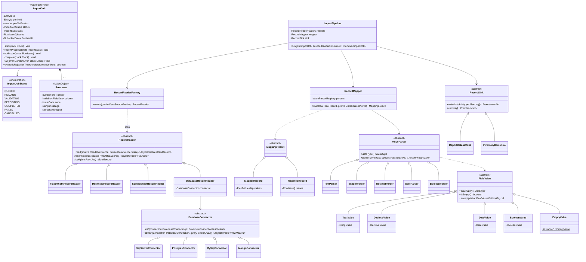

> Patrones: **Template Method** (`RecordReader.read` fija el algoritmo: abrir → aplicar
> `RowRule` → dividir), **Strategy** (lectores, conectores, *parsers*), **Factory**
> (`RecordReaderFactory`), **Null Object** (`EmptyValue` evita `null`/`undefined` en celdas).

## 8. Datasets, colecciones y clasificaciones

```mermaid
classDiagram
    class Dataset {
        <<abstract>>
        -EntityId id
        -EntityId projectId
        -Period period
        -DatasetStatus status
        -number dataVersion
        -number recordCount
        +stage()* DataStage
        +publish(clock Clock) void
    }
    class DataLoad {
        -EntityId profileId
        -EntityScope scope
        -number version
        -EntityId importJobId
        -Nullable~EntityId~ supersededBy
        +supersede(next DataLoad) void
        +stage() DataStage
    }
    class ConsolidatedDataset {
        -EntityId definitionId
        -EntityId[] sourceDatasetIds
        +stage() DataStage
    }
    class TransformedDataset {
        -EntityId pipelineId
        -number pipelineVersion
        -EntityId sourceDatasetId
        +stage() DataStage
    }
    class DataStage {
        <<enumeration>>
        RAW
        CONSOLIDATED
        TRANSFORMED
    }
    class DatasetStatus {
        <<enumeration>>
        STAGED
        PUBLISHED
        SUPERSEDED
        FAILED
    }
    class DataRecord {
        <<Entity>>
        -EntityId datasetId
        -DataStage stage
        -Period period
        -EntityScope scope
        -RecordKey key
        -ValueSet values
        -AttributeSet attributes
        -ClassificationMembership[] memberships
        +field(key FieldKey) FieldValue
        +number(key FieldKey) Result~Decimal~
        +withField(key FieldKey, value FieldValue) Result~DataRecord~
    }
    class RecordKey {
        <<ValueObject>>
        -Map~FieldKey,string~ identifiers
        -Map~FieldKey,string~ labels
        +textOf(field FieldKey) Nullable~string~
        +hash() string
    }
    class ValueSet {
        <<ValueObject>>
        -Map~FieldKey,FieldValue~ values
        +get(field FieldKey) FieldValue
        +with(field FieldKey, value FieldValue) ValueSet
    }
    class AttributeSet {
        <<ValueObject>>
        -Map~FieldKey,FieldValue~ attributes
        +get(field FieldKey) FieldValue
        +with(field FieldKey, value FieldValue) AttributeSet
    }
    class SupplementaryCollection {
        <<AggregateRoot>>
        -EntityId id
        -EntityId projectId
        -string name
        -CollectionField[] fields
        -CollectionPeriodicity periodicity
        +rename(name string) Result~SupplementaryCollection~
        +addField(field CollectionField) Result~SupplementaryCollection~
        +renameField(key FieldKey, label FieldLabel) Result~SupplementaryCollection~
        +createEntry(values FieldValueMap, period Nullable~Period~) Result~CollectionEntry~
        +keyFields() CollectionField[]
    }
    class CollectionField {
        <<ValueObject>>
        -FieldKey key
        -FieldLabel label
        -DataType dataType
        -Nullable~NumericNature~ nature
        -boolean isKey
        -boolean required
    }
    class CollectionEntry {
        <<Entity>>
        -EntityId collectionId
        -Nullable~Period~ period
        -FieldValueMap values
    }
    class CollectionPeriodicity {
        <<enumeration>>
        NONE
        MONTHLY
        DAILY
    }
    class Classification {
        <<AggregateRoot>>
        -EntityId id
        -EntityId projectId
        -string name
        -FieldKey targetField
        -ClassificationNode[] roots
        -UnmatchedPolicy unmatchedPolicy
        +create(name string, target CatalogField, compatibility OperationCompatibility)$ Result~Classification~
        +retarget(target CatalogField, compatibility OperationCompatibility) Result~Classification~
        +addNode(parentId Nullable~EntityId~, node ClassificationNode) Result~Classification~
        +moveNode(nodeId EntityId, newParentId Nullable~EntityId~) Result~Classification~
        +classify(key RecordKey) Optional~ClassificationMembership~
        +coverage(keys RecordKey[]) CoverageReport
    }
    class ClassificationNode {
        <<Entity>>
        -EntityId id
        -string code
        -string name
        -number order
        -PresentationSign sign
        -MatchRule rule
        -ClassificationNode[] children
        +isLeaf() boolean
        +matches(value string) boolean
    }
    class MatchRule {
        <<abstract>>
        +isSatisfiedBy(value string)* boolean
        +and(other MatchRule) MatchRule
        +or(other MatchRule) MatchRule
        +not() MatchRule
    }
    class EqualsRule {
        -string[] values
    }
    class StartsWithRule {
        -string prefix
    }
    class ContainsRule {
        -string fragment
    }
    class EndsWithRule {
        -string suffix
    }
    class RangeRule {
        -string from
        -string to
    }
    class AndRule
    class OrRule
    class NotRule
    class NeverMatchRule
    class ClassificationMembership {
        <<ValueObject>>
        -EntityId classificationId
        -EntityId nodeId
        -EntityId[] ancestorIds
    }
    class CoverageReport {
        <<ValueObject>>
        -number matched
        -string[] unmatched
        -string[] ambiguous
    }

    Dataset <|-- DataLoad
    Dataset <|-- ConsolidatedDataset
    Dataset <|-- TransformedDataset
    Dataset --> DataStage
    Dataset --> DatasetStatus
    Dataset "1" *-- "0..*" DataRecord
    DataRecord *-- RecordKey
    DataRecord *-- ValueSet
    DataRecord *-- AttributeSet
    DataRecord "1" *-- "0..*" ClassificationMembership
    SupplementaryCollection "1" *-- "1..*" CollectionField
    SupplementaryCollection "1" --> "0..*" CollectionEntry
    SupplementaryCollection --> CollectionPeriodicity
    Classification "1" *-- "1..*" ClassificationNode
    ClassificationNode "1" *-- "0..*" ClassificationNode : hijos
    ClassificationNode *-- MatchRule
    MatchRule <|-- EqualsRule
    MatchRule <|-- StartsWithRule
    MatchRule <|-- ContainsRule
    MatchRule <|-- EndsWithRule
    MatchRule <|-- RangeRule
    MatchRule <|-- AndRule
    MatchRule <|-- OrRule
    MatchRule <|-- NotRule
    MatchRule <|-- NeverMatchRule
    Classification ..> ClassificationMembership : produce
    Classification ..> CoverageReport
```

> Patrones: **Composite** (árbol de `ClassificationNode`), **Specification** (`MatchRule` con
> combinadores `and/or/not`), **Null Object** (`NeverMatchRule` para nodos agrupadores sin regla).

**Dónde queda cada encabezado en un `DataRecord`.** `ReportDatasetSink` ubica cada valor según la
instantánea (`FieldSnapshot`) de su columna. Todas las claves son `FieldKey`, nunca nombres:

| Rol y tipo del encabezado | Ubicación | Ejemplo ficticio |
|---|---|---|
| `id` (cualquier tipo; un entero se guarda por su texto) | `key.identifiers` | *Código de producto* = `PRD-0042` |
| `id_name` | `key.labels` | *Descripción del producto* = «Producto Demo» |
| `data` numérico (Decimal o Entero) | `values` (`DecimalValue` o `EmptyValue`) | *Monto de venta*, *Unidades vendidas*, *% de descuento* |
| `data` Texto, Fecha o Sí/No | `attributes` | *Vendedor*, *Fecha de venta*, *Es promoción* |

- `DataRecord.field(key)` busca el encabezado en `identifiers`, `labels`, `values` o
  `attributes` y devuelve `EmptyValue` (*Null Object*) si no está.
- `DataRecord.number(key)` devuelve `Fail(FIELD_NOT_NUMERIC)` si el encabezado no es numérico;
  nunca convierte texto en número.
- `DataRecord.withField(key, value)` valida que el valor coincida con el tipo del encabezado.

**Colecciones complementarias.** Los campos de una colección (`CollectionField`) se describen
igual que los encabezados: nombre (`FieldLabel`, único dentro de la colección), tipo y naturaleza
(un tipo de cambio es naturaleza `RATE`, por lo que nunca se suma). Las referencias guardadas usan
el `EntityId` de la colección y el `FieldKey` del campo; en las fórmulas se escriben con nombres
(`COLECCION("Tipo de cambio"; [Tasa de cierre]; …)`), se guardan en forma canónica (§10) y se
validan con la misma `OperationCompatibility`. Por eso `rename` y `renameField` no rompen nada.

**Clasificaciones.** `Classification.create` y `retarget` devuelven `Fail(FIELD_NOT_CLASSIFIABLE)`
si el encabezado no es `id` o `id_name` clasificable (Texto, o `id` Entero, que se clasifica por su
representación de texto tal como está en `RecordKey`). El selector «Clasificar por» solo muestra
esos encabezados, con su nombre vigente; renombrar el encabezado no altera las membresías.

## 9. Consolidación y operaciones (`consolidation`, `transformations`)

```mermaid
classDiagram
    class ConsolidationDefinition {
        <<AggregateRoot>>
        -EntityId id
        -EntityId projectId
        -string name
        -CurrencyCode currency
        -ScopeLevel level
        -EntityScope[] members
        -FieldKey[] groupBy
        -FieldKey[] valueFields
        +addMember(scope EntityScope) Result~ConsolidationDefinition~
        +addGroupBy(field CatalogField, compatibility OperationCompatibility) Result~ConsolidationDefinition~
        +addValueField(field CatalogField, compatibility OperationCompatibility) Result~ConsolidationDefinition~
        +plan(period Period, available DataLoad[]) Result~ConsolidationPlan~
    }
    class ConsolidationPlan {
        <<ValueObject>>
        -Period period
        -DataLoad[] inputs
        -EntityScope[] missing
        -MissingField[] missingFields
        +isComplete() boolean
    }
    class MissingField {
        <<ValueObject>>
        -EntityId dataLoadId
        -FieldKey field
    }
    class ConsolidationEngine {
        <<abstract>>
        +run(definition ConsolidationDefinition, plan ConsolidationPlan)* Promise~ConsolidatedDataset~
    }
    class MongoAggregationConsolidationEngine
    class TransformationPipeline {
        <<AggregateRoot>>
        -EntityId id
        -EntityId projectId
        -string name
        -DatasetSelector source
        -TransformationStep[] steps
        -number version
        +addStep(step TransformationStep, schema FieldSchema) Result~TransformationPipeline~
        +moveStep(stepId EntityId, index number, schema FieldSchema) Result~TransformationPipeline~
        +removeStep(stepId EntityId, schema FieldSchema) Result~TransformationPipeline~
    }
    class FieldSchema {
        <<ValueObject>>
        -CatalogField[] fields
        +find(key FieldKey) Optional~CatalogField~
        +labelOf(key FieldKey) string
        +extend(produced CatalogField[]) FieldSchema
    }
    class FieldRequirement {
        <<ValueObject>>
        -FieldKey field
        -FieldOperation operation
    }
    class PipelineRunner {
        +run(pipeline TransformationPipeline, context PipelineContext) Promise~PipelineRunReport~
    }
    class PipelineContext {
        -Period period
        -FieldSchema schema
        -CollectionLookup collections
        -PriorPeriodReader history
        -FormulaEvaluator formulas
        -IssueCollector issues
    }
    class TransformationStep {
        <<abstract>>
        -EntityId id
        -string label
        +apply(records RecordStream, context PipelineContext)* RecordStream
        +requiredFields()* FieldRequirement[]
        +producedFields()* FieldKey[]
        #validate(schema FieldSchema, compatibility OperationCompatibility)* ValidationReport
        +describe(schema FieldSchema)* string
    }
    class FilterStep {
        -RecordSpecification specification
        -FilterMode mode
    }
    class ConditionalAssignmentStep {
        -RecordSpecification when
        -FieldKey target
        -CompiledFormula thenValue
        -CompiledFormula otherwiseValue
    }
    class ComputedFieldStep {
        -FieldKey target
        -CompiledFormula expression
    }
    class AccumulationStep {
        -AccumulationMode mode
        -FieldKey increaseField
        -Nullable~FieldKey~ decreaseField
        -Nullable~FieldKey~ openingField
        -FieldKey target
    }
    class CurrencyConversionStep {
        -EntityId rateCollectionId
        -FieldKey currencyField
        -CurrencyCode targetCurrency
        -RateQuote quote
        -ConversionRule[] rules
    }
    class ConversionRule {
        <<ValueObject>>
        -FieldKey valueField
        -FieldKey rateField
        -FieldKey targetField
    }
    class RateQuote {
        <<enumeration>>
        UNITS_PER_TARGET
        TARGET_PER_UNIT
    }
    class SyntheticRecordStep {
        -RecordKey key
        -FieldAssignment[] assignments
    }
    class FieldAssignment {
        <<ValueObject>>
        -FieldKey field
        -CompiledFormula value
    }
    class EqualityCheckStep {
        -CompiledFormula left
        -CompiledFormula right
        -ExpressionScope scope
        -Decimal tolerance
        -IssueSeverity severity
    }
    class ExpressionScope {
        <<enumeration>>
        RECORD
        DATASET
    }
    class AccumulationMode {
        <<enumeration>>
        ROLL_FORWARD
        YEAR_TO_DATE
        YEAR_TO_DATE_NET
    }
    class RecordSpecification {
        <<abstract>>
        +isSatisfiedBy(record DataRecord)* boolean
        +validate(schema FieldSchema, compatibility OperationCompatibility)* ValidationReport
    }
    class TextFieldSpecification {
        -FieldKey field
        -TextOperator operator
        -string value
    }
    class NumberFieldSpecification {
        -FieldKey field
        -ComparisonOperator operator
        -Decimal value
    }
    class DateFieldSpecification {
        -FieldKey field
        -Nullable~Date~ from
        -Nullable~Date~ to
    }
    class BooleanFieldSpecification {
        -FieldKey field
        -boolean value
    }
    class EmptyFieldSpecification {
        -FieldKey field
    }
    class ClassificationSpecification {
        -EntityId classificationId
        -EntityId nodeId
    }
    class AndSpecification {
        -RecordSpecification[] operands
    }
    class OrSpecification {
        -RecordSpecification[] operands
    }
    class NotSpecification {
        -RecordSpecification operand
    }
    class TextOperator {
        <<enumeration>>
        EQUALS
        CONTAINS
        STARTS_WITH
        ENDS_WITH
    }
    class ComparisonOperator {
        <<enumeration>>
        EQUALS
        NOT_EQUALS
        GREATER_THAN
        GREATER_OR_EQUAL
        LESS_THAN
        LESS_OR_EQUAL
    }

    ConsolidationDefinition ..> ConsolidationPlan : crea
    ConsolidationPlan "1" *-- "0..*" MissingField
    ConsolidationEngine <|-- MongoAggregationConsolidationEngine
    ConsolidationEngine ..> ConsolidationPlan
    TransformationPipeline "1" *-- "1..*" TransformationStep
    TransformationPipeline ..> FieldSchema : valida contra
    PipelineRunner ..> TransformationPipeline
    PipelineRunner ..> PipelineContext
    PipelineContext *-- FieldSchema
    TransformationStep ..> FieldRequirement : declara
    TransformationStep <|-- FilterStep
    TransformationStep <|-- ConditionalAssignmentStep
    TransformationStep <|-- ComputedFieldStep
    TransformationStep <|-- AccumulationStep
    TransformationStep <|-- CurrencyConversionStep
    TransformationStep <|-- SyntheticRecordStep
    TransformationStep <|-- EqualityCheckStep
    AccumulationStep --> AccumulationMode
    CurrencyConversionStep "1" *-- "1..*" ConversionRule
    CurrencyConversionStep --> RateQuote
    SyntheticRecordStep "1" *-- "1..*" FieldAssignment
    EqualityCheckStep --> ExpressionScope
    FilterStep --> RecordSpecification
    ConditionalAssignmentStep --> RecordSpecification
    RecordSpecification <|-- TextFieldSpecification
    RecordSpecification <|-- NumberFieldSpecification
    RecordSpecification <|-- DateFieldSpecification
    RecordSpecification <|-- BooleanFieldSpecification
    RecordSpecification <|-- EmptyFieldSpecification
    RecordSpecification <|-- ClassificationSpecification
    RecordSpecification <|-- AndSpecification
    RecordSpecification <|-- OrSpecification
    RecordSpecification <|-- NotSpecification
    TextFieldSpecification --> TextOperator
    NumberFieldSpecification --> ComparisonOperator
```

**Consolidación según la naturaleza.** Consolidar no es «sumar»: cada campo de `valueFields` se
agrega según la naturaleza y la agregación por defecto de su encabezado en el catálogo (Monto y
Cantidad se suman; Precio unitario o Tasa se promedian ponderados por su `weightField`).

- `addGroupBy` exige un encabezado agrupable (`FieldOperation.GROUP_BY`) y devuelve
  `Fail(FIELD_NOT_GROUPABLE)` en caso contrario; `addValueField` exige un número agregable
  (`CONSOLIDATION_VALUE`) y devuelve `Fail(FIELD_NOT_AGGREGATABLE)` para textos, fechas, números
  descriptivos o tasas sin ponderación.
- Los `id_name` cuyo `describes` está en `groupBy` se conservan (último valor no vacío); los
  demás atributos se descartan.
- En el resultado (`data_records` de etapa `CONSOLIDATED`), `key.identifiers` contiene
  exactamente los campos de `groupBy`, `key.labels` los `id_name` que los describen y `key.hash`
  se calcula sobre ellos.
- `plan()` llena `missingFields` cuando una carga de entrada (de otra preconfiguración o versión)
  no trae un campo de `groupBy` o de `valueFields`; la interfaz lo muestra con el nombre vigente.

Ejemplo ficticio (ventas de Empresa Demo): agrupar por *Código de producto* y *Código de tienda*,
sumar *Monto de venta* y *Unidades vendidas* y ponderar *Precio unitario* por *Unidades vendidas*.
*Vendedor* (Texto) no se ofrece como valor; por API se rechaza con `FIELD_NOT_AGGREGATABLE`.
*% de descuento* sí es agregable (Tasa ponderada por *Monto de venta*): si se elige, se consolida
con promedio ponderado por *Monto de venta*; en este ejemplo simplemente no se elige.

**Validación de los pasos.** Cada paso declara los encabezados que usa (`requiredFields()`, con la
operación de `FieldOperation` que realiza sobre cada uno) y los que produce (`producedFields()`).
`TransformationPipeline` valida cada paso contra el `FieldSchema` disponible en ese punto (los
encabezados activos presentes en la fuente según `FieldAvailability`, más los producidos por los
pasos anteriores) con `OperationCompatibility` (`FIELD_NOT_IN_SOURCE` si el encabezado no está
en la fuente); `moveStep` y `removeStep` revalidan el orden: un encabezado producido
debe existir antes del paso que lo usa. `describe(schema)` redacta el paso con los nombres
vigentes (p. ej. «Saldo = Saldo anterior + Debe − Haber»).

| Paso | Regla de compatibilidad |
|---|---|
| `FilterStep` y especificaciones | Cada especificación se valida con la operación `FILTER`; `TextFieldSpecification` solo acepta Texto, `NumberFieldSpecification` números, `DateFieldSpecification` fechas y `BooleanFieldSpecification` Sí/No. Todas leen con `DataRecord.field(key)`. |
| `ComputedFieldStep`, `ConditionalAssignmentStep` | Se evalúan por registro (`RecordEvaluationContext`); el tipo y la naturaleza de la expresión deben coincidir con los del destino (`TARGET_TYPE_MISMATCH`). |
| `AccumulationStep` | Aumenta, disminuye y valor inicial son de la misma naturaleza (`AMOUNT` o `QUANTITY`, operaciones `ACCUMULATE_*`); el destino es un encabezado `DERIVED` de esa naturaleza. |
| `CurrencyConversionStep` | `valueField` debe ser convertible (`CURRENCY_CONVERT`: solo Monto o Precio unitario); `rateField` es un campo `RATE` de la colección (`CONVERSION_RATE`); `targetField` es el mismo encabezado (se sobrescribe en la etapa transformada) o uno `DERIVED`, p. ej. *Monto de venta (USD)*. La moneda de origen es `DataRecord.scope.currency`. |
| `SyntheticRecordStep` | `key` trae todos los `id` del dataset; cada `FieldAssignment` se valida contra el tipo y la naturaleza de su encabezado; los encabezados sin asignar quedan con `EmptyValue`. |
| `EqualityCheckStep` | Con `RECORD` se evalúa por registro; con `DATASET` en `AggregateEvaluationContext`, donde `[X]` y `SUMA([X])` exigen un encabezado agregable. |

Los destinos de los pasos (campo calculado, acumulado, asignación condicional, conversión, fila
sintética) son encabezados del catálogo, normalmente de origen `DERIVED`, creados desde el propio
paso con «Nuevo encabezado…» (nombre libre y único, rol `data`, tipo y naturaleza inferidos y
confirmados por el usuario). Desde ese momento aparecen por su nombre en todos los selectores y
fórmulas posteriores.

Semántica **genérica** de `AccumulationStep` (RF-REP-10): los pasos no conocen "debe" ni
"haber"; el usuario elige por su nombre qué encabezados cumplen cada papel.

| Modo | Cálculo para el período *p* | Ejemplo contable | Ejemplo ventas |
|---|---|---|---|
| `ROLL_FORWARD` | `destino(p) = inicial(p−1 o campo) + aumenta(p) − disminuye(p)` | saldo = saldo anterior + debe − haber | existencia = existencia anterior + compras − ventas |
| `YEAR_TO_DATE` | `destino(p) = Σ aumenta(inicioAño..p)` | debe acumulado | unidades vendidas en el año |
| `YEAR_TO_DATE_NET` | `destino(p) = Σ (aumenta − disminuye)(inicioAño..p)` | neto acumulado debe − haber | ventas netas de devoluciones |

`EqualityCheckStep` valida cualquier igualdad escrita con los nombres de los encabezados, por
ejemplo `SUMA([Debe]) = SUMA([Haber])` (alcance `DATASET`),
`[Saldo anterior] + [Debe] - [Haber] = [Saldo actual]` (alcance `RECORD`) o
`SUMA([Unidades vendidas]) = SUMA([Unidades despachadas])`. Ninguna igualdad está fija a
debe/haber.

> Patrones: **Pipeline / Chain of Responsibility** (`TransformationStep`), **Strategy**
> (`ConsolidationEngine`), **Specification** (`RecordSpecification`).

## 10. Motor de fórmulas (`libs/shared/formula-engine`)

```mermaid
classDiagram
    class FormulaCompiler {
        -Lexer lexer
        -Parser parser
        -TypeChecker types
        +compile(source string, fields FieldResolver, context ContextKind) Result~CompiledFormula~
    }
    class Lexer {
        +tokenize(source string) Result~Token[]~
    }
    class Token {
        <<ValueObject>>
        -TokenType type
        -string lexeme
        -number position
    }
    class TokenType {
        <<enumeration>>
        NUMBER
        TEXT
        FIELD_REF
        CELL_REF
        FUNCTION_NAME
        OPERATOR
        SEPARATOR
        PAREN
    }
    class Parser {
        -Token[] tokens
        -number cursor
        -FieldResolver fields
        +parse(tokens Token[]) Result~Expression~
        -parseExpression(precedence number) Expression
    }
    class FieldResolver {
        <<abstract>>
        +findByLabel(label FieldLabel)* Result~CatalogField~
        +find(key FieldKey)* Optional~CatalogField~
        +labelOf(key FieldKey)* string
        +withinCollection(collectionId EntityId)* FieldResolver
    }
    class CompiledFormula {
        <<ValueObject>>
        -string canonicalSource
        -Expression root
        -CellAddress[] cellDependencies
        -FieldKey[] fieldDependencies
    }
    class FieldReference {
        -FieldKey field
    }
    class Expression {
        <<abstract>>
        +accept(visitor ExpressionVisitor~R~)* R
    }
    class NumberLiteral {
        -Decimal value
    }
    class TextLiteral {
        -string value
    }
    class CellReference {
        -Nullable~string~ page
        -Nullable~string~ element
        -number row
        -number column
    }
    class RangeReference {
        -CellReference start
        -CellReference end
    }
    class UnaryExpression {
        -UnaryOperator operator
        -Expression operand
    }
    class BinaryExpression {
        -BinaryOperator operator
        -Expression left
        -Expression right
    }
    class FunctionCall {
        -string name
        -Expression[] args
    }
    class ExpressionVisitor~R~ {
        <<interface>>
        +visitNumber(node NumberLiteral) R
        +visitText(node TextLiteral) R
        +visitField(node FieldReference) R
        +visitCell(node CellReference) R
        +visitRange(node RangeReference) R
        +visitUnary(node UnaryExpression) R
        +visitBinary(node BinaryExpression) R
        +visitCall(node FunctionCall) R
    }
    class Evaluator {
        -EvaluationContext context
        -FunctionRegistry functions
    }
    class DependencyCollector {
        +collect(root Expression) FormulaDependencies
    }
    class FormulaFormatter {
        -FieldResolver fields
        +format(formula CompiledFormula) string
    }
    class TypeChecker {
        -FieldResolver fields
        -OperationCompatibility compatibility
        +check(expression Expression, context ContextKind, expected Nullable~FormulaType~) Result~FormulaType~
    }
    class FormulaType {
        <<ValueObject>>
        -DataType dataType
        -Nullable~NumericNature~ nature
    }
    class ContextKind {
        <<enumeration>>
        RECORD
        AGGREGATE
        REPORT
    }
    class EvaluationContext {
        <<abstract>>
        +kind()* ContextKind
        +fieldValue(field FieldKey)* FormulaValue
        +aggregate(field FieldKey, aggregation Aggregation)* FormulaValue
        +cellValue(cell CellReference)* FormulaValue
    }
    class RecordEvaluationContext {
        -DataRecord record
    }
    class AggregateEvaluationContext {
        -DataStage stage
        -DimensionFilter[] filters
    }
    class DependencyGraph {
        +add(cell CellAddress, dependencies CellAddress[]) void
        +evaluationOrder() Result~CellAddress[]~
    }
    class FormulaFunction {
        <<abstract>>
        +name()* string
        +arity()* Arity
        +invoke(args FormulaValue[], context EvaluationContext)* FormulaValue
    }
    class SumFunction
    class AverageFunction
    class WeightedAverageFunction
    class MinFunction
    class MaxFunction
    class LastFunction
    class CountFunction
    class IfFunction
    class SafeDivideFunction
    class PeriodFunction
    class ClassificationFunction
    class CollectionFunction
    class MetadataFunction
    class FunctionRegistry {
        +register(fn FormulaFunction) void
        +resolve(name string) Optional~FormulaFunction~
    }
    class FormulaValue {
        <<abstract>>
    }
    class NumberValue {
        -Decimal value
    }
    class TextFormulaValue
    class BooleanFormulaValue
    class ErrorValue {
        -FormulaErrorCode code
    }

    FormulaCompiler --> Lexer
    FormulaCompiler --> Parser
    Lexer ..> Token
    Parser ..> Expression
    FormulaCompiler --> TypeChecker
    FormulaCompiler ..> CompiledFormula
    Token --> TokenType
    Parser --> FieldResolver : nombre a FieldKey
    CompiledFormula *-- Expression
    Expression <|-- NumberLiteral
    Expression <|-- TextLiteral
    Expression <|-- FieldReference
    Expression <|-- CellReference
    Expression <|-- RangeReference
    Expression <|-- UnaryExpression
    Expression <|-- BinaryExpression
    Expression <|-- FunctionCall
    ExpressionVisitor~R~ <|.. Evaluator
    ExpressionVisitor~R~ <|.. DependencyCollector
    ExpressionVisitor~R~ <|.. TypeChecker
    ExpressionVisitor~R~ <|.. FormulaFormatter
    FormulaFormatter --> FieldResolver : nombres vigentes
    TypeChecker --> FieldResolver
    TypeChecker ..> FormulaType
    TypeChecker --> ContextKind
    Evaluator --> EvaluationContext
    EvaluationContext <|-- RecordEvaluationContext
    EvaluationContext <|-- AggregateEvaluationContext
    EvaluationContext --> ContextKind
    Evaluator --> FunctionRegistry
    FunctionRegistry o-- FormulaFunction
    FormulaFunction <|-- SumFunction
    FormulaFunction <|-- AverageFunction
    FormulaFunction <|-- WeightedAverageFunction
    FormulaFunction <|-- MinFunction
    FormulaFunction <|-- MaxFunction
    FormulaFunction <|-- LastFunction
    FormulaFunction <|-- CountFunction
    FormulaFunction <|-- IfFunction
    FormulaFunction <|-- SafeDivideFunction
    FormulaFunction <|-- PeriodFunction
    FormulaFunction <|-- ClassificationFunction
    FormulaFunction <|-- CollectionFunction
    FormulaFunction <|-- MetadataFunction
    Evaluator ..> FormulaValue
    FormulaValue <|-- NumberValue
    FormulaValue <|-- TextFormulaValue
    FormulaValue <|-- BooleanFormulaValue
    FormulaValue <|-- ErrorValue
    DependencyCollector ..> DependencyGraph
```

**Referencias a encabezados por su nombre.** Un encabezado se escribe entre corchetes con su
nombre vigente: `[Debe]`, `[Saldo actual]`, `[Monto de venta]`. Los corchetes son obligatorios,
así que un encabezado nunca choca con una función ni con una celda (`F3`), y como un nombre no
puede contener `[` ni `]` nunca hace falta escapar nada. El `Lexer` emite un token `FIELD_REF` y
el `Parser` lo resuelve con un `FieldResolver` (clase abstracta de `libs/shared/field-catalog`)
sobre el catálogo, los encabezados derivados que estén en alcance y, dentro de `COLECCION`, los
campos de esa colección (`withinCollection`). La comparación es la del catálogo: sin distinguir
mayúsculas ni tildes, con espacios extremos recortados e internos colapsados (`[debe]` equivale a
`[Debe]`). El resultado es un nodo `FieldReference` con la `FieldKey`, nunca con el nombre.

**Forma canónica.** Lo que se guarda es `CompiledFormula.canonicalSource`, con claves internas:
`=[Debe] - [Haber]` se persiste como `=[#f_6Pw4] - [#f_2Lm5]` (y `#id` para colecciones y nodos
de clasificación). `DependencyCollector` llena `cellDependencies` y `fieldDependencies` (estas
alimentan el índice de usos del catálogo). `FormulaFormatter`, otro `ExpressionVisitor`, muestra
la fórmula con los nombres vigentes: si *Debe* se renombra a *Cargos*, el editor muestra
`=[Cargos] - [Haber]` sin intervención del usuario, el resultado no cambia y no hay que migrar
ni republicar nada. Un encabezado nuevo que tome después el nombre *Debe* no captura la fórmula
antigua, porque esta guarda la clave.

Errores de compilación, mostrados con el nombre escrito por el usuario:

| Código | Cuándo |
|---|---|
| `UNKNOWN_FIELD` | Ningún encabezado activo en alcance tiene ese nombre. |
| `FIELD_INACTIVE` | El nombre corresponde a un encabezado desactivado. |
| `FIELD_NOT_IN_SOURCE` | El encabezado existe en el catálogo pero no en la fuente de datos del elemento o paso. |
| `FIELD_NOT_AGGREGATABLE`, `OPERATOR_NOT_ALLOWED_FOR_TYPE`, `TARGET_TYPE_MISMATCH`… | Errores de tipo del `TypeChecker` (ver más abajo). |

**Contextos de evaluación.** El mismo `[X]` significa cosas distintas según dónde se use; el
contexto (`ContextKind`) se fija al compilar:

| Contexto | Dónde se usa | Qué vale `[X]` | Funciones de agregación |
|---|---|---|---|
| `RECORD` (`RecordEvaluationContext`) | Campo calculado, asignación condicional, fila sintética, igualdad por línea | El valor del encabezado en el registro | No permitidas |
| `AGGREGATE` (`AggregateEvaluationContext`) | Igualdad sobre el dataset, validación de totales de importación | La agregación por defecto del encabezado bajo los filtros vigentes | `SUMA([X])`, `PROMEDIO.PONDERADO([X])`… la hacen explícita y exigen que `[X]` sea agregable |
| `REPORT` (`AggregateEvaluationContext` de un elemento de informe) | Celdas, ejes de fórmula, KPI | Igual que `AGGREGATE`, con los filtros de la celda | Igual que `AGGREGATE`; además admite referencias a celdas (`F3`, `Pagina2.EBITDA!C4`), que solo son válidas en informes |

**Verificación de tipos.** Antes de evaluar, el `TypeChecker` (otro `ExpressionVisitor`) infiere
el `FormulaType` (tipo y naturaleza) de cada nodo a partir de los encabezados (vía
`FieldResolver`) y valida cada uso con `OperationCompatibility` (operación `FORMULA_ARITHMETIC`
y las de agregación). Si la fórmula escribe en un encabezado (`expected`), su tipo y naturaleza
deben coincidir con los del destino (`TARGET_TYPE_MISMATCH`).

| Operación | Resultado |
|---|---|
| Monto ± Monto | Monto |
| Cantidad ± Cantidad | Cantidad |
| Monto ± Cantidad | Error |
| Monto × Tasa | Monto |
| Monto ÷ Tasa | Monto |
| Monto ÷ Cantidad | Precio unitario |
| Cantidad × Precio unitario | Monto |
| Monto ÷ Monto | Tasa |
| Número × literal | Misma naturaleza del número |
| Fecha − Fecha | Número descriptivo (días) |
| Texto en aritmética | Error |

**Funciones.** `SUMA`, `PROMEDIO`, `PROMEDIO.PONDERADO([campo]; [peso])` (con un solo argumento
usa el `weightField` del catálogo), `MIN`, `MAX`, `ULTIMO`, `CONTAR`, `SI`, `DIVIDIR`, `PERIODO`,
`CLASIF("Clasificación"; "Nodo"; [campo])` (o `CLASIF("Nodo"; [campo])` cuando el elemento ya
tiene clasificación; sin `[campo]` usa el campo de valor del contexto o da error; la forma
canónica guarda los ids), `COLECCION("Colección"; [Campo de valor]; clave…; PERIODO())` y
`METADATO("Total de control")`. Cada función declara en `arity()` y en la verificación de tipos
las naturalezas que acepta, según `OperationCompatibility` (`CONTAR` acepta cualquier
encabezado).

Ejemplos de fórmulas soportadas (datos ficticios):

```text
=[Debe] - [Haber]                                   ' por registro: campo calculado
=[Saldo anterior] + [Debe] - [Haber]                ' por registro: saldo actual
=SUMA([Monto de venta])                             ' KPI o celda: total bajo los filtros
=PROMEDIO.PONDERADO([% de descuento]; [Monto de venta])
=[Monto de venta] / [Unidades vendidas]             ' resultado: Precio unitario
=CLASIF("Ingresos"; [Monto de venta]) - CLASIF("Costos"; [Monto de venta])
=[Monto de venta] / COLECCION("Tipo de cambio"; [Tasa de cierre]; "USD"; PERIODO()) ' resultado: Monto (Monto ÷ Tasa)
=F3 - F5                                            ' fila 3 menos fila 5 de la misma tabla
=SUMA(F1:F4)                                        ' total de un rango
=Resultados!C12 / Balance!C30                       ' referencia a otras tablas del informe
=Pagina2.EBITDA!C4                                  ' referencia a otra página
=DIVIDIR(F10; F2; 0)                                ' división segura con valor por defecto
=SI(F4 < 0; 0; F4)
```

Errores de tipo con su mensaje:

```text
=[Vendedor] + [Monto de venta]   → «No se puede sumar Texto con Número decimal»
=SUMA([% de descuento])          → «Una tasa no se puede sumar; use PROMEDIO.PONDERADO»
=SUMA([Debe])  en un campo calculado por registro → función de agregación no permitida
=[Cuenta inexistente] * 2        → UNKNOWN_FIELD
```

> Patrones: **Interpreter + Composite** (AST), **Visitor** (evaluar, recolectar dependencias,
> verificar tipos, formatear con nombres vigentes), **Registry** (funciones extensibles). Sin
> `eval` ni `Function`. `formula-engine` depende solo de `kernel` y `field-catalog`:
> `EvaluationContext` es abstracta en la librería y `RecordEvaluationContext` /
> `AggregateEvaluationContext` se implementan en los módulos que la usan (`transformations`,
> `rendering`, `data-ingestion`).

## 11. Plantillas de informe (`templates`, `rendering`)

```mermaid
classDiagram
    class ReportTemplate {
        <<AggregateRoot>>
        -EntityId id
        -EntityId projectId
        -string name
        -number version
        -TemplateStatus status
        -ReportParameter[] parameters
        -ReportPage[] pages
        -ReportTheme theme
        +addPage(format PageFormat, orientation Orientation) ReportPage
        +movePage(pageId EntityId, index number) Result~ReportTemplate~
        +removePage(pageId EntityId) Result~ReportTemplate~
        +findElement(ref ElementRef) Optional~ReportElement~
        +fieldReferences() FieldRequirement[]
        +publish(fields FieldResolver) Result~ReportTemplate~
    }
    class ReportPage {
        <<Entity>>
        -EntityId id
        -string name
        -PageFormat format
        -Orientation orientation
        -Margins margins
        -Nullable~PageBand~ header
        -Nullable~PageBand~ footer
        -ReportElement[] elements
        +addElement(element ReportElement) Result~ReportPage~
        +removeElement(elementId EntityId) void
        +printableArea() LayoutBox
    }
    class PageFormat {
        <<ValueObject>>
        -PageFormatName name
        -Millimeters width
        -Millimeters height
        +letter()$ PageFormat
        +legal()$ PageFormat
        +oficio()$ PageFormat
        +a4()$ PageFormat
        +custom(width Millimeters, height Millimeters)$ Result~PageFormat~
    }
    class PageBand {
        <<ValueObject>>
        -Millimeters height
        -ReportElement[] elements
    }
    class ReportParameter {
        <<ValueObject>>
        -ParameterKind kind
        -string name
        -ParameterDefault defaultValue
    }
    class ReportElement {
        <<abstract>>
        -EntityId id
        -string name
        -LayoutBox box
        -ElementStyle style
        +moveTo(x Millimeters, y Millimeters) void
        +resize(width Millimeters, height Millimeters) void
        +accept(visitor ReportElementVisitor~R~)* R
    }
    class TextElement {
        -RichText content
    }
    class ImageElement {
        -EntityId fileId
        -ImageFit fit
    }
    class ShapeElement {
        -ShapeKind kind
    }
    class MatrixTableElement {
        -DataBinding binding
        -AxisMember[] rows
        -AxisMember[] columns
        -CellOverride[] overrides
        -NumberFormat numberFormat
        -ConditionalFormatRule[] conditionalFormats
    }
    class PivotTableElement {
        -DataBinding binding
        -DimensionRef[] rowDimensions
        -DimensionRef[] columnDimensions
        -MeasureAxisMember[] measures
        -boolean showSubtotals
    }
    class ChartElement {
        -DataBinding binding
        -ChartType type
        -DimensionRef category
        -ChartSeries[] series
        -ChartOptions options
    }
    class ChartSeries {
        <<ValueObject>>
        -AxisLabel label
        -FieldKey field
        -Aggregation aggregation
        -DimensionFilter[] filters
        -Nullable~ElementRef~ source
    }
    class KpiElement {
        -DataBinding binding
        -CompiledFormula formula
        -NumberFormat numberFormat
    }
    class DataBinding {
        <<ValueObject>>
        -DataStage stage
        -Nullable~FieldKey~ valueField
        -DimensionFilter[] baseFilters
    }
    class AxisMember {
        <<abstract>>
        -EntityId id
        -AxisLabel label
        -AxisStyle style
        +resolve(context AxisContext)* AxisResolution
    }
    class AxisLabel {
        <<abstract>>
        +render(fields FieldResolver)* string
    }
    class FixedAxisLabel {
        -string text
    }
    class FieldAxisLabel {
        -FieldKey field
    }
    class MeasureAxisMember {
        -FieldKey field
        -Aggregation aggregation
        -Nullable~NumberFormat~ numberFormat
    }
    class FilterAxisMember {
        -DimensionFilter[] filters
    }
    class FormulaAxisMember {
        -CompiledFormula formula
    }
    class TotalAxisMember {
        -AxisRange range
        -Aggregation aggregation
    }
    class LabelAxisMember
    class DimensionFilter {
        <<ValueObject>>
        -DimensionRef dimension
        -FilterOperator operator
        -FilterValue[] values
        +create(dimension DimensionRef, operator FilterOperator, values FilterValue[], fields FieldResolver)$ Result~DimensionFilter~
    }
    class DimensionRef {
        <<abstract>>
        +title(fields FieldResolver)* string
    }
    class ScopeDimension {
        -ScopeLevel level
    }
    class PeriodDimension {
        -PeriodPart part
    }
    class ClassificationDimension {
        -EntityId classificationId
        -number depth
    }
    class FieldDimension {
        -FieldKey field
        -Nullable~DateGrouping~ dateGrouping
    }
    class PeriodPart {
        <<enumeration>>
        YEAR
        MONTH
    }
    class DateGrouping {
        <<enumeration>>
        DAY
        MONTH
        YEAR
    }
    class FilterOperator {
        <<enumeration>>
        EQUALS
        NOT_EQUALS
        IN
        CONTAINS
        STARTS_WITH
        GREATER_THAN
        LESS_THAN
        BETWEEN
        IS_EMPTY
    }
    class FilterValue {
        <<abstract>>
    }
    class TextFilterValue {
        -string value
    }
    class DecimalFilterValue {
        -Decimal value
    }
    class DateFilterValue {
        -Date value
    }
    class BooleanFilterValue {
        -boolean value
    }
    class RelativePeriodValue {
        -RelativePeriod relation
    }
    class ConditionalFormatRule {
        <<ValueObject>>
        -FormatCondition condition
        -CellStyle style
    }
    class NumberFormat {
        <<ValueObject>>
        -number decimals
        -boolean thousandsSeparator
        -NegativeStyle negativeStyle
        -NumberScale scale
        -string prefix
        -string suffix
    }
    class ReportElementVisitor~R~ {
        <<interface>>
        +visitText(element TextElement) R
        +visitImage(element ImageElement) R
        +visitShape(element ShapeElement) R
        +visitMatrix(element MatrixTableElement) R
        +visitPivot(element PivotTableElement) R
        +visitChart(element ChartElement) R
        +visitKpi(element KpiElement) R
    }
    class ReportComputationService {
        -ReportQueryEngine queries
        -FormulaCompiler formulas
        -FieldResolver fields
        +compute(template ReportTemplate, parameters ReportParameterValues) Promise~Result~ComputedReport~~
    }
    class ElementComputationVisitor
    class ReportQueryEngine {
        <<abstract>>
        +evaluateCells(requests CellQuery[])* Promise~CellResult[]~
        +evaluatePivot(element PivotTableElement, context RenderContext)* Promise~PivotResult~
    }
    class MongoReportQueryEngine
    class ComputedReport {
        -ComputedPage[] pages
        -Date computedAt
        -number dataVersion
        -number catalogVersion
    }

    ReportTemplate "1" *-- "1..*" ReportPage
    ReportTemplate "1" *-- "0..*" ReportParameter
    ReportPage *-- PageFormat
    ReportPage "1" *-- "0..2" PageBand
    ReportPage "1" *-- "0..*" ReportElement
    PageBand o-- ReportElement
    ReportElement <|-- TextElement
    ReportElement <|-- ImageElement
    ReportElement <|-- ShapeElement
    ReportElement <|-- MatrixTableElement
    ReportElement <|-- PivotTableElement
    ReportElement <|-- ChartElement
    ReportElement <|-- KpiElement
    MatrixTableElement *-- DataBinding
    PivotTableElement *-- DataBinding
    ChartElement *-- DataBinding
    KpiElement *-- DataBinding
    MatrixTableElement "1" *-- "1..*" AxisMember : filas y columnas
    MatrixTableElement *-- NumberFormat
    MatrixTableElement "1" *-- "0..*" ConditionalFormatRule
    PivotTableElement "1" *-- "0..*" DimensionRef : filas y columnas
    PivotTableElement "1" *-- "1..*" MeasureAxisMember : medidas
    ChartElement *-- DimensionRef : categoría
    ChartElement "1" *-- "1..*" ChartSeries
    ChartSeries *-- AxisLabel
    ChartSeries "1" *-- "0..*" DimensionFilter
    AxisMember *-- AxisLabel
    AxisLabel <|-- FixedAxisLabel
    AxisLabel <|-- FieldAxisLabel
    AxisMember <|-- MeasureAxisMember
    AxisMember <|-- FilterAxisMember
    AxisMember <|-- FormulaAxisMember
    AxisMember <|-- TotalAxisMember
    AxisMember <|-- LabelAxisMember
    FilterAxisMember "1" *-- "1..*" DimensionFilter
    DataBinding "1" *-- "0..*" DimensionFilter
    DimensionFilter *-- DimensionRef
    DimensionFilter --> FilterOperator
    DimensionRef <|-- ScopeDimension
    DimensionRef <|-- PeriodDimension
    DimensionRef <|-- ClassificationDimension
    DimensionRef <|-- FieldDimension
    PeriodDimension --> PeriodPart
    FieldDimension --> DateGrouping
    DimensionFilter "1" *-- "1..*" FilterValue
    FilterValue <|-- TextFilterValue
    FilterValue <|-- DecimalFilterValue
    FilterValue <|-- DateFilterValue
    FilterValue <|-- BooleanFilterValue
    FilterValue <|-- RelativePeriodValue
    ReportElementVisitor~R~ <|.. ElementComputationVisitor
    ReportComputationService --> ReportQueryEngine
    ReportComputationService ..> ElementComputationVisitor
    ReportComputationService ..> ComputedReport
    ReportQueryEngine <|-- MongoReportQueryEngine
```

**Encabezados en los informes.** Todo lo que el diseñador elige por nombre (campo de valor,
medidas, series, dimensiones, filtros, fórmulas) se guarda como `FieldKey` o en forma canónica:

- `FieldDimension` agrupa por cualquier encabezado agrupable de cualquier rol (`id`, `id_name` o
  `data` de texto, número descriptivo, fecha por día/mes/año o sí/no), p. ej. *Código de tienda*
  o *Vendedor*. `ScopeDimension`, `PeriodDimension` y `ClassificationDimension` cubren alcance,
  período y nodos de una clasificación.
- `MeasureAxisMember` permite columnas o filas que son encabezados distintos, como
  «Saldo anterior | Debe | Haber | Saldo actual» o «Unidades vendidas | Monto de venta |
  % de descuento», cada una con su agregación y su formato.
- `FieldAxisLabel` y el título de una `FieldDimension` muestran el **nombre vigente** del
  encabezado; `FixedAxisLabel` es un texto fijo escrito por el usuario.
- Selectores: medidas, series, KPI y campo de valor solo ofrecen números agregables
  (`REPORT_MEASURE`, `CHART_SERIES`, `KPI_VALUE`; *Contar* siempre se permite); categorías,
  dimensiones, filas y columnas solo encabezados agrupables (`GROUP_BY`, `PIVOT_DIMENSION`,
  `CHART_CATEGORY`).
- `DimensionFilter.create` valida el operador y los valores contra el tipo del encabezado
  (`OPERATOR_NOT_ALLOWED_FOR_TYPE`, `VALUE_TYPE_MISMATCH`): `CONTAINS` solo en Texto, `BETWEEN`
  con `DateFilterValue` o `DecimalFilterValue`, Sí/No con `BooleanFilterValue`, etc.
- `ChartSeries` grafica un encabezado con su agregación y filtros; si `source` no es nulo, la
  serie toma los valores de esa fila de una tabla matricial y `field` debe coincidir con el
  campo de esa fila. `KpiElement` evalúa su fórmula (p. ej. `=SUMA([Monto de venta])`) en el
  contexto de agregación de su `binding`.
- `PivotTableElement` calcula los subtotales según la agregación de cada medida: una tasa nunca
  se suma.

**Resolución de una celda** de `MatrixTableElement`:

```text
campo       = el de la fila f o de la columna c si alguna es MeasureAxisMember,
              si no binding.valueField
agregación  = la del MeasureAxisMember, si no la agregación por defecto del encabezado
celda(f, c) = agregación( campo,
                 filtros(binding.baseFilters)
               ∩ filtros(fila f)
               ∩ filtros(columna c)
               ∩ parámetros del informe (período, alcance) )
```

Si la fila y la columna definen campos distintos, la tabla no se publica
(`CONFLICTING_MEASURES`); si ninguna define campo y `binding.valueField` es nulo, la celda no
tiene medida y también es un error de validación.

Las filas/columnas de tipo fórmula o total se evalúan después, en el orden topológico calculado
por `DependencyGraph`. Todas las celdas de filtro de una tabla se resuelven en **una sola**
agregación de MongoDB (`$match` común + `$group` por clave de fila × columna).

**Validación de referencias.** `ReportTemplate.publish(fields)` y
`ReportComputationService.compute()` recorren `fieldReferences()` (binding, medidas, series,
dimensiones, filtros y dependencias de fórmulas) y devuelven `Fail(FIELD_NOT_FOUND)`,
`Fail(FIELD_INACTIVE)` o `Fail(FIELD_INCOMPATIBLE)` indicando el elemento afectado. Al desactivar o
reemplazar un encabezado, el catálogo consulta el índice de usos (`FieldUsageIndex`) y muestra las
plantillas afectadas (ver
[12 §2.5](12-preconfiguraciones-y-carga-multiple.md#25-reglas-del-catálogo)).

**Renombrar no crea versión.** `ComputedReport` transporta `FieldKey`; los nombres se resuelven con
el catálogo vigente al renderizar. La clave de caché es
`rpt:{templateId}:{version}:{paramsHash}:{dataVersion}:{catalogVersion}`: renombrar un encabezado
invalida la caché y actualiza los títulos, pero **no** crea una versión nueva de la plantilla ni
obliga a republicarla.

Ejemplo ficticio (ventas de Empresa Demo): filas por *Código de tienda*, columnas por mes y
acumulado, celdas con *Monto de venta* y una fila de fórmula `=[Monto de venta] / [Unidades vendidas]`
(precio unitario promedio). Si *Monto de venta* se renombra a *Venta neta*, los títulos y la
fórmula muestran el nombre nuevo sin editar la plantilla.

> Patrones: **Composite** (plantilla → páginas → elementos), **Visitor** (cálculo, renderizado,
> exportación), **Factory Method** (`PageFormat.letter()`…), **Strategy** (`ReportQueryEngine`).

## 12. Inventarios — toma y rondas (`inventory`)

```mermaid
classDiagram
    class InventoryCount {
        <<AggregateRoot>>
        -EntityId id
        -EntityId projectId
        -string name
        -string warehouse
        -Date scheduledAt
        -CountMode mode
        -Tolerance tolerance
        -number maxRounds
        -InventoryCountStatus status
        -EntityId sourceProfileId
        -InventoryFieldMapping fieldMapping
        -FieldVisibilityPolicy visibility
        -CountParticipant[] participants
        -CountRound[] rounds
        +addParticipant(participant CountParticipant) Result~InventoryCount~
        +configureVisibility(policy FieldVisibilityPolicy) void
        +markReady() Result~InventoryCount~
        +startFirstRound(plan AssignmentPlan, clock Clock) Result~CountRound~
        +closeCurrentRound(clock Clock) Result~RoundSummary~
        +openRecount(itemIds EntityId[], plan AssignmentPlan, clock Clock) Result~CountRound~
        +close(clock Clock) Result~CountResult~
        +currentRound() Optional~CountRound~
    }
    class InventoryCountStatus {
        <<enumeration>>
        DRAFT
        READY
        IN_PROGRESS
        PAUSED
        IN_REVIEW
        CLOSED
        CANCELLED
    }
    class CountMode {
        <<enumeration>>
        BLIND
        WITH_EXPECTED_STOCK
    }
    class InventoryFieldMapping {
        <<ValueObject>>
        -FieldKey skuField
        -FieldKey descriptionField
        -FieldKey expectedQuantityField
        -Nullable~FieldKey~ unitCostField
        -Nullable~FieldKey~ unitField
        -LocationMapping location
        -Nullable~CoordinateMapping~ coordinates
        +create(fields FieldResolver, profile DataSourceProfile, draft MappingDraft)$ Result~InventoryFieldMapping~
    }
    class LocationMapping {
        <<abstract>>
        +segmentsOf(values FieldValueMap)* string[]
    }
    class SingleFieldLocation {
        -FieldKey field
        -string separator
    }
    class SegmentedLocation {
        -FieldKey[] segments
    }
    class CoordinateMapping {
        <<ValueObject>>
        -FieldKey xField
        -FieldKey yField
    }
    class Tolerance {
        <<ValueObject>>
        -ToleranceKind kind
        -Decimal value
        +isExceededBy(expected Decimal, counted Decimal) boolean
    }
    class CountParticipant {
        <<ValueObject>>
        -EntityId userId
        -ParticipantRole role
    }
    class ParticipantRole {
        <<enumeration>>
        COUNTER
        SUPERVISOR
    }
    class FieldVisibilityPolicy {
        <<ValueObject>>
        -Map~ParticipantRole,FieldKey[]~ byRole
        -Map~EntityId,FieldKey[]~ byUser
        +visibleFieldsFor(participant CountParticipant) FieldKey[]
    }
    class InventoryItem {
        <<Entity>>
        -EntityId id
        -EntityId countId
        -string sku
        -string description
        -string unit
        -Decimal expectedQuantity
        -Nullable~Decimal~ unitCost
        -StorageLocation location
        -AttributeSet attributes
        +project(fields FieldKey[]) ItemView
    }
    class StorageLocation {
        <<ValueObject>>
        -string[] segments
        -Nullable~Coordinates~ coordinates
        +compareTo(other StorageLocation) number
        +zoneKey(depth number) string
    }
    class CountRound {
        <<Entity>>
        -EntityId id
        -number number
        -RoundScope scope
        -RoundStatus status
        -CounterAssignment[] assignments
        -Date openedAt
        -Nullable~Date~ closedAt
        +nextItemFor(userId EntityId) Optional~EntityId~
        +record(entry CountEntry) Result~CountRound~
        +reassign(from EntityId, to EntityId, itemIds EntityId[]) Result~CountRound~
        +progress() RoundProgress
    }
    class RoundScope {
        <<enumeration>>
        ALL_ITEMS
        DISCREPANCIES_OF_PREVIOUS
    }
    class RoundStatus {
        <<enumeration>>
        OPEN
        CLOSED
    }
    class CounterAssignment {
        <<Entity>>
        -EntityId userId
        -EntityId[] route
        -number cursor
        -AssignmentOrigin origin
        +next() Optional~EntityId~
        +releaseTail(count number) EntityId[]
        +append(itemIds EntityId[]) void
        +remaining() number
    }
    class CountEntry {
        <<Entity>>
        -EntityId id
        -EntityId roundId
        -EntityId itemId
        -EntityId counterId
        -Decimal countedQuantity
        -CountOutcome outcome
        -Nullable~string~ comment
        -EntityId[] evidenceIds
        -Date countedAt
        -number revision
        +correct(quantity Decimal, by EntityId, clock Clock) CountEntry
    }
    class CountOutcome {
        <<enumeration>>
        COUNTED
        NOT_FOUND
        DAMAGED
        OTHER
    }
    class Evidence {
        <<Entity>>
        -EntityId id
        -EntityId entryId
        -EntityId fileId
        -EvidenceKind kind
        -EntityId uploadedBy
        -Date capturedAt
    }
    class VarianceCalculator {
        +calculate(item InventoryItem, entry CountEntry, tolerance Tolerance) Variance
    }
    class Variance {
        <<ValueObject>>
        -Decimal expected
        -Decimal counted
        -Decimal difference
        -Nullable~Decimal~ valuedDifference
        -boolean withinTolerance
    }

    InventoryCount --> InventoryCountStatus
    InventoryCount --> CountMode
    InventoryCount *-- Tolerance
    InventoryCount *-- InventoryFieldMapping
    InventoryFieldMapping *-- LocationMapping
    InventoryFieldMapping *-- CoordinateMapping
    LocationMapping <|-- SingleFieldLocation
    LocationMapping <|-- SegmentedLocation
    InventoryCount *-- FieldVisibilityPolicy
    InventoryCount "1" *-- "1..*" CountParticipant
    CountParticipant --> ParticipantRole
    InventoryCount "1" --> "1..*" InventoryItem : productos
    InventoryItem *-- StorageLocation
    InventoryCount "1" *-- "1..*" CountRound : rondas
    CountRound --> RoundScope
    CountRound --> RoundStatus
    CountRound "1" *-- "1..*" CounterAssignment
    CountRound "1" --> "0..*" CountEntry
    CountEntry --> CountOutcome
    CountEntry "1" --> "0..*" Evidence
    VarianceCalculator ..> Variance
    VarianceCalculator ..> Tolerance
```

**Mapeo de campos de la toma.** En el paso «Mapeo de campos» del asistente de configuración, el
usuario elige por su nombre qué encabezado de la preconfiguración `sourceProfileId` cumple cada
papel (se propone por coincidencia de nombre). `InventoryFieldMapping.create` valida cada elección
con `OperationCompatibility` y devuelve `FIELD_NOT_IN_PROFILE` (el encabezado no está en esa
preconfiguración), `FIELD_ROLE_MISMATCH` o `FIELD_NATURE_MISMATCH`:

| Papel | Encabezado admitido | Ejemplo ficticio |
|---|---|---|
| SKU (`INVENTORY_SKU`) | `id` de tipo Texto | *Código de producto* = `PRD-0042` |
| Descripción (`INVENTORY_DESCRIPTION`) | Texto (`id_name` o `data`) | *Nombre de producto* |
| Existencia esperada (`INVENTORY_QUANTITY`) | Número de naturaleza Cantidad | *Existencia en sistema* |
| Costo unitario (`INVENTORY_UNIT_COST`, opcional) | Número de naturaleza Precio unitario | *Costo promedio* |
| Unidad (`INVENTORY_UNIT`, opcional) | Texto | *Unidad de medida* |
| Ubicación (`INVENTORY_LOCATION`) | Texto: uno con separador (`SingleFieldLocation`) o varios en orden (`SegmentedLocation`: bodega → pasillo → estante → nivel → posición) | *Ubicación* = `B1-P03-E2` |
| Coordenadas X/Y (`INVENTORY_COORDINATE`, opcional) | Número descriptivo | *Coordenada X*, *Coordenada Y* |

- Sin costo unitario, `InventoryItem.unitCost` y `Variance.valuedDifference` quedan en `null`:
  la diferencia no se valoriza.
- `SpatialClusterStrategy` (§13) solo se ofrece si la toma tiene coordenadas mapeadas.
- `ItemView` y `FieldVisibilityPolicy` guardan `FieldKey` y muestran el nombre vigente de cada
  encabezado; el resto de columnas de la preconfiguración llega a `InventoryItem.attributes`.

## 13. Inventarios — estrategias de asignación

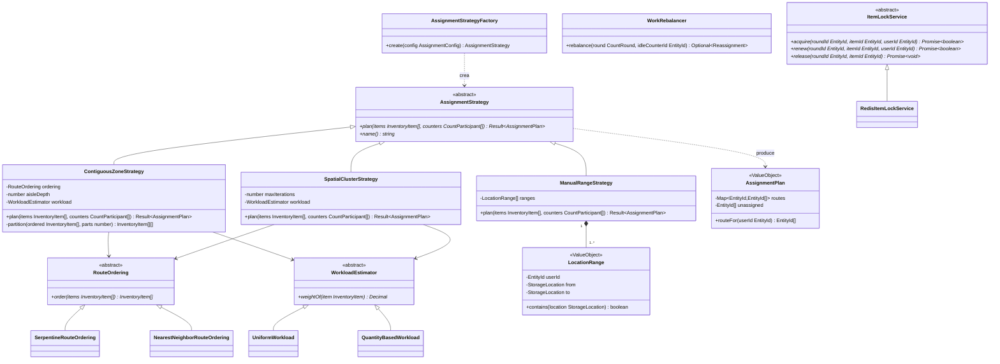

**Algoritmo `ContiguousZoneStrategy`** (cumple "cerca entre sí, lejos entre usuarios"):

1. Ordenar los productos con `SerpentineRouteOrdering`: orden natural por segmentos de ubicación
   (bodega → pasillo → estante → nivel → posición), invirtiendo el sentido en pasillos alternos.
2. Calcular el peso de cada producto (`WorkloadEstimator`).
3. Partir la secuencia en *K* bloques **contiguos** de peso balanceado (partición lineal); al elegir
   cada corte se prefiere el límite de pasillo (`zoneKey(aisleDepth)`) más cercano dentro de ±10 %
   del peso objetivo, para que dos usuarios no compartan pasillo.
4. Cada bloque es la ruta de un inventariador: los usuarios empiezan en zonas distintas y avanzan
   dentro de su zona.
5. `WorkRebalancer`: cuando alguien termina, recibe la mitad final (`releaseTail`) de la ruta del
   usuario con más pendientes, es decir, el extremo más lejano a la posición actual de este.

`SpatialClusterStrategy` aplica *k-means* con restricción de capacidad sobre coordenadas X/Y y
ordena cada clúster con `NearestNeighborRouteOrdering`. Solo está disponible si la toma tiene
coordenadas mapeadas (`InventoryFieldMapping.coordinates` no nulo, §12).
