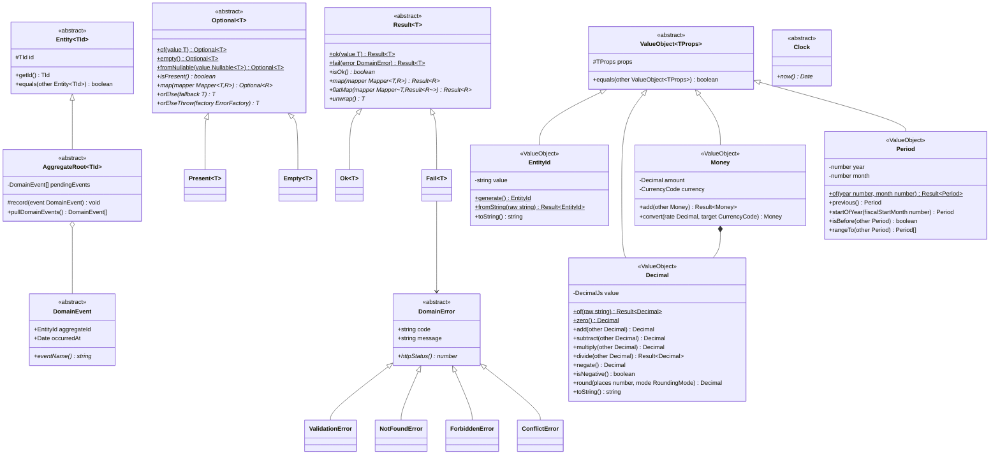
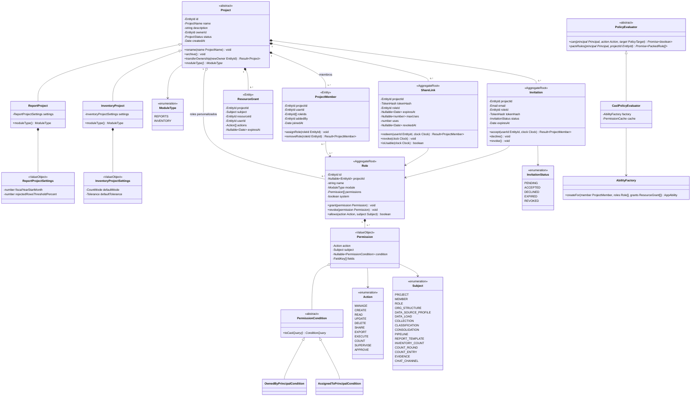
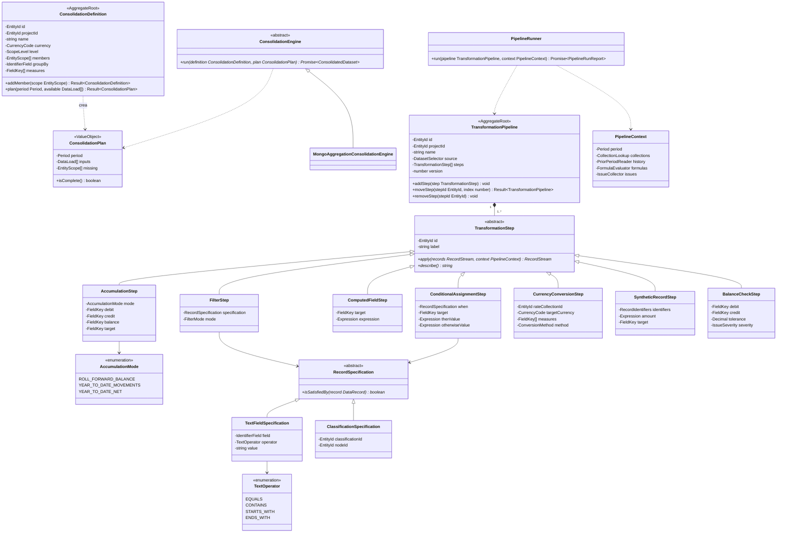
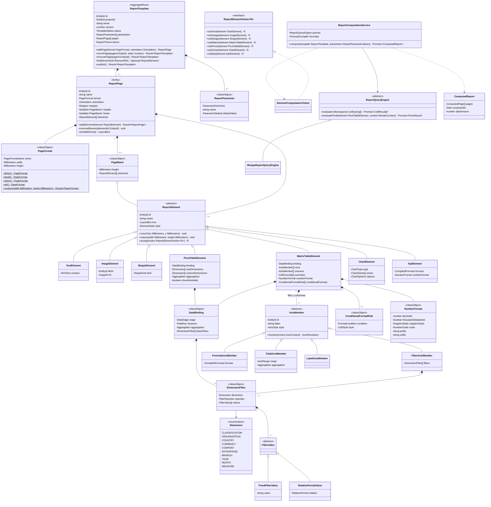

# 04 · Modelo de dominio (diagramas de clases UML)

Convenciones de los diagramas:

- `<<AggregateRoot>>`, `<<Entity>>`, `<<ValueObject>>`, `<<abstract>>`, `<<interface>>`,
  `<<enumeration>>` indican el estereotipo de cada clase.
- `-` privado, `#` protegido, `+` público; `$` método estático; `*` método abstracto.
- `Nullable~T~` = `T | null` (la **única** forma permitida de ausencia; ver
  [08-convenciones](08-convenciones-tipado-poo.md)). No existen atributos opcionales.
- Todo monto o cantidad usa `Decimal` (nunca `number`).
- Todas las entidades heredan de `Entity~TId~` y los agregados de `AggregateRoot~TId~`; para
  mantener los diagramas legibles la herencia del *kernel* se omite fuera del diagrama 1.

## 1. Núcleo compartido (`libs/shared/kernel`)



## 2. Identidad y seguridad (`iam`)

```mermaid
classDiagram
    class User {
        <<AggregateRoot>>
        -EntityId id
        -Email email
        -PasswordHash passwordHash
        -UserProfile profile
        -UserStatus status
        -TwoFactorSettings twoFactor
        -LoginSecurityState security
        -Date createdAt
        -Nullable~Date~ lastLoginAt
        +register(email Email, hash PasswordHash, profile UserProfile)$ User
        +verifyEmail(clock Clock) void
        +changePassword(hash PasswordHash) void
        +recordFailedLogin(policy LockoutPolicy, clock Clock) void
        +recordSuccessfulLogin(clock Clock) void
        +isLocked(clock Clock) boolean
        +enableTwoFactor(secret EncryptedSecret, codes RecoveryCode[]) void
        +disableTwoFactor() void
        +updateProfile(profile UserProfile) void
    }
    class Email {
        <<ValueObject>>
        -string value
        +create(raw string)$ Result~Email~
    }
    class PasswordHash {
        <<ValueObject>>
        -string value
    }
    class UserProfile {
        <<ValueObject>>
        -string displayName
        -Nullable~EntityId~ avatarFileId
        -Locale locale
        -string timeZone
    }
    class TwoFactorSettings {
        <<ValueObject>>
        -boolean enabled
        -Nullable~EncryptedSecret~ secret
        -RecoveryCode[] recoveryCodes
        +disabled()$ TwoFactorSettings
    }
    class LoginSecurityState {
        <<ValueObject>>
        -number failedAttempts
        -number lockoutCount
        -Nullable~Date~ lockedUntil
    }
    class LockoutPolicy {
        <<ValueObject>>
        -number maxAttempts
        -number baseLockMinutes
        +lockDurationFor(lockoutCount number) number
    }
    class UserStatus {
        <<enumeration>>
        PENDING_VERIFICATION
        ACTIVE
        LOCKED
        DISABLED
    }
    class Session {
        <<AggregateRoot>>
        -EntityId id
        -EntityId userId
        -DeviceInfo device
        -EntityId refreshFamilyId
        -Date createdAt
        -Date lastSeenAt
        -Nullable~Date~ revokedAt
        +touch(clock Clock) void
        +revoke(clock Clock) void
        +isActive() boolean
    }
    class RefreshToken {
        <<Entity>>
        -EntityId id
        -EntityId sessionId
        -EntityId familyId
        -TokenHash hash
        -Date expiresAt
        -Nullable~Date~ usedAt
        -Nullable~EntityId~ replacedBy
        +rotate(next RefreshToken, clock Clock) Result~RefreshToken~
        +wasAlreadyUsed() boolean
    }
    class OneTimeToken {
        <<Entity>>
        -EntityId userId
        -TokenPurpose purpose
        -TokenHash hash
        -Date expiresAt
        -Nullable~Date~ consumedAt
        +consume(clock Clock) Result~OneTimeToken~
    }
    class TokenPurpose {
        <<enumeration>>
        EMAIL_VERIFICATION
        PASSWORD_RESET
        TWO_FACTOR_CHALLENGE
    }
    class PasswordHasher {
        <<abstract>>
        +hash(plain PlainPassword)* Promise~PasswordHash~
        +verify(plain PlainPassword, hash PasswordHash)* Promise~boolean~
    }
    class Argon2PasswordHasher
    class AccessTokenIssuer {
        <<abstract>>
        +issue(principal AuthenticatedPrincipal)* AccessToken
        +verify(raw string)* Result~AuthenticatedPrincipal~
    }
    class JwtAccessTokenIssuer
    class AuthenticationService {
        -UserRepository users
        -SessionRepository sessions
        -PasswordHasher hasher
        -AccessTokenIssuer issuer
        -RefreshTokenService refreshTokens
        -SecurityAuditLogger audit
        +login(command LoginCommand) Promise~Result~LoginOutcome~~
        +completeTwoFactor(command TwoFactorCommand) Promise~Result~LoginOutcome~~
        +refresh(raw RefreshTokenValue) Promise~Result~LoginOutcome~~
        +logout(sessionId EntityId) Promise~void~
    }
    class LoginOutcome {
        <<abstract>>
    }
    class AuthenticatedLogin {
        +AccessToken accessToken
        +RefreshTokenValue refreshToken
    }
    class TwoFactorRequired {
        +ChallengeToken challenge
    }
    class SecurityAuditEntry {
        <<Entity>>
        -Nullable~EntityId~ userId
        -SecurityEventType type
        -string ipAddress
        -string userAgent
        -Date occurredAt
    }
    class UserRepository {
        <<abstract>>
        +findById(id EntityId)* Promise~Optional~User~~
        +findByEmail(email Email)* Promise~Optional~User~~
        +save(user User)* Promise~void~
    }

    User *-- Email
    User *-- PasswordHash
    User *-- UserProfile
    User *-- TwoFactorSettings
    User *-- LoginSecurityState
    User --> UserStatus
    User ..> LockoutPolicy
    User "1" --> "0..*" Session : abre
    Session "1" *-- "1..*" RefreshToken : familia
    User "1" --> "0..*" OneTimeToken
    OneTimeToken --> TokenPurpose
    PasswordHasher <|-- Argon2PasswordHasher
    AccessTokenIssuer <|-- JwtAccessTokenIssuer
    AuthenticationService --> UserRepository
    AuthenticationService --> PasswordHasher
    AuthenticationService --> AccessTokenIssuer
    AuthenticationService ..> LoginOutcome
    LoginOutcome <|-- AuthenticatedLogin
    LoginOutcome <|-- TwoFactorRequired
    AuthenticationService ..> SecurityAuditEntry : registra
```



## 3. Proyectos y control de acceso (`projects`, `access-control`)



## 4. Chat (`chat`)


## 5. Estructura organizacional (`reports/org-structure`)


> `EntityScopeFactory` garantiza que la moneda esté habilitada en el país, que la compañía
> pertenezca al país y que la empresa/sucursal pertenezcan a la compañía/empresa indicadas.

## 6. Ingestión de datos — configuración (`data-ingestion`)

Motor **compartido** por Reportes e Inventarios (`ProfileTarget`).

```mermaid
classDiagram
    class DataSourceProfile {
        <<abstract>>
        -EntityId id
        -EntityId projectId
        -string name
        -ProfileTarget target
        -ColumnDefinition[] columns
        -RowRule[] rowRules
        -number version
        +addColumn(column ColumnDefinition) Result~DataSourceProfile~
        +removeColumn(key FieldKey) void
        +identifierColumns() ColumnDefinition[]
        +activeColumns() ColumnDefinition[]
        +validateConfiguration() ValidationReport
        +sourceKind()* SourceKind
        #validateSpecifics(report ValidationReport)* void
    }
    class FileSourceProfile {
        <<abstract>>
        -FileExtension[] acceptedExtensions
        -TextEncoding encoding
    }
    class FixedWidthProfile {
        +sourceKind() SourceKind
        #validateSpecifics(report ValidationReport) void
    }
    class DelimitedProfile {
        -Delimiter delimiter
        -Nullable~string~ textQualifier
        -boolean hasHeaderRow
        #validateSpecifics(report ValidationReport) void
    }
    class SpreadsheetProfile {
        -SheetSelector sheet
        -number headerRow
        -number firstDataRow
        #validateSpecifics(report ValidationReport) void
    }
    class DatabaseProfile {
        -EntityId connectionId
        -SelectQuery query
        -QueryParameter[] parameters
        #validateSpecifics(report ValidationReport) void
    }
    class SheetSelector {
        <<abstract>>
        +resolve(sheetNames string[])* Result~string~
    }
    class FirstSheetSelector
    class NamedSheetSelector {
        -string sheetName
    }
    class Delimiter {
        <<ValueObject>>
        -string symbol
        +comma()$ Delimiter
        +semicolon()$ Delimiter
        +pipe()$ Delimiter
        +tab()$ Delimiter
        +custom(symbol string)$ Result~Delimiter~
    }
    class ColumnDefinition {
        <<ValueObject>>
        -FieldKey key
        -string label
        -ColumnLocator locator
        -DataType dataType
        -ColumnRole role
        -boolean required
        -boolean omitted
        -ParseOptions parseOptions
        +isIdentifier() boolean
    }
    class ColumnLocator {
        <<abstract>>
        +extract(raw RawRecord)* Nullable~string~
    }
    class FixedWidthLocator {
        -number start
        -number length
        +overlaps(other FixedWidthLocator) boolean
    }
    class IndexLocator {
        -number index
    }
    class HeaderLocator {
        -string headerName
    }
    class ParseOptions {
        <<ValueObject>>
        -string decimalSeparator
        -string thousandsSeparator
        -NegativeNumberFormat negativeFormat
        -string datePattern
        -boolean trim
    }
    class DataType {
        <<enumeration>>
        TEXT
        INTEGER
        DECIMAL
        DATE
        BOOLEAN
    }
    class ColumnRole {
        <<enumeration>>
        IDENTIFIER_CODE
        IDENTIFIER_NAME
        IDENTIFIER_ID
        MEASURE
        DEBIT
        CREDIT
        BALANCE
        OPENING_BALANCE
        ATTRIBUTE
        DATE
        LOCATION
        EXPECTED_QUANTITY
        UNIT_COST
    }
    class RowRule {
        <<abstract>>
        +shouldSkip(line RawLine)* boolean
        +describe()* string
    }
    class SkipBlankLinesRule
    class SkipPageBreaksRule
    class SkipLeadingLinesRule {
        -number count
    }
    class SkipMatchingTextRule {
        -TextOperator operator
        -string text
    }
    class DatabaseConnection {
        <<AggregateRoot>>
        -EntityId projectId
        -DatabaseEngine engine
        -string host
        -number port
        -string database
        -string username
        -EncryptedSecret secret
        -number timeoutMs
    }
    class DatabaseEngine {
        <<enumeration>>
        SQL_SERVER
        POSTGRESQL
        MYSQL
        MONGODB
        ORACLE
    }
    class ProfileTarget {
        <<enumeration>>
        REPORT_DATASET
        INVENTORY_ITEMS
    }

    DataSourceProfile <|-- FileSourceProfile
    DataSourceProfile <|-- DatabaseProfile
    FileSourceProfile <|-- FixedWidthProfile
    FileSourceProfile <|-- DelimitedProfile
    FileSourceProfile <|-- SpreadsheetProfile
    DataSourceProfile --> ProfileTarget
    DataSourceProfile "1" *-- "1..*" ColumnDefinition
    DataSourceProfile "1" *-- "0..*" RowRule
    ColumnDefinition *-- ColumnLocator
    ColumnDefinition *-- ParseOptions
    ColumnDefinition --> DataType
    ColumnDefinition --> ColumnRole
    ColumnLocator <|-- FixedWidthLocator
    ColumnLocator <|-- IndexLocator
    ColumnLocator <|-- HeaderLocator
    RowRule <|-- SkipBlankLinesRule
    RowRule <|-- SkipPageBreaksRule
    RowRule <|-- SkipLeadingLinesRule
    RowRule <|-- SkipMatchingTextRule
    SpreadsheetProfile *-- SheetSelector
    SheetSelector <|-- FirstSheetSelector
    SheetSelector <|-- NamedSheetSelector
    DelimitedProfile *-- Delimiter
    DatabaseProfile --> DatabaseConnection
    DatabaseConnection --> DatabaseEngine
```



## 7. Ingestión de datos — lectura y validación


> Patrones: **Template Method** (`RecordReader.read` fija el algoritmo: abrir → aplicar
> `RowRule` → dividir), **Strategy** (lectores, conectores, *parsers*), **Factory**
> (`RecordReaderFactory`), **Null Object** (`EmptyValue` evita `null`/`undefined` en celdas).

## 8. Datasets, colecciones y clasificaciones

```mermaid
classDiagram
    class Dataset {
        <<abstract>>
        -EntityId id
        -EntityId projectId
        -Period period
        -DatasetStatus status
        -number dataVersion
        -number recordCount
        +stage()* DataStage
        +publish(clock Clock) void
    }
    class DataLoad {
        -EntityId profileId
        -EntityScope scope
        -number version
        -EntityId importJobId
        -Nullable~EntityId~ supersededBy
        +supersede(next DataLoad) void
        +stage() DataStage
    }
    class ConsolidatedDataset {
        -EntityId definitionId
        -EntityId[] sourceDatasetIds
        +stage() DataStage
    }
    class TransformedDataset {
        -EntityId pipelineId
        -number pipelineVersion
        -EntityId sourceDatasetId
        +stage() DataStage
    }
    class DataStage {
        <<enumeration>>
        RAW
        CONSOLIDATED
        TRANSFORMED
    }
    class DatasetStatus {
        <<enumeration>>
        STAGED
        PUBLISHED
        SUPERSEDED
        FAILED
    }
    class DataRecord {
        <<Entity>>
        -EntityId datasetId
        -DataStage stage
        -Period period
        -EntityScope scope
        -RecordIdentifiers identifiers
        -MeasureSet measures
        -AttributeSet attributes
        -ClassificationMembership[] memberships
        +measure(key FieldKey) Decimal
        +withMeasure(key FieldKey, value Decimal) DataRecord
    }
    class RecordIdentifiers {
        <<ValueObject>>
        -Nullable~string~ code
        -Nullable~string~ name
        -Nullable~string~ externalId
        +valueOf(field IdentifierField) Nullable~string~
    }
    class MeasureSet {
        <<ValueObject>>
        -Map~FieldKey,Decimal~ values
        +get(key FieldKey) Decimal
        +with(key FieldKey, value Decimal) MeasureSet
    }
    class SupplementaryCollection {
        <<AggregateRoot>>
        -EntityId id
        -EntityId projectId
        -string name
        -CollectionField[] fields
        -CollectionPeriodicity periodicity
        +addField(field CollectionField) Result~SupplementaryCollection~
        +createEntry(values FieldValueMap, period Nullable~Period~) Result~CollectionEntry~
        +keyFields() CollectionField[]
    }
    class CollectionField {
        <<ValueObject>>
        -FieldKey key
        -string label
        -DataType dataType
        -boolean isKey
        -boolean required
    }
    class CollectionEntry {
        <<Entity>>
        -EntityId collectionId
        -Nullable~Period~ period
        -FieldValueMap values
    }
    class CollectionPeriodicity {
        <<enumeration>>
        NONE
        MONTHLY
        DAILY
    }
    class Classification {
        <<AggregateRoot>>
        -EntityId id
        -EntityId projectId
        -string name
        -IdentifierField targetField
        -ClassificationNode[] roots
        -UnmatchedPolicy unmatchedPolicy
        +addNode(parentId Nullable~EntityId~, node ClassificationNode) Result~Classification~
        +moveNode(nodeId EntityId, newParentId Nullable~EntityId~) Result~Classification~
        +classify(identifiers RecordIdentifiers) Optional~ClassificationMembership~
        +coverage(identifiers RecordIdentifiers[]) CoverageReport
    }
    class ClassificationNode {
        <<Entity>>
        -EntityId id
        -string code
        -string name
        -number order
        -PresentationSign sign
        -MatchRule rule
        -ClassificationNode[] children
        +isLeaf() boolean
        +matches(value string) boolean
    }
    class MatchRule {
        <<abstract>>
        +isSatisfiedBy(value string)* boolean
        +and(other MatchRule) MatchRule
        +or(other MatchRule) MatchRule
        +not() MatchRule
    }
    class EqualsRule {
        -string[] values
    }
    class StartsWithRule {
        -string prefix
    }
    class ContainsRule {
        -string fragment
    }
    class EndsWithRule {
        -string suffix
    }
    class RangeRule {
        -string from
        -string to
    }
    class AndRule
    class OrRule
    class NotRule
    class NeverMatchRule
    class ClassificationMembership {
        <<ValueObject>>
        -EntityId classificationId
        -EntityId nodeId
        -EntityId[] ancestorIds
    }
    class CoverageReport {
        <<ValueObject>>
        -number matched
        -string[] unmatched
        -string[] ambiguous
    }

    Dataset <|-- DataLoad
    Dataset <|-- ConsolidatedDataset
    Dataset <|-- TransformedDataset
    Dataset --> DataStage
    Dataset --> DatasetStatus
    Dataset "1" *-- "0..*" DataRecord
    DataRecord *-- RecordIdentifiers
    DataRecord *-- MeasureSet
    DataRecord "1" *-- "0..*" ClassificationMembership
    SupplementaryCollection "1" *-- "1..*" CollectionField
    SupplementaryCollection "1" --> "0..*" CollectionEntry
    SupplementaryCollection --> CollectionPeriodicity
    Classification "1" *-- "1..*" ClassificationNode
    ClassificationNode "1" *-- "0..*" ClassificationNode : hijos
    ClassificationNode *-- MatchRule
    MatchRule <|-- EqualsRule
    MatchRule <|-- StartsWithRule
    MatchRule <|-- ContainsRule
    MatchRule <|-- EndsWithRule
    MatchRule <|-- RangeRule
    MatchRule <|-- AndRule
    MatchRule <|-- OrRule
    MatchRule <|-- NotRule
    MatchRule <|-- NeverMatchRule
    Classification ..> ClassificationMembership : produce
    Classification ..> CoverageReport
```



> Patrones: **Composite** (árbol de `ClassificationNode`), **Specification** (`MatchRule` con
> combinadores `and/or/not`), **Null Object** (`NeverMatchRule` para nodos agrupadores sin regla).

## 9. Consolidación y operaciones (`consolidation`, `transformations`)



Semántica de `AccumulationStep` (RF-REP-10):

| Modo | Cálculo para el período *p* |
|---|---|
| `ROLL_FORWARD_BALANCE` | `saldo(p) = saldo(p−1) + debe(p) − haber(p)` |
| `YEAR_TO_DATE_MOVEMENTS` | `debeAcum(p) = Σ debe(inicioAño..p)`; `haberAcum(p) = Σ haber(inicioAño..p)` |
| `YEAR_TO_DATE_NET` | `netoAcum(p) = Σ (debe − haber)(inicioAño..p)` |

> Patrones: **Pipeline / Chain of Responsibility** (`TransformationStep`), **Strategy**
> (`ConsolidationEngine`), **Specification** (`RecordSpecification`).

## 10. Motor de fórmulas (`libs/shared/formula-engine`)

```mermaid
classDiagram
    class FormulaCompiler {
        -Lexer lexer
        -Parser parser
        +compile(source string) Result~CompiledFormula~
    }
    class Lexer {
        +tokenize(source string) Result~Token[]~
    }
    class Token {
        <<ValueObject>>
        -TokenType type
        -string lexeme
        -number position
    }
    class Parser {
        -Token[] tokens
        -number cursor
        +parse(tokens Token[]) Result~Expression~
        -parseExpression(precedence number) Expression
    }
    class CompiledFormula {
        -string source
        -Expression root
        -CellAddress[] dependencies
    }
    class Expression {
        <<abstract>>
        +accept(visitor ExpressionVisitor~R~)* R
    }
    class NumberLiteral {
        -Decimal value
    }
    class TextLiteral {
        -string value
    }
    class CellReference {
        -Nullable~string~ page
        -Nullable~string~ element
        -number row
        -number column
    }
    class RangeReference {
        -CellReference start
        -CellReference end
    }
    class UnaryExpression {
        -UnaryOperator operator
        -Expression operand
    }
    class BinaryExpression {
        -BinaryOperator operator
        -Expression left
        -Expression right
    }
    class FunctionCall {
        -string name
        -Expression[] args
    }
    class ExpressionVisitor~R~ {
        <<interface>>
        +visitNumber(node NumberLiteral) R
        +visitText(node TextLiteral) R
        +visitCell(node CellReference) R
        +visitRange(node RangeReference) R
        +visitUnary(node UnaryExpression) R
        +visitBinary(node BinaryExpression) R
        +visitCall(node FunctionCall) R
    }
    class Evaluator {
        -EvaluationContext context
        -FunctionRegistry functions
    }
    class DependencyCollector
    class DependencyGraph {
        +add(cell CellAddress, dependencies CellAddress[]) void
        +evaluationOrder() Result~CellAddress[]~
    }
    class FormulaFunction {
        <<abstract>>
        +name()* string
        +arity()* Arity
        +invoke(args FormulaValue[], context EvaluationContext)* FormulaValue
    }
    class SumFunction
    class IfFunction
    class SafeDivideFunction
    class ClassificationFunction
    class CollectionFunction
    class PeriodFunction
    class FunctionRegistry {
        +register(fn FormulaFunction) void
        +resolve(name string) Optional~FormulaFunction~
    }
    class FormulaValue {
        <<abstract>>
    }
    class NumberValue {
        -Decimal value
    }
    class TextFormulaValue
    class BooleanFormulaValue
    class ErrorValue {
        -FormulaErrorCode code
    }

    FormulaCompiler --> Lexer
    FormulaCompiler --> Parser
    Lexer ..> Token
    Parser ..> Expression
    FormulaCompiler ..> CompiledFormula
    CompiledFormula *-- Expression
    Expression <|-- NumberLiteral
    Expression <|-- TextLiteral
    Expression <|-- CellReference
    Expression <|-- RangeReference
    Expression <|-- UnaryExpression
    Expression <|-- BinaryExpression
    Expression <|-- FunctionCall
    ExpressionVisitor~R~ <|.. Evaluator
    ExpressionVisitor~R~ <|.. DependencyCollector
    Evaluator --> FunctionRegistry
    FunctionRegistry o-- FormulaFunction
    FormulaFunction <|-- SumFunction
    FormulaFunction <|-- IfFunction
    FormulaFunction <|-- SafeDivideFunction
    FormulaFunction <|-- ClassificationFunction
    FormulaFunction <|-- CollectionFunction
    FormulaFunction <|-- PeriodFunction
    Evaluator ..> FormulaValue
    FormulaValue <|-- NumberValue
    FormulaValue <|-- TextFormulaValue
    FormulaValue <|-- BooleanFormulaValue
    FormulaValue <|-- ErrorValue
    DependencyCollector ..> DependencyGraph
```



Ejemplos de fórmulas soportadas:

```text
=F3 - F5                                   ' fila 3 menos fila 5 de la misma tabla
=SUMA(F1:F4)                               ' total de un rango
=Resultados!C12 / Balance!C30              ' referencia a otras tablas del informe
=Pagina2.EBITDA!C4                         ' referencia a otra página
=DIVIDIR(F10; F2; 0)                       ' división segura con valor por defecto
=CLASIF("Ingresos") - CLASIF("Costos")     ' saldo de nodos de clasificación
=F8 / COLECCION("TipoCambio"; "USD"; PERIODO())
=SI(F4 < 0; 0; F4)
```

> Patrones: **Interpreter + Composite** (AST), **Visitor** (evaluar, recolectar dependencias,
> formatear), **Registry** (funciones extensibles). Sin `eval` ni `Function`.

## 11. Plantillas de informe (`templates`, `rendering`)



**Resolución de una celda** de `MatrixTableElement`:

```text
celda(f, c) = agregación( medida,
                 filtros(binding.baseFilters)
               ∩ filtros(fila f)
               ∩ filtros(columna c)
               ∩ parámetros del informe (período, alcance) )
```

Las filas/columnas de tipo fórmula o total se evalúan después, en el orden topológico calculado
por `DependencyGraph`. Todas las celdas de filtro de una tabla se resuelven en **una sola**
agregación de MongoDB (`$match` común + `$group` por clave de fila × columna).

> Patrones: **Composite** (plantilla → páginas → elementos), **Visitor** (cálculo, renderizado,
> exportación), **Factory Method** (`PageFormat.letter()`…), **Strategy** (`ReportQueryEngine`).

## 12. Inventarios — toma y rondas (`inventory`)

```mermaid
classDiagram
    class InventoryCount {
        <<AggregateRoot>>
        -EntityId id
        -EntityId projectId
        -string name
        -string warehouse
        -Date scheduledAt
        -CountMode mode
        -Tolerance tolerance
        -number maxRounds
        -InventoryCountStatus status
        -EntityId sourceProfileId
        -FieldVisibilityPolicy visibility
        -CountParticipant[] participants
        -CountRound[] rounds
        +addParticipant(participant CountParticipant) Result~InventoryCount~
        +configureVisibility(policy FieldVisibilityPolicy) void
        +markReady() Result~InventoryCount~
        +startFirstRound(plan AssignmentPlan, clock Clock) Result~CountRound~
        +closeCurrentRound(clock Clock) Result~RoundSummary~
        +openRecount(itemIds EntityId[], plan AssignmentPlan, clock Clock) Result~CountRound~
        +close(clock Clock) Result~CountResult~
        +currentRound() Optional~CountRound~
    }
    class InventoryCountStatus {
        <<enumeration>>
        DRAFT
        READY
        IN_PROGRESS
        PAUSED
        IN_REVIEW
        CLOSED
        CANCELLED
    }
    class CountMode {
        <<enumeration>>
        BLIND
        WITH_EXPECTED_STOCK
    }
    class Tolerance {
        <<ValueObject>>
        -ToleranceKind kind
        -Decimal value
        +isExceededBy(expected Decimal, counted Decimal) boolean
    }
    class CountParticipant {
        <<ValueObject>>
        -EntityId userId
        -ParticipantRole role
    }
    class ParticipantRole {
        <<enumeration>>
        COUNTER
        SUPERVISOR
    }
    class FieldVisibilityPolicy {
        <<ValueObject>>
        -Map~ParticipantRole,FieldKey[]~ byRole
        -Map~EntityId,FieldKey[]~ byUser
        +visibleFieldsFor(participant CountParticipant) FieldKey[]
    }
    class InventoryItem {
        <<Entity>>
        -EntityId id
        -EntityId countId
        -string sku
        -string description
        -string unit
        -Decimal expectedQuantity
        -Decimal unitCost
        -StorageLocation location
        -AttributeSet attributes
        +project(fields FieldKey[]) ItemView
    }
    class StorageLocation {
        <<ValueObject>>
        -string[] segments
        -Nullable~Coordinates~ coordinates
        +compareTo(other StorageLocation) number
        +zoneKey(depth number) string
    }
    class CountRound {
        <<Entity>>
        -EntityId id
        -number number
        -RoundScope scope
        -RoundStatus status
        -CounterAssignment[] assignments
        -Date openedAt
        -Nullable~Date~ closedAt
        +nextItemFor(userId EntityId) Optional~EntityId~
        +record(entry CountEntry) Result~CountRound~
        +reassign(from EntityId, to EntityId, itemIds EntityId[]) Result~CountRound~
        +progress() RoundProgress
    }
    class RoundScope {
        <<enumeration>>
        ALL_ITEMS
        DISCREPANCIES_OF_PREVIOUS
    }
    class RoundStatus {
        <<enumeration>>
        OPEN
        CLOSED
    }
    class CounterAssignment {
        <<Entity>>
        -EntityId userId
        -EntityId[] route
        -number cursor
        -AssignmentOrigin origin
        +next() Optional~EntityId~
        +releaseTail(count number) EntityId[]
        +append(itemIds EntityId[]) void
        +remaining() number
    }
    class CountEntry {
        <<Entity>>
        -EntityId id
        -EntityId roundId
        -EntityId itemId
        -EntityId counterId
        -Decimal countedQuantity
        -CountOutcome outcome
        -Nullable~string~ comment
        -EntityId[] evidenceIds
        -Date countedAt
        -number revision
        +correct(quantity Decimal, by EntityId, clock Clock) CountEntry
    }
    class CountOutcome {
        <<enumeration>>
        COUNTED
        NOT_FOUND
        DAMAGED
        OTHER
    }
    class Evidence {
        <<Entity>>
        -EntityId id
        -EntityId entryId
        -EntityId fileId
        -EvidenceKind kind
        -EntityId uploadedBy
        -Date capturedAt
    }
    class VarianceCalculator {
        +calculate(item InventoryItem, entry CountEntry, tolerance Tolerance) Variance
    }
    class Variance {
        <<ValueObject>>
        -Decimal expected
        -Decimal counted
        -Decimal difference
        -Decimal valuedDifference
        -boolean withinTolerance
    }

    InventoryCount --> InventoryCountStatus
    InventoryCount --> CountMode
    InventoryCount *-- Tolerance
    InventoryCount *-- FieldVisibilityPolicy
    InventoryCount "1" *-- "1..*" CountParticipant
    CountParticipant --> ParticipantRole
    InventoryCount "1" --> "1..*" InventoryItem : productos
    InventoryItem *-- StorageLocation
    InventoryCount "1" *-- "1..*" CountRound : rondas
    CountRound --> RoundScope
    CountRound --> RoundStatus
    CountRound "1" *-- "1..*" CounterAssignment
    CountRound "1" --> "0..*" CountEntry
    CountEntry --> CountOutcome
    CountEntry "1" --> "0..*" Evidence
    VarianceCalculator ..> Variance
    VarianceCalculator ..> Tolerance
```



## 13. Inventarios — estrategias de asignación


**Algoritmo `ContiguousZoneStrategy`** (cumple "cerca entre sí, lejos entre usuarios"):

1. Ordenar los productos con `SerpentineRouteOrdering`: orden natural por segmentos de ubicación
   (bodega → pasillo → estante → nivel → posición), invirtiendo el sentido en pasillos alternos.
2. Calcular el peso de cada producto (`WorkloadEstimator`).
3. Partir la secuencia en *K* bloques **contiguos** de peso balanceado (partición lineal); al elegir
   cada corte se prefiere el límite de pasillo (`zoneKey(aisleDepth)`) más cercano dentro de ±10 %
   del peso objetivo, para que dos usuarios no compartan pasillo.
4. Cada bloque es la ruta de un inventariador: los usuarios empiezan en zonas distintas y avanzan
   dentro de su zona.
5. `WorkRebalancer`: cuando alguien termina, recibe la mitad final (`releaseTail`) de la ruta del
   usuario con más pendientes, es decir, el extremo más lejano a la posición actual de este.

`SpatialClusterStrategy` aplica *k-means* con restricción de capacidad sobre coordenadas X/Y y
ordena cada clúster con `NearestNeighborRouteOrdering`.
