# 05 · Flujos (secuencia y actividad) y máquinas de estado

## 1. Secuencias

### 1.1 Inicio de sesión con 2FA y emisión de tokens

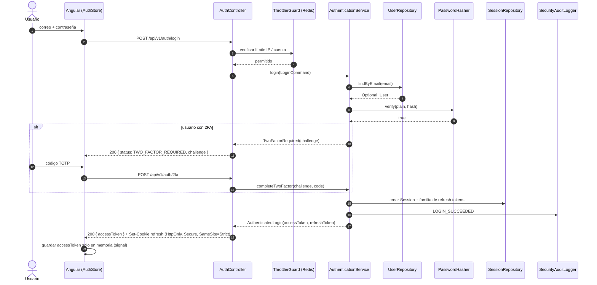

### 1.2 Rotación de *refresh token* con detección de reutilización

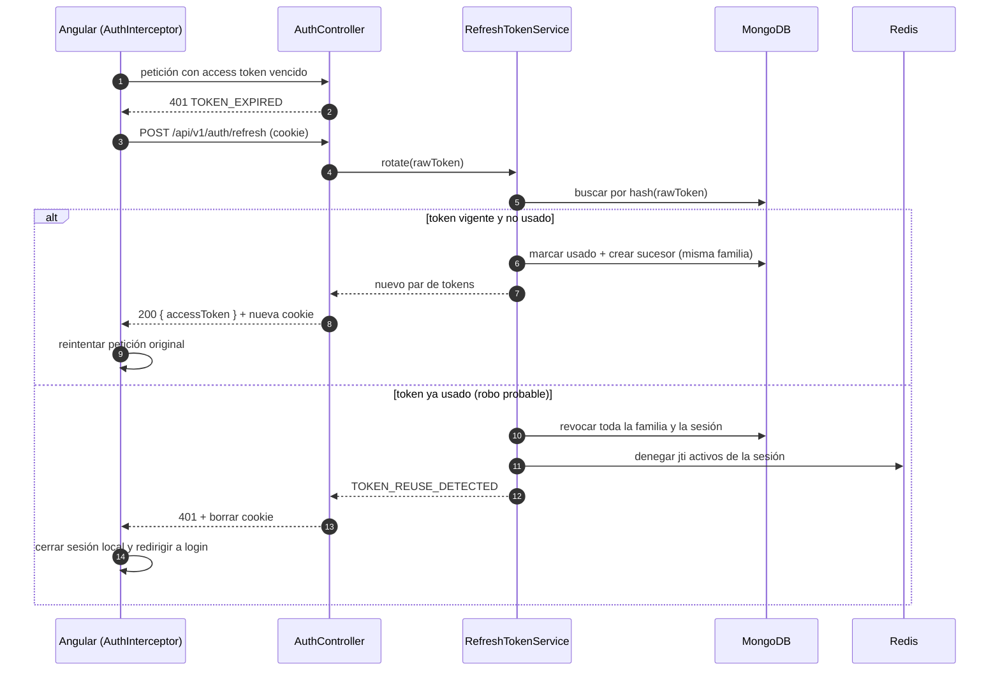

### 1.3 Importación de datos (Reportes)

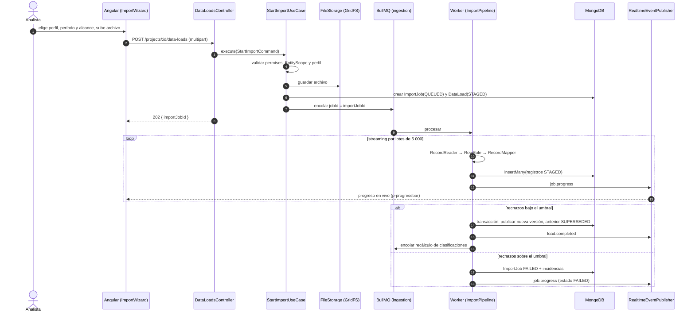

### 1.4 Previsualización en vivo y exportación PDF

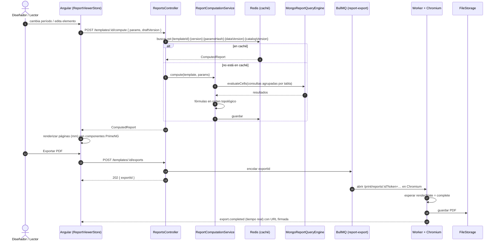

> **Encabezados en el informe calculado.** `ComputedReport` transporta claves internas de
> encabezado (`FieldKey`), nunca nombres; los títulos de filas, columnas, dimensiones, series y
> leyendas se resuelven con el catálogo vigente (`FieldCatalogStore.labelOf`) al renderizar la
> previsualización y la página de impresión. La clave de caché incluye `catalogVersion`
> (`rpt:{templateId}:{version}:{paramsHash}:{dataVersion}:{catalogVersion}`), de modo que
> renombrar un encabezado (p. ej. *Debe* → *Cargos*) invalida la caché y **no** crea una versión
> nueva de la plantilla: las definiciones guardan claves y las fórmulas su forma canónica
> (`=[#f_6Pw4] - [#f_2Lm5]`). Antes de calcular, `ReportComputationService.compute()` valida cada
> referencia y responde `FIELD_NOT_FOUND`, `FIELD_INACTIVE` o `FIELD_INCOMPATIBLE` indicando el
> elemento afectado.

### 1.5 Conteo guiado en tiempo real (Inventarios)

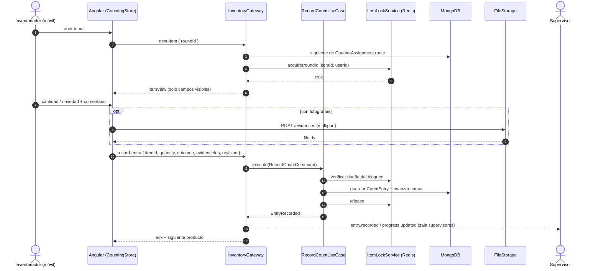

### 1.6 Compartir proyecto por vínculo o por correo

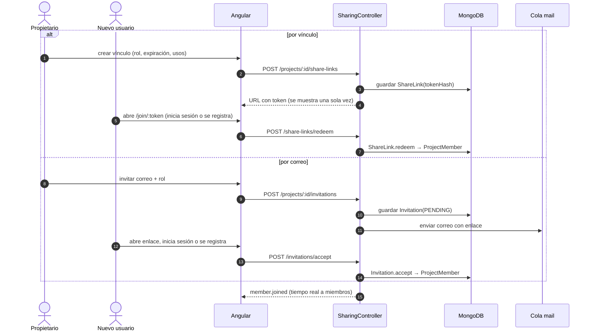

## 2. Actividades

### 2.1 Ciclo de vida de los datos de un proyecto de reportes

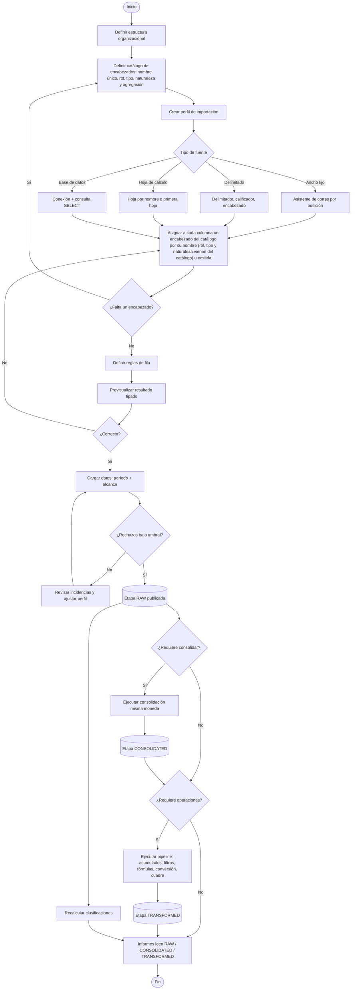

La obligatoriedad de una columna no se define en el perfil: se deriva del rol del encabezado
(los de rol `id` son obligatorios). La columna guarda solo la `FieldKey` del encabezado y una
instantánea (`FieldSnapshot`) tomada al activar la versión; la interfaz la muestra siempre con el
nombre vigente. Desde ese momento el encabezado se elige por su nombre (por ejemplo *Debe*,
*Haber*, *Saldo* o *Monto de venta*) en clasificaciones, consolidaciones, pipelines, informes y
fórmulas (`=[Debe] - [Haber]`); los encabezados derivados que crean los pasos de operaciones con
«Nuevo encabezado…» quedan disponibles por su nombre en todos los pasos y elementos posteriores.

### 2.2 Toma de inventario con rondas

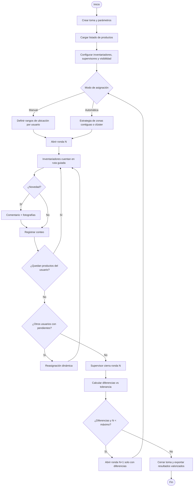

### 2.3 Renombrar o desactivar un encabezado

Aplica a encabezados importados y derivados del `FieldCatalog` del proyecto. Todas las
definiciones (preconfiguraciones, pipelines, consolidaciones, clasificaciones, colecciones,
plantillas, mapeos de inventario y claves de `data_records`) guardan `FieldKey`, por lo que
renombrar es una sola actualización del catálogo; desactivar y reemplazar consultan primero el
índice de usos (`FieldUsageIndex`, colección `field_usages`).

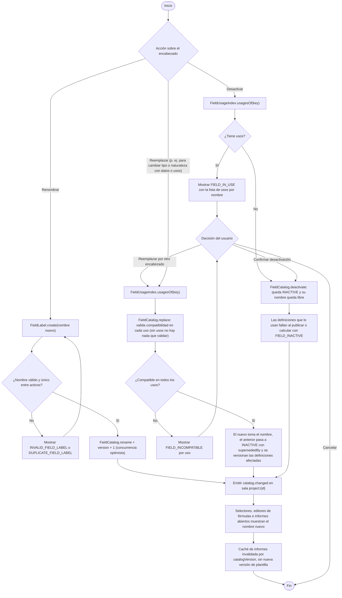

- **Renombrar** nunca altera resultados ni membresías: tras renombrar *Debe* → *Cargos* el editor
  muestra `=[Cargos] - [Haber]` sin intervención, porque la fórmula guardada es
  `=[#f_6Pw4] - [#f_2Lm5]`.
- **Desactivar** libera el nombre; la interfaz muestra las referencias antiguas como
  «Debe (inactivo)». Reutilizar ese nombre en otro encabezado nunca redirige referencias antiguas.
- **Reemplazar** se puede pedir directamente, tenga o no usos (por ejemplo, para cambiar tipo o
  naturaleza de un encabezado con datos cargados, que son inmutables); trata la clave antigua como alias de la nueva al leer períodos anteriores, cuando
  ambas son compatibles.

## 3. Máquinas de estado

### 3.1 `ImportJob`

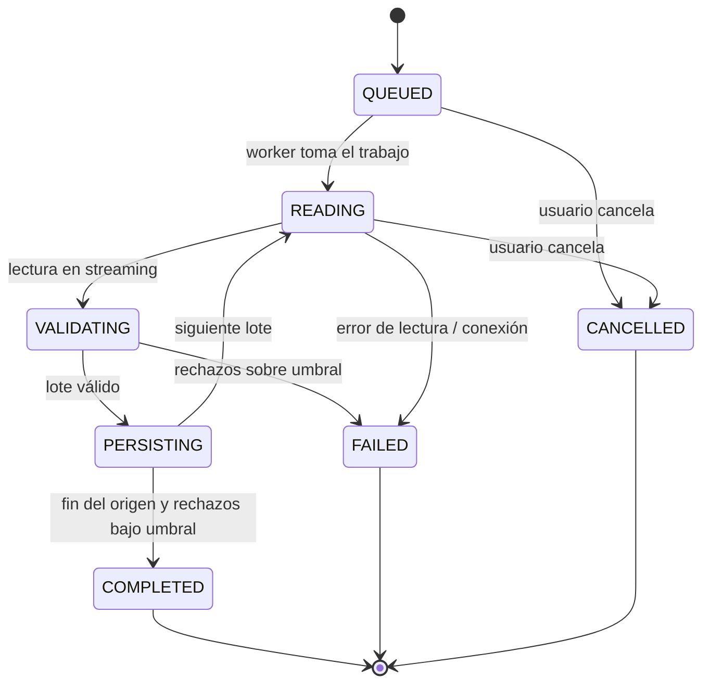

### 3.2 `Dataset` (cargas, consolidados, transformados)

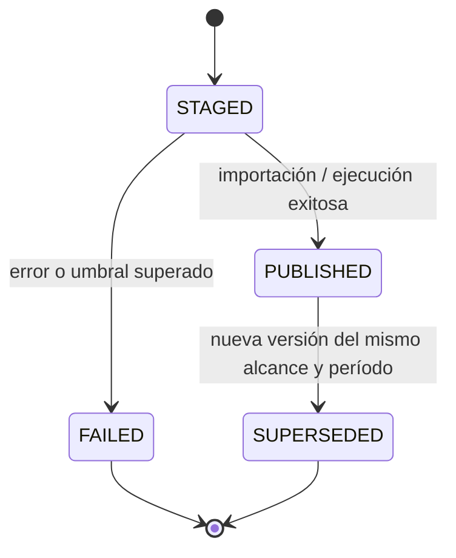

### 3.3 `InventoryCount`

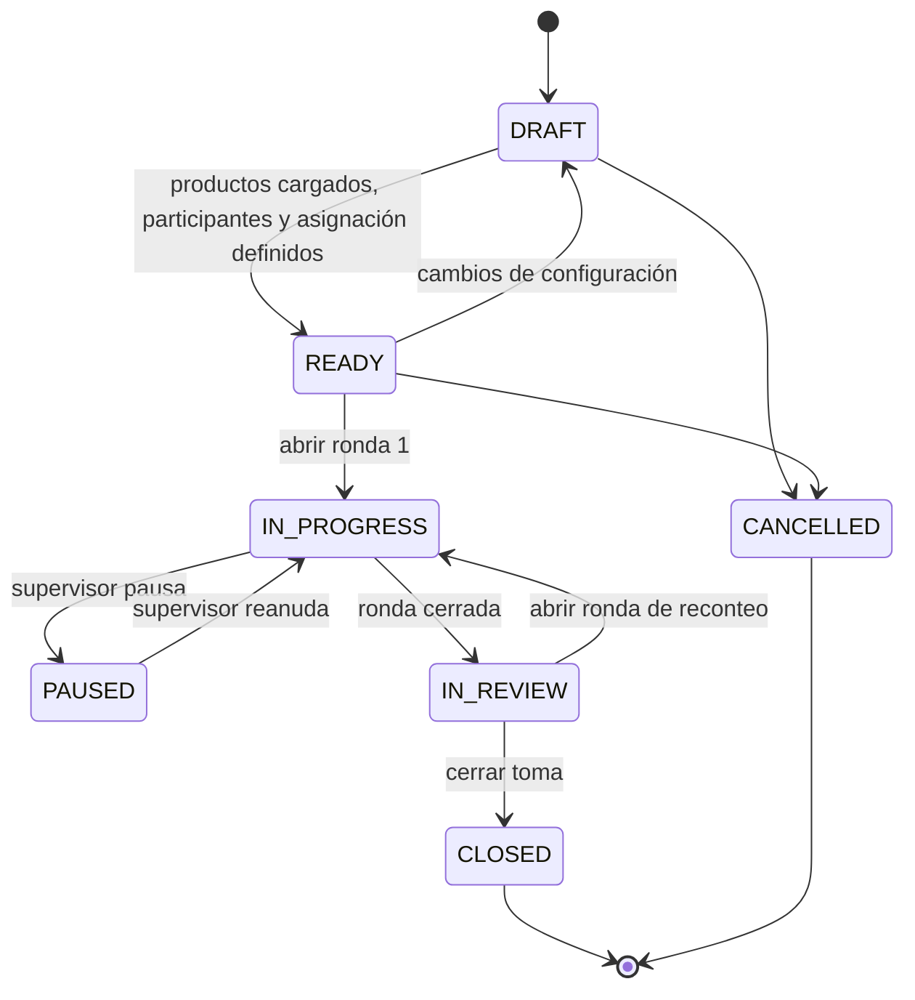

### 3.4 `Invitation`

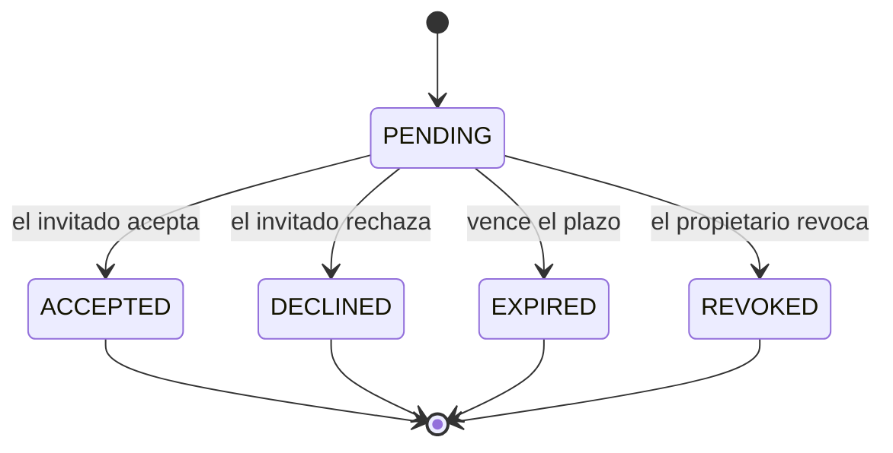

### 3.5 `ReportTemplate`

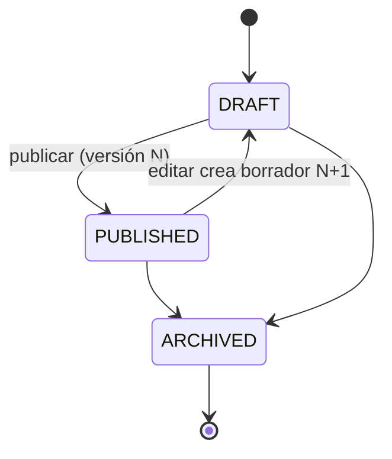

### 3.6 `CatalogField`

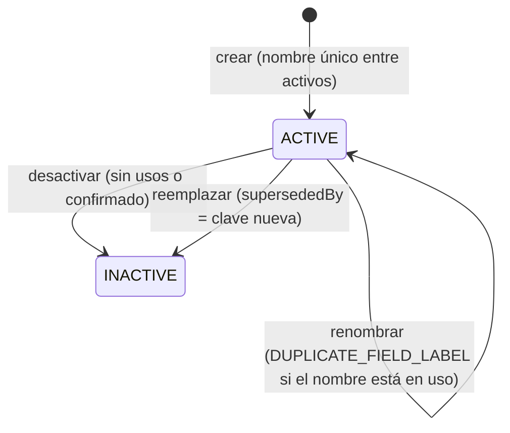

> Tipo y naturaleza de un `CatalogField` son inmutables cuando el encabezado tiene datos cargados
> o usos registrados en `field_usages`; el nombre siempre se puede cambiar. `INACTIVE` es un estado
> final: `FieldCatalog` no define una operación para reactivar; si se necesita de nuevo, se crea
> otro encabezado (con otra clave) o se usa el sucesor. Un encabezado reemplazado conserva
> `supersededBy`.
