# 06 · Modelo de datos (MongoDB)

## 1. Principios

- **Un agregado = un documento** (o un documento raíz y sus colecciones hijas cuando crecen sin
  límite: registros de datos, mensajes, conteos).
- Todos los documentos de negocio llevan `projectId` para aislar datos y construir índices
  compuestos que empiezan por el proyecto.
- Montos y cantidades se guardan como **`Decimal128`**; el mapper los convierte a `Decimal`.
- Campos ausentes se guardan como **`null` explícito** (`@Prop({ type: String, default: null })`),
  coherente con la prohibición de `undefined`.
- Concurrencia optimista con `version` (`optimisticConcurrency: true` en los schemas de agregados
  editables colaborativamente).
- Colecciones con discriminadores de Mongoose para jerarquías POO: `projects` (`moduleType`),
  `data_source_profiles` (`sourceKind`), `conversations` (`type`), `datasets` (`stage`).
- *Replica set* obligatorio: transacciones al publicar versiones y *change streams* opcionales.
- **Referencias a encabezados por clave interna**: el usuario nombra los encabezados con total
  libertad (*Debe*, *Haber*, *Saldo*, *Monto de venta*…) y los usa por ese nombre en selectores y
  fórmulas, pero **toda referencia guardada** usa la clave generada `FieldKey` (p. ej. `f_6Pw4`),
  **nunca el nombre**: columnas de preconfiguraciones, máscaras, validaciones de cuadre, atributos
  derivados, pasos de pipelines, consolidaciones, clasificaciones, colecciones, elementos de informe,
  mapeo y visibilidad de inventario y claves de `data_records`. El nombre (`label`) solo existe en
  `field_catalogs` y se resuelve con el catálogo vigente al mostrar. Renombrar un encabezado es una
  sola actualización de `field_catalogs`: no se migra ningún otro documento ni se republican
  plantillas.
- **Fórmulas en forma canónica**: el usuario escribe `=[Monto de venta] / [Unidades vendidas]` y se
  guarda `=[#f_4Mv1] / [#f_5Uv2]` (con `#id` para colecciones y nodos de clasificación), junto con
  sus dependencias (`CompiledFormula{canonicalSource, cellDependencies[], fieldDependencies[]}`). El
  editor la presenta con los nombres vigentes: tras renombrar *Debe* → *Cargos*, `=[Debe] - [Haber]`
  (guardada como `=[#f_6Pw4] - [#f_2Lm5]`) se muestra como `=[Cargos] - [Haber]` sin intervención.

## 2. Diagrama entidad-relación

```mermaid
erDiagram
    USERS ||--o{ SESSIONS : abre
    SESSIONS ||--|{ REFRESH_TOKENS : rota
    USERS ||--o{ ONE_TIME_TOKENS : recibe
    USERS ||--o{ AUDIT_LOGS : genera

    USERS ||--o{ PROJECT_MEMBERS : participa
    PROJECTS ||--|{ PROJECT_MEMBERS : tiene
    PROJECTS ||--o{ ROLES : define
    PROJECT_MEMBERS }o--|{ ROLES : usa
    PROJECTS ||--o{ RESOURCE_GRANTS : concede
    PROJECTS ||--o{ SHARE_LINKS : comparte
    PROJECTS ||--o{ INVITATIONS : invita

    CONVERSATIONS ||--o{ MESSAGES : contiene
    CONVERSATIONS ||--o{ READ_MARKERS : registra

    PROJECTS ||--o| ORGANIZATIONS : reportes
    ORGANIZATIONS ||--|{ COMPANIES : agrupa
    COMPANIES ||--o{ DATA_LOADS : etiqueta

    PROJECTS ||--|| FIELD_CATALOGS : nombra
    FIELD_CATALOGS ||--o{ FIELD_USAGES : indexa
    PROJECTS ||--o{ DATA_SOURCE_PROFILES : configura
    DATA_SOURCE_PROFILES }o--o| DB_CONNECTIONS : usa
    DATA_SOURCE_PROFILES ||--o{ IMPORT_JOBS : ejecuta
    IMPORT_JOBS ||--o| DATASETS : produce
    DATASETS ||--o{ DATA_RECORDS : contiene

    PROJECTS ||--o{ COLLECTIONS : define
    COLLECTIONS ||--o{ COLLECTION_ENTRIES : contiene
    PROJECTS ||--o{ CLASSIFICATIONS : define
    PROJECTS ||--o{ CONSOLIDATION_DEFINITIONS : define
    PROJECTS ||--o{ PIPELINES : define
    PROJECTS ||--o{ REPORT_TEMPLATES : define
    REPORT_TEMPLATES ||--o{ REPORT_EXPORTS : exporta

    PROJECTS ||--o{ INVENTORY_COUNTS : programa
    INVENTORY_COUNTS ||--|{ INVENTORY_ITEMS : incluye
    INVENTORY_COUNTS ||--|{ COUNT_ROUNDS : itera
    COUNT_ROUNDS ||--o{ COUNT_ENTRIES : registra
    INVENTORY_ITEMS ||--o{ COUNT_ENTRIES : cuenta
    COUNT_ENTRIES ||--o{ EVIDENCES : adjunta
```



## 3. Colecciones e índices

### 3.1 Globales

| Colección | Campos clave | Índices |
|---|---|---|
| `users` | `email`, `passwordHash`, `profile{}`, `status`, `twoFactor{enabled, secret, recoveryCodes[]}`, `security{failedAttempts, lockoutCount, lockedUntil}` | `{email:1}` único (collation `strength:2`) |
| `sessions` | `userId`, `device{userAgent, ip}`, `refreshFamilyId`, `lastSeenAt`, `revokedAt` | `{userId:1, revokedAt:1}` |
| `refresh_tokens` | `sessionId`, `familyId`, `tokenHash`, `expiresAt`, `usedAt`, `replacedBy` | `{tokenHash:1}` único; TTL `{expiresAt:1}` |
| `one_time_tokens` | `userId`, `purpose`, `tokenHash`, `expiresAt`, `consumedAt` | `{tokenHash:1}` único; TTL `{expiresAt:1}` |
| `audit_logs` | `userId`, `projectId`, `type`, `ip`, `userAgent`, `details{}`, `occurredAt` | `{userId:1, occurredAt:-1}`, `{projectId:1, occurredAt:-1}` |
| `projects` | `moduleType` (discriminador), `name`, `ownerId`, `status`, `settings{}` | `{ownerId:1}`, `{status:1, moduleType:1}` |
| `project_members` | `projectId`, `userId`, `roleIds[]`, `addedBy`, `joinedAt` | `{projectId:1, userId:1}` único, `{userId:1}` |
| `roles` | `projectId` (null = plantilla del sistema), `module`, `name`, `permissions[]{action, subject, condition, fields[]}`, `system` | `{projectId:1, name:1}` único |
| `resource_grants` | `projectId`, `subject`, `resourceId`, `userId`, `actions[]`, `expiresAt` | `{projectId:1, userId:1}`, `{subject:1, resourceId:1}` |
| `share_links` | `projectId`, `tokenHash`, `roleId`, `expiresAt`, `maxUses`, `uses`, `revokedAt` | `{tokenHash:1}` único |
| `invitations` | `projectId`, `email`, `roleId`, `tokenHash`, `status`, `expiresAt` | `{tokenHash:1}` único, `{email:1, status:1}` |
| `conversations` | `type` (discriminador), `pairKey` (directas), `projectId` (proyecto), `lastMessageAt` | `{pairKey:1}` único parcial, `{projectId:1}` |
| `messages` | `conversationId`, `senderId`, `body{text, mentions[]}`, `attachments[]`, `sentAt`, `editedAt`, `deletedAt` | `{conversationId:1, _id:-1}` (paginación por cursor) |
| `read_markers` | `conversationId`, `userId`, `lastReadMessageId`, `readAt` | `{userId:1, conversationId:1}` único |
| `notifications` | `userId`, `type`, `payload{}`, `readAt`, `createdAt` | `{userId:1, readAt:1, createdAt:-1}` |
| `fs.files` / `fs.chunks` | GridFS: `metadata{projectId, ownerId, purpose, mime, sha256}` | `{'metadata.projectId':1}` |

### 3.2 Ingestión y Reportes

| Colección | Campos clave | Índices |
|---|---|---|
| `db_connections` | `projectId`, `engine`, `host`, `port`, `database`, `username`, `secret{iv, tag, cipherText, keyId}` | `{projectId:1}` |
| `field_catalogs` | `projectId`, `version`, `fields[]{key (generada), label, normalizedLabel, origin (IMPORTED \| DERIVED), producedBy{ownerKind (PIPELINE \| PROFILE), ownerId, stepId} (null si es importado), role, dataType, nature, defaultAggregation, describes, weightField, supersededBy, active}` | `{projectId:1}` único |
| `field_usages` | `projectId`, `fieldKey`, `ownerKind` (`PROFILE` \| `PIPELINE` \| `CONSOLIDATION` \| `CLASSIFICATION` \| `COLLECTION` \| `TEMPLATE` \| `INVENTORY_COUNT`), `ownerId`, `ownerVersion`, `operation` (`FieldOperation`) | `{projectId:1, fieldKey:1}`, `{ownerKind:1, ownerId:1}` |
| `data_source_profiles` | `projectId`, `name`, `description`, `status`, `sourceKind` (discriminador), `target`, `extensions[]`, `fileNamePattern`, `columns[]{catalogField (FieldKey), locator, parseOptions{…, emptyHandling, booleanValues}, snapshot{role, dataType, nature, defaultAggregation, describes, emptyHandling}}` (`parseOptions.emptyHandling` guarda la opción por columna «cero» / «sin valor» de D5; al activar la versión se copia a `snapshot.emptyHandling`), `identifierMasks[]{field (FieldKey), mask}`, `balanceChecks[]{scope (TOTAL \| PER_LINE), left, right (fórmulas canónicas), tolerance}`, `derivedAttributes[]{source, target (FieldKey DERIVED), calculator}`, `metadata[]{region, target}`, `rowRules[]`, `version`, específicos por tipo | `{projectId:1, name:1}` único, `{projectId:1, status:1, extensions:1}` |
| `import_batches` | `projectId`, `createdBy`, `createdAt`, `items[]{fileName, fileId, contentHash, profileId, profileVersion, period, scope, status, importJobId}` | `{projectId:1, createdAt:-1}`, `{'items.contentHash':1}` |
| `import_jobs` | `projectId`, `profileId`, `profileVersion`, `status`, `stats{read, accepted, rejected}`, `issues[]` (máx. 1 000) | `{projectId:1, createdAt:-1}` |
| `organizations` | `projectId`, `code`, `name`, `countries[]{_id, isoCode, name, currencies[]}` | `{projectId:1}` único |
| `companies` | `projectId`, `organizationId`, `countryId`, `code`, `name`, `enterprises[]{_id, code, name, branches[]}` | `{projectId:1, code:1}` único |
| `currencies` | catálogo ISO 4217: `code`, `name`, `symbol`, `minorUnits` | `{code:1}` único |
| `datasets` | `projectId`, `stage` (discriminador), `period{year, month}`, `status`, `dataVersion`, `scope{…}` (RAW), `definitionId` (CONSOLIDATED), `pipelineId` (TRANSFORMED) | `{projectId:1, stage:1, 'period.year':1, 'period.month':1, status:1}` |
| `data_records` | `projectId`, `datasetId`, `stage`, `period{year, month}`, `scope{organizationId, countryId, currency, companyId, enterpriseId, branchId}`, `key{identifiers{<FieldKey>: texto}, labels{<FieldKey>: texto}, hash}`, `values{<FieldKey>: Decimal128 \| null}` (`null` = sin valor), `attributes{<FieldKey>: texto/fecha/booleano}`, `memberships[]{classificationId, nodeId, ancestorIds[]}` | ver 3.2.1 |
| `collections` | `projectId`, `name`, `fields[]{key (generada), label, normalizedLabel, dataType, nature, isKey, required}` (`normalizedLabel` único dentro de la colección), `periodicity` | `{projectId:1, name:1}` único |
| `collection_entries` | `collectionId`, `period`, `values{<FieldKey>: Decimal128 \| texto \| fecha}`, `keyHash` | `{collectionId:1, keyHash:1, 'period.year':1, 'period.month':1}` único |
| `classifications` | `projectId`, `name`, `targetField` (FieldKey de un `id` o `id_name` clasificable), `nodes[]` (árbol embebido), `unmatchedPolicy`, `version` | `{projectId:1, name:1}` único |
| `consolidation_definitions` | `projectId`, `name`, `currency`, `level`, `members[]`, `groupBy[]` (FieldKey agrupables), `valueFields[]` (FieldKey agregables) | `{projectId:1}` |
| `pipelines` | `projectId`, `name`, `source{}`, `steps[]{_id, kind (discriminador), label, …}` (referencias `FieldKey`, `target` y fórmulas canónicas), `version` | `{projectId:1}` |
| `report_templates` | `projectId`, `name`, `status`, `version`, `parameters[]`, `pages[]{format, orientation, margins, header, footer, elements[]}` (dimensiones, medidas, series, filtros y etiquetas por `FieldKey`; fórmulas canónicas), `theme{}` | `{projectId:1, status:1}` |
| `report_template_versions` | instantánea inmutable por versión publicada | `{templateId:1, version:-1}` único |
| `report_exports` | `templateId`, `version`, `params{}`, `status`, `fileId`, `requestedBy` | `{templateId:1, createdAt:-1}` |

Reglas de los encabezados (ver docs/04 y docs/12 §2.5–§2.8):

- **Nombre (`label`)**: obligatorio, de 1 a 80 caracteres y sin `[` ni `]` (por eso nunca hay que
  escapar nada en fórmulas). `normalizedLabel` (sin distinguir mayúsculas ni tildes, espacios
  extremos recortados e internos colapsados) es **único entre los encabezados activos** del
  proyecto, importados y derivados. Como `fields[]` está embebido en un único documento por
  proyecto, un índice único de MongoDB no lo puede imponer: lo impone el agregado
  (`FieldCatalog.addField`, `rename` y `addFromTemplate` → `Fail(DUPLICATE_FIELD_LABEL)` o
  `Fail(INVALID_FIELD_LABEL)`) y la concurrencia optimista con `version` evita duplicados por
  ediciones simultáneas. `version` es además el `catalogVersion` de la clave de caché de informes.
- **Desactivar**: el nombre de un encabezado inactivo queda libre y la interfaz lo muestra como
  «Debe (inactivo)». Como las referencias guardan la `key`, reutilizar el nombre nunca redirige
  referencias antiguas. Al **reemplazar**, el nuevo encabezado toma el nombre, el anterior queda
  inactivo con `supersededBy` y las definiciones afectadas se guardan en versiones nuevas que
  apuntan a la clave nueva.
- **Origen**: `IMPORTED` se asigna a columnas de preconfiguraciones; `DERIVED` es el destino
  (`target`) de un paso de pipeline (campo calculado, acumulado, asignación condicional, conversión
  de moneda, fila sintética) o de un atributo derivado de la importación, se crea desde el propio
  paso con «Nuevo encabezado…» y registra `producedBy`. Un derivado no se puede asignar a columnas
  (`DERIVED_FIELD_NOT_ASSIGNABLE`) y aparece por su nombre en todos los selectores posteriores.
- **Inmutabilidad**: `dataType` y `nature` no cambian si el encabezado tiene datos cargados **o
  usos** registrados en `field_usages`; el `label` siempre se puede cambiar.
- **`field_usages`**: índice de usos que cada repositorio actualiza **en la misma transacción** en
  que guarda su definición. Lo consulta `FieldUsageIndex` para mostrar «Usado en N», para
  `FieldCatalog.deactivate` (`FIELD_IN_USE`) y para `FieldCatalog.replace`.
- **Colecciones complementarias**: los pasos de conversión guardan `rateCollectionId` y `rateField`
  (`FieldKey` de naturaleza Tasa). `COLECCION("Tipo de cambio"; [Tasa de cierre]; …)` se escribe con
  nombres y se guarda en forma canónica con `collectionId` y `FieldKey`.
- **Consolidación**: en los `data_records` CONSOLIDATED, `key.identifiers` contiene exactamente los
  campos de `groupBy[]`, `key.labels` los `id_name` que los describen y `key.hash` se calcula sobre
  ellos. Cada valor de `valueFields[]` se agrega según la naturaleza y la agregación del catálogo
  (suma, promedio ponderado con `weightField`).
- **Informes**: los resultados calculados transportan `FieldKey`; la clave de caché en Redis es
  `rpt:{templateId}:{version}:{paramsHash}:{dataVersion}:{catalogVersion}`, de modo que renombrar
  invalida la caché y **no** crea una versión nueva de la plantilla.

#### 3.2.1 Índices de `data_records` (colección de mayor volumen)

| Índice | Uso |
|---|---|
| `{datasetId:1}` | borrar / reemplazar una versión completa |
| `{projectId:1, stage:1, 'period.year':1, 'period.month':1, 'scope.companyId':1}` | consultas de informes por período y entidad |
| `{projectId:1, stage:1, 'memberships.nodeId':1, 'period.year':1, 'period.month':1}` | filas de tabla filtradas por nodo de clasificación |
| `{projectId:1, 'key.hash':1, 'period.year':1, 'period.month':1}` | acumulados y consolidación por identificador (compuesto) |
| `{'key.identifiers.$**':1}` (comodín) | búsquedas y clasificaciones sobre cualquier campo identificador |

> Si el volumen supera decenas de millones de registros por proyecto se evaluará *sharding* por
> `{projectId:1, 'period.year':1}`.

### 3.3 Inventarios

| Colección | Campos clave | Índices |
|---|---|---|
| `inventory_counts` | `projectId`, `name`, `warehouse`, `scheduledAt`, `mode`, `tolerance{kind, value}`, `maxRounds`, `status`, `sourceProfileId`, `fieldMapping{skuField, descriptionField, expectedQuantityField, unitCostField (null), unitField (null), location{kind (SINGLE \| SEGMENTED), field, separator, segments[]}, coordinates{xField, yField} (null)}` (todos `FieldKey`), `visibility{byRole: {<rol>: FieldKey[]}, byUser: {<userId>: FieldKey[]}}`, `participants[]` | `{projectId:1, status:1}` |
| `inventory_items` | `countId`, `sku`, `description`, `unit`, `expectedQuantity`, `unitCost` (null si no hay costo mapeado), `location{segments[], sortKey, x, y}`, `attributes{<FieldKey>: valor}` | `{countId:1, 'location.sortKey':1}`, `{countId:1, sku:1}` único |
| `count_rounds` | `countId`, `number`, `scope`, `status`, `assignments[]{userId, route[], cursor, origin}`, `openedAt`, `closedAt` | `{countId:1, number:1}` único |
| `count_entries` | `roundId`, `itemId`, `counterId`, `countedQuantity`, `outcome`, `comment`, `evidenceIds[]`, `countedAt`, `revision` | `{roundId:1, itemId:1}` único, `{roundId:1, counterId:1, countedAt:-1}` |
| `evidences` | `entryId`, `fileId`, `kind`, `uploadedBy`, `capturedAt` | `{entryId:1}` |

> `location.sortKey` es la ubicación normalizada con relleno numérico (`B01-P003-E02-N01`) para
> ordenar por índice sin lógica en la consulta.

## 4. Ejemplo de documento `data_records`

Registro de un proyecto de **ventas directas** (datos ficticios). Las claves `f_…` son los
identificadores internos de los encabezados del catálogo (*Código de producto*, *Código de tienda*,
*Descripción del producto*, *Unidades vendidas*, *Monto de venta*, *Vendedor*, *Fecha de venta*);
un registro contable tiene exactamente la misma forma con otros encabezados.

| Clave (`FieldKey`) | Nombre vigente en `field_catalogs` | Se guarda en |
|---|---|---|
| `f_7Kq2` | *Código de producto* | `key.identifiers` |
| `f_9Tz1` | *Código de tienda* | `key.identifiers` |
| `f_3Hb8` | *Descripción del producto* | `key.labels` |
| `f_4Mv1` | *Monto de venta* | `values` |
| `f_5Uv2` | *Unidades vendidas* | `values` |
| `f_8Vr6` | *Vendedor* | `attributes` |
| `f_1Dx9` | *Fecha de venta* | `attributes` |

Estas claves son ficticias y distintas de las del ejemplo contable (`f_6Pw4` = *Debe*,
`f_2Lm5` = *Haber*). El nombre de la segunda columna es solo de lectura: se resuelve con el
catálogo vigente y no se guarda en el registro.

```json
{
  "_id": { "$oid": "66f7c0c2a1b2c3d4e5f60718" },
  "projectId": { "$oid": "66f7c0c2a1b2c3d4e5f60001" },
  "datasetId": { "$oid": "66f7c0c2a1b2c3d4e5f60101" },
  "stage": "RAW",
  "period": { "year": 2026, "month": 8 },
  "scope": {
    "organizationId": { "$oid": "66f7c0c2a1b2c3d4e5f60201" },
    "countryId": { "$oid": "66f7c0c2a1b2c3d4e5f60202" },
    "currency": "GTQ",
    "companyId": { "$oid": "66f7c0c2a1b2c3d4e5f60203" },
    "enterpriseId": null,
    "branchId": null
  },
  "key": {
    "identifiers": { "f_7Kq2": "PRD-0042", "f_9Tz1": "T-03" },
    "labels": { "f_3Hb8": "Producto de demostración" },
    "hash": "b41c9e0d"
  },
  "values": {
    "f_4Mv1": { "$numberDecimal": "2250.00" },
    "f_5Uv2": { "$numberDecimal": "18" }
  },
  "attributes": { "f_8Vr6": "Vendedor Demo", "f_1Dx9": { "$date": "2026-08-14T00:00:00Z" } },
  "memberships": [
    {
      "classificationId": { "$oid": "66f7c0c2a1b2c3d4e5f60301" },
      "nodeId": { "$oid": "66f7c0c2a1b2c3d4e5f60310" },
      "ancestorIds": [
        { "$oid": "66f7c0c2a1b2c3d4e5f60302" },
        { "$oid": "66f7c0c2a1b2c3d4e5f60305" }
      ]
    }
  ]
}
```
