# 06 · Modelo de datos (MongoDB)

## 1. Principios

- **Un agregado = un documento** (o un documento raíz y sus colecciones hijas cuando crecen sin
  límite: registros de datos, mensajes, conteos).
- Todos los documentos de negocio llevan `projectId` para aislar datos y construir índices
  compuestos que empiezan por el proyecto.
- Montos y cantidades se guardan como **`Decimal128`**; el mapper los convierte a `Decimal`.
- Campos ausentes se guardan como **`null` explícito** (`@Prop({ type: String, default: null })`),
  coherente con la prohibición de `undefined`.
- Concurrencia optimista con `version` (`optimisticConcurrency: true` en los schemas de agregados
  editables colaborativamente).
- Colecciones con discriminadores de Mongoose para jerarquías POO: `projects` (`moduleType`),
  `data_source_profiles` (`sourceKind`), `conversations` (`type`), `datasets` (`stage`).
- *Replica set* obligatorio: transacciones al publicar versiones y *change streams* opcionales.

## 2. Diagrama entidad-relación

```mermaid
erDiagram
    USERS ||--o{ SESSIONS : abre
    SESSIONS ||--|{ REFRESH_TOKENS : rota
    USERS ||--o{ ONE_TIME_TOKENS : recibe
    USERS ||--o{ AUDIT_LOGS : genera

    USERS ||--o{ PROJECT_MEMBERS : participa
    PROJECTS ||--|{ PROJECT_MEMBERS : tiene
    PROJECTS ||--o{ ROLES : define
    PROJECT_MEMBERS }o--|{ ROLES : usa
    PROJECTS ||--o{ RESOURCE_GRANTS : concede
    PROJECTS ||--o{ SHARE_LINKS : comparte
    PROJECTS ||--o{ INVITATIONS : invita

    CONVERSATIONS ||--o{ MESSAGES : contiene
    CONVERSATIONS ||--o{ READ_MARKERS : registra

    PROJECTS ||--o| ORGANIZATIONS : reportes
    ORGANIZATIONS ||--|{ COMPANIES : agrupa
    COMPANIES ||--o{ DATA_LOADS : etiqueta

    PROJECTS ||--o{ DATA_SOURCE_PROFILES : configura
    DATA_SOURCE_PROFILES }o--o| DB_CONNECTIONS : usa
    DATA_SOURCE_PROFILES ||--o{ IMPORT_JOBS : ejecuta
    IMPORT_JOBS ||--o| DATASETS : produce
    DATASETS ||--o{ DATA_RECORDS : contiene

    PROJECTS ||--o{ COLLECTIONS : define
    COLLECTIONS ||--o{ COLLECTION_ENTRIES : contiene
    PROJECTS ||--o{ CLASSIFICATIONS : define
    PROJECTS ||--o{ CONSOLIDATION_DEFINITIONS : define
    PROJECTS ||--o{ PIPELINES : define
    PROJECTS ||--o{ REPORT_TEMPLATES : define
    REPORT_TEMPLATES ||--o{ REPORT_EXPORTS : exporta

    PROJECTS ||--o{ INVENTORY_COUNTS : programa
    INVENTORY_COUNTS ||--|{ INVENTORY_ITEMS : incluye
    INVENTORY_COUNTS ||--|{ COUNT_ROUNDS : itera
    COUNT_ROUNDS ||--o{ COUNT_ENTRIES : registra
    INVENTORY_ITEMS ||--o{ COUNT_ENTRIES : cuenta
    COUNT_ENTRIES ||--o{ EVIDENCES : adjunta
```



## 3. Colecciones e índices

### 3.1 Globales

| Colección | Campos clave | Índices |
|---|---|---|
| `users` | `email`, `passwordHash`, `profile{}`, `status`, `twoFactor{enabled, secret, recoveryCodes[]}`, `security{failedAttempts, lockoutCount, lockedUntil}` | `{email:1}` único (collation `strength:2`) |
| `sessions` | `userId`, `device{userAgent, ip}`, `refreshFamilyId`, `lastSeenAt`, `revokedAt` | `{userId:1, revokedAt:1}` |
| `refresh_tokens` | `sessionId`, `familyId`, `tokenHash`, `expiresAt`, `usedAt`, `replacedBy` | `{tokenHash:1}` único; TTL `{expiresAt:1}` |
| `one_time_tokens` | `userId`, `purpose`, `tokenHash`, `expiresAt`, `consumedAt` | `{tokenHash:1}` único; TTL `{expiresAt:1}` |
| `audit_logs` | `userId`, `projectId`, `type`, `ip`, `userAgent`, `details{}`, `occurredAt` | `{userId:1, occurredAt:-1}`, `{projectId:1, occurredAt:-1}` |
| `projects` | `moduleType` (discriminador), `name`, `ownerId`, `status`, `settings{}` | `{ownerId:1}`, `{status:1, moduleType:1}` |
| `project_members` | `projectId`, `userId`, `roleIds[]`, `addedBy`, `joinedAt` | `{projectId:1, userId:1}` único, `{userId:1}` |
| `roles` | `projectId` (null = plantilla del sistema), `module`, `name`, `permissions[]{action, subject, condition, fields[]}`, `system` | `{projectId:1, name:1}` único |
| `resource_grants` | `projectId`, `subject`, `resourceId`, `userId`, `actions[]`, `expiresAt` | `{projectId:1, userId:1}`, `{subject:1, resourceId:1}` |
| `share_links` | `projectId`, `tokenHash`, `roleId`, `expiresAt`, `maxUses`, `uses`, `revokedAt` | `{tokenHash:1}` único |
| `invitations` | `projectId`, `email`, `roleId`, `tokenHash`, `status`, `expiresAt` | `{tokenHash:1}` único, `{email:1, status:1}` |
| `conversations` | `type` (discriminador), `pairKey` (directas), `projectId` (proyecto), `lastMessageAt` | `{pairKey:1}` único parcial, `{projectId:1}` |
| `messages` | `conversationId`, `senderId`, `body{text, mentions[]}`, `attachments[]`, `sentAt`, `editedAt`, `deletedAt` | `{conversationId:1, _id:-1}` (paginación por cursor) |
| `read_markers` | `conversationId`, `userId`, `lastReadMessageId`, `readAt` | `{userId:1, conversationId:1}` único |
| `notifications` | `userId`, `type`, `payload{}`, `readAt`, `createdAt` | `{userId:1, readAt:1, createdAt:-1}` |
| `fs.files` / `fs.chunks` | GridFS: `metadata{projectId, ownerId, purpose, mime, sha256}` | `{'metadata.projectId':1}` |

### 3.2 Ingestión y Reportes

| Colección | Campos clave | Índices |
|---|---|---|
| `db_connections` | `projectId`, `engine`, `host`, `port`, `database`, `username`, `secret{iv, tag, cipherText, keyId}` | `{projectId:1}` |
| `field_catalogs` | `projectId`, `fields[]{key, label, dataType, role, identifier, active}` | `{projectId:1}` único |
| `data_source_profiles` | `projectId`, `name`, `status`, `sourceKind` (discriminador), `target`, `extensions[]`, `fileNamePattern`, `columns[]{catalogField, locator, parseOptions, snapshot}`, `rowRules[]`, `version`, específicos por tipo | `{projectId:1, name:1}` único, `{projectId:1, status:1, extensions:1}` |
| `import_batches` | `projectId`, `createdBy`, `items[]{fileName, fileId, contentHash, profileId, profileVersion, period, scope, status, importJobId}` | `{projectId:1, createdAt:-1}` |
| `import_jobs` | `projectId`, `profileId`, `profileVersion`, `status`, `stats{read, accepted, rejected}`, `issues[]` (máx. 1 000) | `{projectId:1, createdAt:-1}` |
| `organizations` | `projectId`, `code`, `name`, `countries[]{_id, isoCode, name, currencies[]}` | `{projectId:1}` único |
| `companies` | `projectId`, `organizationId`, `countryId`, `code`, `name`, `enterprises[]{_id, code, name, branches[]}` | `{projectId:1, code:1}` único |
| `currencies` | catálogo ISO 4217: `code`, `name`, `symbol`, `minorUnits` | `{code:1}` único |
| `datasets` | `projectId`, `stage` (discriminador), `period{year, month}`, `status`, `dataVersion`, `scope{…}` (RAW), `definitionId` (CONSOLIDATED), `pipelineId` (TRANSFORMED) | `{projectId:1, stage:1, 'period.year':1, 'period.month':1, status:1}` |
| `data_records` | `projectId`, `datasetId`, `stage`, `period{year, month}`, `scope{organizationId, countryId, currency, companyId, enterpriseId, branchId}`, `key{identifiers{<campo>: texto}, labels{<campo>: texto}, hash}`, `values{<campo>: Decimal128}`, `attributes{<campo>: texto/fecha/booleano}`, `memberships[]{classificationId, nodeId, ancestorIds[]}` | ver 3.2.1 |
| `collections` | `projectId`, `name`, `fields[]`, `periodicity` | `{projectId:1, name:1}` único |
| `collection_entries` | `collectionId`, `period`, `values{}`, `keyHash` | `{collectionId:1, keyHash:1, 'period.year':1, 'period.month':1}` único |
| `classifications` | `projectId`, `name`, `targetField`, `nodes[]` (árbol embebido), `unmatchedPolicy`, `version` | `{projectId:1, name:1}` único |
| `consolidation_definitions` | `projectId`, `name`, `currency`, `level`, `members[]`, `groupBy`, `measures[]` | `{projectId:1}` |
| `pipelines` | `projectId`, `name`, `source{}`, `steps[]` (discriminador `kind`), `version` | `{projectId:1}` |
| `report_templates` | `projectId`, `name`, `status`, `version`, `parameters[]`, `pages[]{format, orientation, margins, header, footer, elements[]}`, `theme{}` | `{projectId:1, status:1}` |
| `report_template_versions` | instantánea inmutable por versión publicada | `{templateId:1, version:-1}` único |
| `report_exports` | `templateId`, `version`, `params{}`, `status`, `fileId`, `requestedBy` | `{templateId:1, createdAt:-1}` |

#### 3.2.1 Índices de `data_records` (colección de mayor volumen)

| Índice | Uso |
|---|---|
| `{datasetId:1}` | borrar / reemplazar una versión completa |
| `{projectId:1, stage:1, 'period.year':1, 'period.month':1, 'scope.companyId':1}` | consultas de informes por período y entidad |
| `{projectId:1, stage:1, 'memberships.nodeId':1, 'period.year':1, 'period.month':1}` | filas de tabla filtradas por nodo de clasificación |
| `{projectId:1, 'key.hash':1, 'period.year':1, 'period.month':1}` | acumulados y consolidación por identificador (compuesto) |
| `{'key.identifiers.$**':1}` (comodín) | búsquedas y clasificaciones sobre cualquier campo identificador |

> Si el volumen supera decenas de millones de registros por proyecto se evaluará *sharding* por
> `{projectId:1, 'period.year':1}`.

### 3.3 Inventarios

| Colección | Campos clave | Índices |
|---|---|---|
| `inventory_counts` | `projectId`, `name`, `warehouse`, `scheduledAt`, `mode`, `tolerance{kind, value}`, `maxRounds`, `status`, `sourceProfileId`, `visibility{byRole, byUser}`, `participants[]` | `{projectId:1, status:1}` |
| `inventory_items` | `countId`, `sku`, `description`, `unit`, `expectedQuantity`, `unitCost`, `location{segments[], sortKey, x, y}`, `attributes{}` | `{countId:1, 'location.sortKey':1}`, `{countId:1, sku:1}` único |
| `count_rounds` | `countId`, `number`, `scope`, `status`, `assignments[]{userId, route[], cursor, origin}`, `openedAt`, `closedAt` | `{countId:1, number:1}` único |
| `count_entries` | `roundId`, `itemId`, `counterId`, `countedQuantity`, `outcome`, `comment`, `evidenceIds[]`, `countedAt`, `revision` | `{roundId:1, itemId:1}` único, `{roundId:1, counterId:1, countedAt:-1}` |
| `evidences` | `entryId`, `fileId`, `kind`, `uploadedBy`, `capturedAt` | `{entryId:1}` |

> `location.sortKey` es la ubicación normalizada con relleno numérico (`B01-P003-E02-N01`) para
> ordenar por índice sin lógica en la consulta.

## 4. Ejemplo de documento `data_records`

Registro de un proyecto de **ventas directas** (datos ficticios). Las claves `f_…` son los
identificadores internos de los encabezados del catálogo (*Código de producto*, *Código de tienda*,
*Descripción del producto*, *Unidades vendidas*, *Monto de venta*, *Vendedor*, *Fecha de venta*);
un registro contable tiene exactamente la misma forma con otros encabezados.

```json
{
  "_id": { "$oid": "66f7c0c2a1b2c3d4e5f60718" },
  "projectId": { "$oid": "66f7c0c2a1b2c3d4e5f60001" },
  "datasetId": { "$oid": "66f7c0c2a1b2c3d4e5f60101" },
  "stage": "RAW",
  "period": { "year": 2026, "month": 8 },
  "scope": {
    "organizationId": { "$oid": "66f7c0c2a1b2c3d4e5f60201" },
    "countryId": { "$oid": "66f7c0c2a1b2c3d4e5f60202" },
    "currency": "GTQ",
    "companyId": { "$oid": "66f7c0c2a1b2c3d4e5f60203" },
    "enterpriseId": null,
    "branchId": null
  },
  "key": {
    "identifiers": { "f_7Kq2": "PRD-0042", "f_9Tz1": "T-03" },
    "labels": { "f_3Hb8": "Producto de demostración" },
    "hash": "b41c9e0d"
  },
  "values": {
    "f_2Lm5": { "$numberDecimal": "18" },
    "f_6Pw4": { "$numberDecimal": "2250.00" }
  },
  "attributes": { "f_8Vr6": "Vendedor Demo", "f_1Dx9": { "$date": "2026-08-14T00:00:00Z" } },
  "memberships": [
    {
      "classificationId": { "$oid": "66f7c0c2a1b2c3d4e5f60301" },
      "nodeId": { "$oid": "66f7c0c2a1b2c3d4e5f60310" },
      "ancestorIds": [
        { "$oid": "66f7c0c2a1b2c3d4e5f60302" },
        { "$oid": "66f7c0c2a1b2c3d4e5f60305" }
      ]
    }
  ]
}
```
