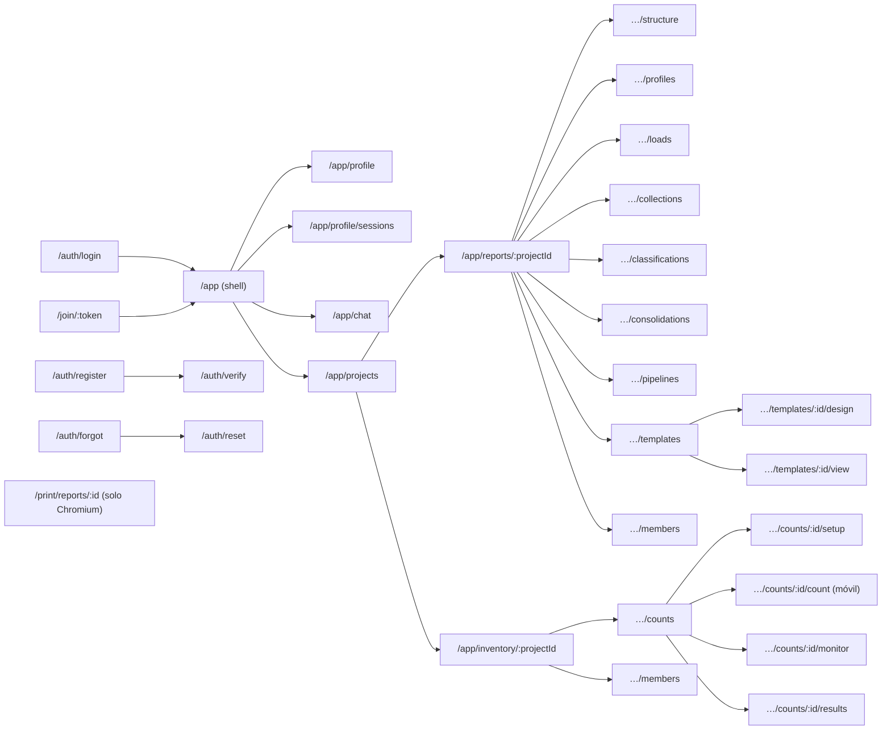

# 07 · Frontend Angular 22 + PrimeNG 22

## 1. Lineamientos

| Tema | Decisión |
|---|---|
| Componentes | **Standalone**, `ChangeDetectionStrategy.OnPush`, aplicación **zoneless** (`provideZonelessChangeDetection()`). |
| Reactividad | **Signals** para el estado (`signal`, `computed`, `linkedSignal`, `resource`); RxJS solo en fronteras (HTTP, sockets). |
| Entradas/salidas | `input.required<T>()`, `input<T \| null>(null)`, `output<T>()`, `model<T>()`. Nunca `input<T>()` sin valor inicial (produce `T \| undefined`). |
| Consultas de vista | `viewChild.required()` / `contentChild.required()`; nunca las variantes opcionales. |
| Formularios | *Typed Reactive Forms* con `NonNullableFormBuilder` y un **modelo de formulario por clase** (`ProfileForm extends FormModel<ProfileFormValue>`). |
| Estado | Clases *Store* por feature que extienden `BaseStore<TState>` (sin NgRx; POO explícita). |
| Datos | Clases `ApiClient` por contexto con métodos tipados con los DTO de `libs/shared/contracts`; *mappers* DTO → modelo de vista (clases). |
| Tiempo real | `RealtimeChannel<TServerEvents, TClientEvents>` sobre `socket.io-client`, con los mapas de eventos compartidos. |
| UI | **Solo PrimeNG** (componentes, directivas, PrimeIcons, temas `@primeuix/themes`). El HTML nativo se usa únicamente para estructura/maquetación y para el lienzo de páginas del informe; ningún control interactivo nativo (`<button>`, `<input>`, `<select>`, `<table>`, `<dialog>`) sin su directiva/componente PrimeNG equivalente. Una regla de lint propia lo verifica. |
| Carga diferida | Rutas *lazy* por feature; `@defer` para el diseñador, gráficos y editor enriquecido. |
| i18n | Textos en español vía archivos de traducción; `PrimeNG.setTranslation()` con la localización `es`. |
| Tema | `providePrimeNG({ theme: { preset: AsisteGltPreset } })` donde `AsisteGltPreset = definePreset(Aura, {...})` con tokens de marca; modo oscuro por selector `.app-dark`. |
| Estilos | **SCSS** (sin Tailwind ni frameworks de utilidades): estilos por componente (`styleUrl`) y una capa global `styles/` con `_tokens.scss` (solo lectura de variables CSS `--p-*` del tema), `_layout.scss` (mixins de grid/flex y puntos de quiebre) y `_print.scss` (páginas del informe). Prohibidos colores fijos: todo color proviene de variables del tema para respetar el modo oscuro. |
| Offline | PWA (`@angular/service-worker`) para el modo servidor local: *shell* en caché y cola de conteos en IndexedDB. |

## 2. Estructura de una feature

```text
libs/web/feature-reports/src/lib/
├── pages/                     # componentes enrutados (contenedores)
│   ├── data-loads.page.ts
│   └── template-designer.page.ts
├── components/                # componentes de presentación construidos con PrimeNG
│   ├── fixed-width-ruler/
│   ├── matrix-table-editor/
│   └── report-canvas/
├── state/                     # stores (clases) basados en signals
│   ├── data-loads.store.ts
│   └── designer.store.ts
├── data-access/               # clientes HTTP y canales de tiempo real
│   ├── data-loads.api-client.ts
│   └── reports.realtime-channel.ts
├── models/                    # clases de modelo de vista + mappers
└── reports.routes.ts
```

## 3. Diagrama de clases del frontend (núcleo y ejemplos)

```mermaid
classDiagram
    class BaseStore~TState~ {
        <<abstract>>
        #WritableSignal~TState~ state
        #update(updater StateUpdater~TState~) void
        +select(projector Projector~TState,R~) Signal~R~
    }
    class ApiClient {
        <<abstract>>
        #HttpClient http
        #ApiConfig config
        #get(path string, decoder Decoder~T~) Observable~T~
        #post(path string, body B, decoder Decoder~T~) Observable~T~
        #put(path string, body B, decoder Decoder~T~) Observable~T~
        #delete(path string) Observable~void~
    }
    class RealtimeChannel~TServer,TClient~ {
        <<abstract>>
        -Socket socket
        #namespace()* string
        +connect(token AccessToken) void
        +on(event E, handler Handler~TServer,E~) Subscription
        +emit(event E, payload Payload~TClient,E~) Promise~Ack~
        +disconnect() void
    }
    class TokenStore {
        -WritableSignal~Nullable~AccessToken~~ token
        +current() Nullable~AccessToken~
        +set(token AccessToken) void
        +clear() void
    }
    class AuthService {
        -AuthApiClient api
        -TokenStore tokens
        -Router router
        +login(credentials LoginCredentials) Promise~LoginResult~
        +refresh() Promise~boolean~
        +logout() Promise~void~
    }
    class AuthInterceptor {
        <<HttpInterceptor>>
        -TokenStore tokens
        -AuthService auth
        +intercept(request HttpRequest, next HttpHandler) Observable~HttpEvent~
    }
    class PermissionService {
        -WritableSignal~AppAbility~ ability
        +load(projectId EntityId) Promise~void~
        +can(action Action, subject Subject) Signal~boolean~
    }
    class CanDirective {
        <<Directive>>
        +action InputSignal~Action~
        +subject InputSignal~Subject~
    }
    class ChatStore {
        -ChatApiClient api
        -ChatRealtimeChannel channel
        +conversations Signal~ConversationVm[]~
        +activeMessages Signal~MessageVm[]~
        +unreadTotal Signal~number~
        +open(conversationId EntityId) Promise~void~
        +send(text string) Promise~void~
    }
    class DesignerStore {
        -ReportsApiClient api
        -CommandHistory history
        +template Signal~TemplateVm~
        +selection Signal~Nullable~ElementVm~~
        +execute(command DesignerCommand) void
        +undo() void
        +redo() void
    }
    class CommandHistory {
        -DesignerCommand[] undoStack
        -DesignerCommand[] redoStack
        +push(command DesignerCommand) void
        +canUndo() boolean
        +canRedo() boolean
    }
    class DesignerCommand {
        <<abstract>>
        +execute(state DesignerState)* DesignerState
        +undo(state DesignerState)* DesignerState
        +label()* string
    }
    class AddElementCommand
    class MoveElementCommand
    class UpdateStyleCommand
    class UpdateAxisCommand
    class CountingStore {
        -InventoryRealtimeChannel channel
        -PendingSubmissionQueue queue
        +currentItem Signal~Nullable~ItemVm~~
        +progress Signal~CounterProgressVm~
        +connection Signal~ConnectionState~
        +submit(entry CountEntryForm) Promise~void~
    }
    class PendingSubmissionQueue {
        -IndexedDbStore storage
        +enqueue(submission PendingSubmission) Promise~void~
        +flush(channel InventoryRealtimeChannel) Promise~number~
    }
    class ChatPageComponent {
        <<Component>>
        -ChatStore store
    }
    class ConversationListComponent {
        <<Component>>
        +conversations InputSignal~ConversationVm[]~
        +selected OutputEmitterRef~EntityId~
    }
    class TemplateDesignerPage {
        <<Component>>
        -DesignerStore store
    }
    class CountingPage {
        <<Component>>
        -CountingStore store
    }
    class FieldCatalogStore {
        -ApiClient api
        -RealtimeChannel~TServer,TClient~ channel
        -OperationCompatibility compatibility
        +fields Signal~CatalogFieldVm[]~
        +labelOf(key FieldKey) Signal~string~
        +compatible(operation FieldOperation, source DatasetSelector) Signal~CatalogFieldVm[]~
    }
    class CatalogFieldSelectComponent {
        <<Component>>
        -FieldCatalogStore store
        +operation InputSignal~FieldOperation~
        +source InputSignal~Nullable~DatasetSelector~~
        +value ModelSignal~Nullable~FieldKey~~
    }
    class FormulaInputComponent {
        <<Component>>
        -FieldCatalogStore store
        -TypeChecker checker
        +context InputSignal~ContextKind~
        +value ModelSignal~string~
    }
    class OperationCompatibility {
        +check(field CatalogField, operation FieldOperation) Result~CatalogField~
    }

    BaseStore~TState~ <|-- ChatStore
    BaseStore~TState~ <|-- DesignerStore
    BaseStore~TState~ <|-- CountingStore
    AuthService --> TokenStore
    AuthInterceptor --> TokenStore
    AuthInterceptor --> AuthService
    CanDirective --> PermissionService
    ChatStore ..> ApiClient
    ChatStore ..> RealtimeChannel~TServer,TClient~
    CountingStore ..> RealtimeChannel~TServer,TClient~
    CountingStore --> PendingSubmissionQueue
    DesignerStore --> CommandHistory
    CommandHistory o-- DesignerCommand
    DesignerCommand <|-- AddElementCommand
    DesignerCommand <|-- MoveElementCommand
    DesignerCommand <|-- UpdateStyleCommand
    DesignerCommand <|-- UpdateAxisCommand
    ChatPageComponent --> ChatStore
    ChatPageComponent *-- ConversationListComponent
    TemplateDesignerPage --> DesignerStore
    CountingPage --> CountingStore
    BaseStore~TState~ <|-- FieldCatalogStore
    FieldCatalogStore ..> ApiClient
    FieldCatalogStore ..> RealtimeChannel~TServer,TClient~
    FieldCatalogStore ..> OperationCompatibility
    CatalogFieldSelectComponent --> FieldCatalogStore
    FormulaInputComponent --> FieldCatalogStore
```



> `StateUpdater~TState~` es `(current: TState) => TState`: el estado siempre se reemplaza completo
> (con *spread* del anterior), sin `Partial<T>`, para no introducir propiedades opcionales.
> `Decoder~T~` valida la respuesta JSON en tiempo de ejecución (el cuerpo HTTP entra como `unknown`).
> `FieldCatalogStore` es el único punto donde la interfaz resuelve encabezados: mantiene los
> encabezados del proyecto (`CatalogFieldVm`: `FieldKey`, nombre vigente, rol, tipo, naturaleza,
> agregación, origen y estado), traduce `FieldKey` → nombre vigente con `labelOf` y filtra por
> operación con `OperationCompatibility` (de `libs/shared/field-catalog`, la misma clase que usan el
> dominio y el `TypeChecker`) y por disponibilidad en la fuente. Se actualiza con el evento de tiempo
> real `catalog.changed` (namespace `/projects`, sala `project:{id}`). `OperationCompatibility` y
> `TypeChecker` se muestran aquí solo como dependencias: `OperationCompatibility` está definida en
> [12 §5](12-preconfiguraciones-y-carga-multiple.md#5-modelo-de-clases) y `TypeChecker` en
> [04 §10](04-modelo-de-dominio.md) (motor de fórmulas).

## 4. Mapa de navegación



## 5. Pantallas y componentes PrimeNG

| Pantalla | Componentes PrimeNG |
|---|---|
| Shell de la aplicación | `Menubar`, `PanelMenu` (navegación lateral en `Drawer` para móvil), `Breadcrumb`, `Avatar`, `OverlayBadge`, `Menu` (usuario), `Toast`, `ConfirmDialog`, `ProgressBar` (carga global), `ScrollTop` |
| Login / registro / recuperar | `Card`, `FloatLabel`, `InputText`, `Password` (medidor de fortaleza), `Checkbox`, `Button`, `Message`, `InputOtp` (2FA), `Divider` |
| Perfil y seguridad | `Tabs`, `FileUpload` (avatar), `Image`, `Select` (idioma, zona horaria), `ToggleSwitch` (2FA), `Dialog` (QR + códigos de recuperación), `Table` (sesiones activas), `Tag`, `ConfirmPopup` |
| Chat | `Splitter`, `Listbox` (conversaciones con plantilla `Avatar` + `OverlayBadge`), `Scroller` (mensajes con scroll virtual), `Textarea` (autoResize), `Button`, `AutoComplete` (nuevo chat / menciones), `Tag` (escribiendo…), `Drawer` (chat flotante) |
| Proyectos | `DataView` (tarjetas / lista), `Card`, `SelectButton` (módulo), `IconField` + `InputIcon` (búsqueda), `Dialog` (crear), `SpeedDial` |
| Miembros y permisos | `Table` (miembros), `MultiSelect` (roles), `PickList` (permisos de un rol), `TreeTable` (matriz acción × recurso con `Checkbox`), `Dialog` (vínculo con `InputGroup` + botón copiar), `DatePicker` (expiración), `InputNumber` (usos) |
| Estructura organizacional | `OrganizationChart` (vista), `TreeTable` (edición), `Select` / `MultiSelect` (monedas), `Dialog` |
| Perfil de importación (asistente) | Ver [11-importacion-ancho-fijo](11-importacion-ancho-fijo.md) para el lienzo de ancho fijo. `Stepper` (tipo → archivo de muestra → columnas → reglas → previsualización), `SelectButton` (tipo de fuente), `FileUpload`, `Select` (codificación, hoja), `InputText` (delimitador), `Table` editable de columnas: por columna un `CatalogFieldSelectComponent` (§6) que elige el encabezado del catálogo por su nombre vigente (solo encabezados importados activos; excluye los ya asignados en la preconfiguración), `Tag` de rol, tipo y naturaleza en solo lectura (los trae el encabezado; la columna no define nombre, tipo ni rol propios), `Button` «Nuevo encabezado…» que abre el `Dialog` del catálogo y `ToggleSwitch` omitir columna (la obligatoriedad se deriva del rol `id`), `Select` de vacíos («cero» / «sin valor») para montos y cantidades, `Slider` (rango de columna), `ScrollPanel` (muestra de líneas), `Tag` (errores por fila, nombrando el encabezado con su nombre vigente) |
| Conexiones a BD | `Select` (motor), `InputText`, `InputNumber`, `Password`, `Textarea` (consulta), `Button` (probar conexión), `Message` |
| Catálogo de encabezados | `Table` con edición en celda: `InputText` (nombre libre, 1 a 80 caracteres, sin `[` ni `]`, único entre los activos sin distinguir mayúsculas ni tildes; error `DUPLICATE_FIELD_LABEL` / `INVALID_FIELD_LABEL` en `Message`), `Select` (rol: `id`, `id_name`, `data`), `Select` («nombre de…», solo para `id_name`), `Select` (tipo), `Select` (naturaleza, solo números), `Select` (agregación, filtrada por naturaleza), `Select` («ponderado por», solo tasas y precios unitarios; ofrece montos y cantidades), `Tag` de origen (importado / derivado), `Tag` «Usado en N» con `Popover` de usos (por nombre del elemento), tipo y naturaleza deshabilitados si el encabezado tiene datos cargados o usos (el nombre siempre se puede cambiar), `SplitButton` «Agregar desde plantilla» (los nombres repetidos se omiten y se informan con `Toast`), `ConfirmDialog` al desactivar (`FIELD_IN_USE` con la lista de usos) y al reemplazar; un encabezado inactivo se muestra como «Debe (inactivo)» y su nombre queda libre |
| Cargas de datos (carga múltiple, ver [12](12-preconfiguraciones-y-carga-multiple.md)) | `FileUpload` múltiple, `Table` editable por archivo (`Select` en cascada para preconfiguración, organización, país, moneda, compañía, empresa, sucursal; `DatePicker` vista mes), selección con `Checkbox`, `Dialog` (aplicar a seleccionados), `Tag` + `Tooltip` de validación, `ProgressBar` por archivo, `MeterGroup` del lote, historial de lotes en `Table`, `Dialog` + `Table` (incidencias) |
| Colecciones complementarias | `Table` de campos de la colección (`InputText` nombre único dentro de la colección, `Select` tipo y naturaleza, `Checkbox` clave / obligatorio), `Table` de entradas con edición en celda, `InputNumber`, `DatePicker`, `FileUpload` (importar), `Toolbar` |
| Clasificaciones | `CatalogFieldSelectComponent` «Clasificar por» al crear la clasificación (operación `CLASSIFY`: solo encabezados `id` / `id_name` clasificables, por su nombre vigente; nunca montos, tasas ni fechas; si se cambia con nodos existentes, `ConfirmDialog` y recálculo de cobertura), `Tree` (drag & drop de nodos), `ContextMenu`, `Dialog` (editor de regla: `Select` operador + `InputText` / `InputTags`), `MeterGroup` (cobertura), `Table` (no clasificados) |
| Consolidaciones y pipelines | `OrderList` (pasos reordenables; al mover o quitar un paso se revalida que cada encabezado producido exista antes de usarse), `Accordion` (configuración por paso), `CatalogFieldSelectComponent` para agrupar por (`GROUP_BY`), valores consolidados (`CONSOLIDATION_VALUE`), filtros (`FILTER`), acumulados (`ACCUMULATE_*`), conversión de moneda (`CURRENCY_CONVERT`) y destino de cada paso (`COMPUTED_TARGET`, con `Button` «Nuevo encabezado…» que crea un encabezado derivado con nombre libre único y tipo/naturaleza propuestos por el paso), `TreeSelect` (nodos), `FormulaInputComponent` (§6) para campos calculados, asignaciones condicionales y validaciones de igualdad, `Timeline` (ejecuciones) |
| Diseñador de informes | `Splitter` (paleta · lienzo · propiedades), `Tabs` (páginas), `Toolbar` (deshacer/rehacer, zoom con `Slider`, formato de página con `Select`), directivas `pDraggable`/`pDroppable`, `Accordion` (propiedades), `ColorPicker` / `InputColor`, `InputNumber`, `Editor` (texto enriquecido), `CatalogFieldSelectComponent` para el campo de valor, las medidas de fila o columna (p. ej. *Saldo anterior · Debe · Haber · Saldo actual*), las series de gráfico y el valor de KPI (`REPORT_MEASURE`, `CHART_SERIES`, `KPI_VALUE`: solo números agregables) y para filas, columnas, dimensiones de tabla dinámica, categorías de gráfico y filtros (`GROUP_BY`, `PIVOT_DIMENSION`, `CHART_CATEGORY`, `FILTER`: solo agrupables), `Select` de agregación filtrado por naturaleza (una tasa solo con promedio ponderado), `OrderList` (filas y columnas), `TreeSelect` (nodos de clasificación), `FormulaInputComponent` para KPI y filas o columnas de fórmula, `Popover` (formato condicional), `Tooltip`; las etiquetas que vienen de un encabezado (`FieldAxisLabel`) muestran su nombre vigente |
| Visor de informe | `Toolbar` (parámetros: `DatePicker` mes/año, `TreeSelect` alcance), `Table` (tablas matriciales con columnas dinámicas y congeladas), `TreeTable` (tablas dinámicas con subtotales), `Chart` (bar, line, pie, doughnut, radar, polarArea, combinados), `Skeleton`, `SplitButton` (exportar), `ProgressSpinner`; los títulos que vienen de encabezados se resuelven con `FieldCatalogStore.labelOf` al renderizar (el `ComputedReport` trae `FieldKey`), así un renombrado se ve sin editar la plantilla |
| Toma: configuración | `Stepper` con paso «Mapeo de campos» (un `CatalogFieldSelectComponent` por papel, limitado a los encabezados de la preconfiguración y propuesto por coincidencia de nombre: SKU = `id` Texto; descripción = Texto, `id_name` o `data`; existencia = Cantidad; costo unitario = Precio unitario, opcional; unidad = Texto, opcional; ubicación = Texto, un campo o varios segmentos; coordenadas = número Descriptivo, opcional), `Table` (productos), `PickList` (participantes), `SelectButton` (modo ciego / con existencia), `InputNumber` (tolerancia, rondas), `MultiSelect` (encabezados de la preconfiguración visibles por rol, mostrados con su nombre vigente y guardados por `FieldKey`), `Tabs` (asignación manual / automática; la estrategia espacial solo aparece si hay coordenadas mapeadas), `Table` de rangos |
| Toma: conteo (móvil) | `Card`, `Tag` (ubicación), `InputNumber` (botones grandes), `SelectButton` (contado / no encontrado / dañado / otro), `Textarea`, `FileUpload` (cámara), `Galleria` (fotos tomadas), `ProgressBar`, `Message` (estado de conexión), `BlockUI` |
| Toma: monitoreo | `Knob` / `MeterGroup` (avance global), `Table` por inventariador con `ProgressBar`, `Chart` (conteos por hora), `Timeline` (actividad), `Image` / `Galleria` (evidencias), `Tabs` (rondas), `Dialog` (reasignar) |
| Toma: resultados | `Table` con agrupación y exportación, `Tag` (dentro / fuera de tolerancia), `Chart`, `Button` (abrir reconteo / cerrar) |

## 6. Componentes compuestos propios (construidos con PrimeNG)

| Componente | Composición |
|---|---|
| `FixedWidthRulerComponent` | `ScrollPanel` con la muestra en fuente monoespaciada y una regla de posiciones; cada clic agrega/quita un corte. Sincronizado con una `Table` editable (`InputNumber` inicio/longitud) y un `Slider` en modo rango por columna. Colores desde tokens `--p-primary-*`. |
| `ScopeSelectorComponent` | `TreeSelect` con la jerarquía organización → país → moneda → compañía → empresa → sucursal; emite un `EntityScopeVm`. |
| `CatalogFieldSelectComponent` | `Select` (o `MultiSelect` en modo múltiple) de PrimeNG con filtro; `input.required<FieldOperation>()` (operación para la que se elige), `input<Nullable<DatasetSelector>>(null)` (fuente) y `model<Nullable<FieldKey>>`. `optionValue` es siempre el `FieldKey`; la etiqueta es el nombre vigente de `FieldCatalogStore`. Opciones agrupadas por rol, con `Tag` de tipo y naturaleza; solo encabezados activos compatibles (`OperationCompatibility.check`) y presentes en la fuente (advertencia con `Tooltip` si solo están en algunas preconfiguraciones). Si el valor guardado ya es un encabezado inactivo se muestra con `Tag` «inactivo». Donde el destino puede ser derivado incluye `Button` «Nuevo encabezado…». |
| `FormulaInputComponent` | `AutoComplete` que sugiere funciones, celdas y nodos y, al teclear `[`, los encabezados compatibles por su nombre vigente con `Tag` de tipo y naturaleza (en `COLECCION` sugiere los campos de la colección). Valida en el navegador con `libs/shared/formula-engine` (`TypeChecker` + `OperationCompatibility`) y muestra el error con `Message` (p. ej. «No se puede sumar Texto con Número decimal», «Una tasa no se puede sumar; use PROMEDIO.PONDERADO», `UNKNOWN_FIELD`, `FIELD_INACTIVE`, `FIELD_NOT_IN_SOURCE`). Recibe y emite la forma canónica (`=[#f_6Pw4] - [#f_2Lm5]`) y la presenta con `FormulaFormatter` usando los nombres vigentes (`=[Debe] - [Haber]`), de modo que un renombrado se refleja sin editar la fórmula. |
| `ReportCanvasComponent` | Contenedor con dimensiones en `mm` según `PageFormat`; elementos posicionados con `pDraggable`/`pDroppable`; selección con `Popover` de acciones rápidas. |
| `MatrixTableViewComponent` | `Table` con columnas dinámicas, primera columna congelada, estilos por celda (negativos, bordes, formato condicional) calculados en el modelo de vista. |
| `PivotTableViewComponent` | `TreeTable` con filas jerárquicas, columnas dinámicas y subtotales. |
| `EvidenceCaptureComponent` | `FileUpload` en modo básico con `accept="image/*"` y `capture="environment"` vía API *pass-through* (`pt`), compresión de imagen antes de subir, `Galleria` de previsualización. |

### 6.1 Encabezados por su nombre en la interfaz

Los encabezados son dinámicos: el usuario les da cualquier nombre (*Debe*, *Haber*, *Saldo*,
*Cargos*, *Monto de venta*…) y la interfaz lo usa siempre por ese nombre en todas las pantallas
posteriores (preconfiguraciones, clasificaciones, consolidaciones, pipelines, diseñador, visor y
toma de inventario). Reglas para todas las pantallas:

| Regla | Comportamiento en la interfaz |
|---|---|
| Elegir un encabezado | Siempre con `CatalogFieldSelectComponent` (nunca un `InputText` libre); muestra el nombre vigente y entrega el `FieldKey`. |
| Escribir un encabezado en una fórmula | Con `FormulaInputComponent`: `[Nombre del encabezado]` entre corchetes; se guarda en forma canónica con `FieldKey`. |
| Guardar | Todo DTO enviado al backend lleva `FieldKey`, nunca el nombre; el nombre solo se edita en el catálogo. |
| Mostrar | Toda etiqueta, título, mensaje de error o lista de usos resuelve el nombre con `FieldCatalogStore.labelOf(key)`. |
| Renombrar | Una sola edición en el catálogo; al recibir `catalog.changed` se refrescan selectores, editores de fórmulas e informes abiertos sin editar ninguna definición. |
| Desactivar o reemplazar | `ConfirmDialog` con la lista de usos; las referencias existentes muestran «Debe (inactivo)» con `Tag` y el nombre queda libre para otro encabezado. |
| Compatibilidad | Los selectores solo ofrecen encabezados compatibles con la operación (`FieldOperation`) y presentes en la fuente; los errores del backend (`FIELD_NOT_FOUND`, `FIELD_INACTIVE`, `FIELD_INCOMPATIBLE`, `FIELD_NOT_AGGREGATABLE`, `FIELD_NOT_GROUPABLE`…) se muestran nombrando el encabezado y el elemento afectado. |

Ejemplo ficticio: en *Empresa Demo* el usuario renombra *Debe* a *Cargos*; la fórmula
`=[Debe] - [Haber]` pasa a mostrarse `=[Cargos] - [Haber]` y la columna del balance titulada
*Debe* pasa a *Cargos*, sin republicar la plantilla.

## 7. Seguridad en el cliente

- *Access token* **solo en memoria** (`TokenStore`); nunca en `localStorage`.
- Renovación silenciosa al iniciar la app y ante `401 TOKEN_EXPIRED` (una sola petición de
  *refresh* en vuelo; las demás esperan).
- `PermissionService` recibe las reglas CASL empaquetadas del proyecto; la directiva `*appCan`
  oculta acciones no permitidas. La autorización real siempre ocurre en el backend.
- `ErrorInterceptor` traduce los códigos de `libs/shared/contracts/errors` a mensajes `Toast`.
- CSP estricta: sin estilos/scripts *inline* fuera de los que PrimeNG genera con *nonce*
  (`providePrimeNG({ csp: { nonce } })`).
