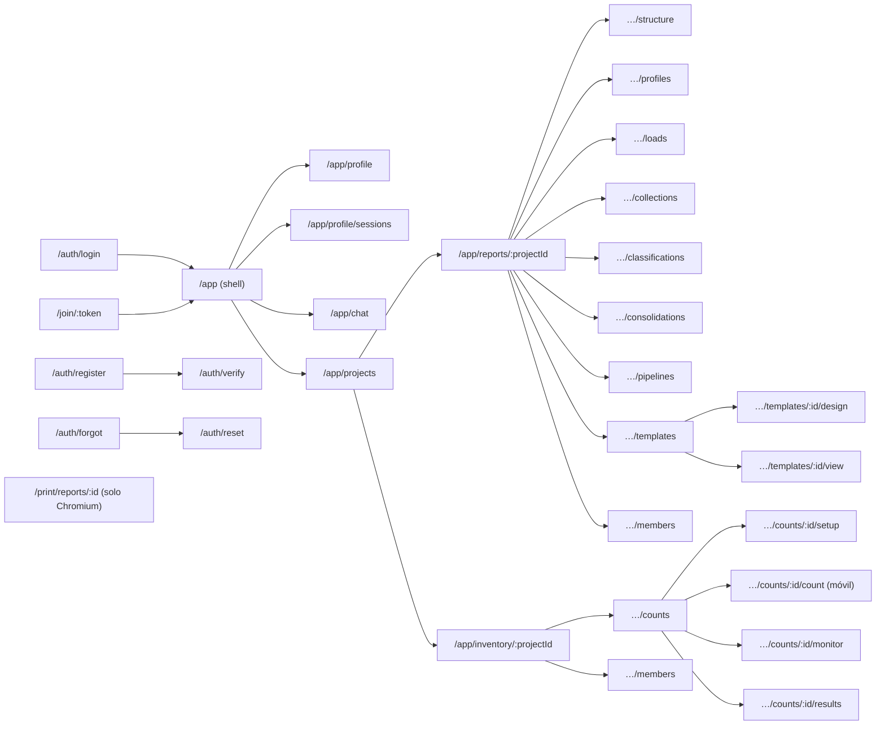

# 07 · Frontend Angular 22 + PrimeNG 22

## 1. Lineamientos

| Tema | Decisión |
|---|---|
| Componentes | **Standalone**, `ChangeDetectionStrategy.OnPush`, aplicación **zoneless** (`provideZonelessChangeDetection()`). |
| Reactividad | **Signals** para el estado (`signal`, `computed`, `linkedSignal`, `resource`); RxJS solo en fronteras (HTTP, sockets). |
| Entradas/salidas | `input.required<T>()`, `input<T \| null>(null)`, `output<T>()`, `model<T>()`. Nunca `input<T>()` sin valor inicial (produce `T \| undefined`). |
| Consultas de vista | `viewChild.required()` / `contentChild.required()`; nunca las variantes opcionales. |
| Formularios | *Typed Reactive Forms* con `NonNullableFormBuilder` y un **modelo de formulario por clase** (`ProfileForm extends FormModel<ProfileFormValue>`). |
| Estado | Clases *Store* por feature que extienden `BaseStore<TState>` (sin NgRx; POO explícita). |
| Datos | Clases `ApiClient` por contexto con métodos tipados con los DTO de `libs/shared/contracts`; *mappers* DTO → modelo de vista (clases). |
| Tiempo real | `RealtimeChannel<TServerEvents, TClientEvents>` sobre `socket.io-client`, con los mapas de eventos compartidos. |
| UI | **Solo PrimeNG** (componentes, directivas, PrimeIcons, temas `@primeuix/themes`). El HTML nativo se usa únicamente para estructura/maquetación y para el lienzo de páginas del informe; ningún control interactivo nativo (`<button>`, `<input>`, `<select>`, `<table>`, `<dialog>`) sin su directiva/componente PrimeNG equivalente. Una regla de lint propia lo verifica. |
| Carga diferida | Rutas *lazy* por feature; `@defer` para el diseñador, gráficos y editor enriquecido. |
| i18n | Textos en español vía archivos de traducción; `PrimeNG.setTranslation()` con la localización `es`. |
| Tema | `providePrimeNG({ theme: { preset: AsisteGltPreset } })` donde `AsisteGltPreset = definePreset(Aura, {...})` con tokens de marca; modo oscuro por selector `.app-dark`. |

## 2. Estructura de una feature

```text
libs/web/feature-reports/src/lib/
├── pages/                     # componentes enrutados (contenedores)
│   ├── data-loads.page.ts
│   └── template-designer.page.ts
├── components/                # componentes de presentación construidos con PrimeNG
│   ├── fixed-width-ruler/
│   ├── matrix-table-editor/
│   └── report-canvas/
├── state/                     # stores (clases) basados en signals
│   ├── data-loads.store.ts
│   └── designer.store.ts
├── data-access/               # clientes HTTP y canales de tiempo real
│   ├── data-loads.api-client.ts
│   └── reports.realtime-channel.ts
├── models/                    # clases de modelo de vista + mappers
└── reports.routes.ts
```

## 3. Diagrama de clases del frontend (núcleo y ejemplos)

```mermaid
classDiagram
    class BaseStore~TState~ {
        <<abstract>>
        #WritableSignal~TState~ state
        #update(updater StateUpdater~TState~) void
        +select(projector Projector~TState,R~) Signal~R~
    }
    class ApiClient {
        <<abstract>>
        #HttpClient http
        #ApiConfig config
        #get(path string, decoder Decoder~T~) Observable~T~
        #post(path string, body B, decoder Decoder~T~) Observable~T~
        #put(path string, body B, decoder Decoder~T~) Observable~T~
        #delete(path string) Observable~void~
    }
    class RealtimeChannel~TServer,TClient~ {
        <<abstract>>
        -Socket socket
        #namespace()* string
        +connect(token AccessToken) void
        +on(event E, handler Handler~TServer,E~) Subscription
        +emit(event E, payload Payload~TClient,E~) Promise~Ack~
        +disconnect() void
    }
    class TokenStore {
        -WritableSignal~Nullable~AccessToken~~ token
        +current() Nullable~AccessToken~
        +set(token AccessToken) void
        +clear() void
    }
    class AuthService {
        -AuthApiClient api
        -TokenStore tokens
        -Router router
        +login(credentials LoginCredentials) Promise~LoginResult~
        +refresh() Promise~boolean~
        +logout() Promise~void~
    }
    class AuthInterceptor {
        <<HttpInterceptor>>
        -TokenStore tokens
        -AuthService auth
        +intercept(request HttpRequest, next HttpHandler) Observable~HttpEvent~
    }
    class PermissionService {
        -WritableSignal~AppAbility~ ability
        +load(projectId EntityId) Promise~void~
        +can(action Action, subject Subject) Signal~boolean~
    }
    class CanDirective {
        <<Directive>>
        +action InputSignal~Action~
        +subject InputSignal~Subject~
    }
    class ChatStore {
        -ChatApiClient api
        -ChatRealtimeChannel channel
        +conversations Signal~ConversationVm[]~
        +activeMessages Signal~MessageVm[]~
        +unreadTotal Signal~number~
        +open(conversationId EntityId) Promise~void~
        +send(text string) Promise~void~
    }
    class DesignerStore {
        -ReportsApiClient api
        -CommandHistory history
        +template Signal~TemplateVm~
        +selection Signal~Nullable~ElementVm~~
        +execute(command DesignerCommand) void
        +undo() void
        +redo() void
    }
    class CommandHistory {
        -DesignerCommand[] undoStack
        -DesignerCommand[] redoStack
        +push(command DesignerCommand) void
        +canUndo() boolean
        +canRedo() boolean
    }
    class DesignerCommand {
        <<abstract>>
        +execute(state DesignerState)* DesignerState
        +undo(state DesignerState)* DesignerState
        +label()* string
    }
    class AddElementCommand
    class MoveElementCommand
    class UpdateStyleCommand
    class UpdateAxisCommand
    class CountingStore {
        -InventoryRealtimeChannel channel
        -PendingSubmissionQueue queue
        +currentItem Signal~Nullable~ItemVm~~
        +progress Signal~CounterProgressVm~
        +connection Signal~ConnectionState~
        +submit(entry CountEntryForm) Promise~void~
    }
    class PendingSubmissionQueue {
        -IndexedDbStore storage
        +enqueue(submission PendingSubmission) Promise~void~
        +flush(channel InventoryRealtimeChannel) Promise~number~
    }
    class ChatPageComponent {
        <<Component>>
        -ChatStore store
    }
    class ConversationListComponent {
        <<Component>>
        +conversations InputSignal~ConversationVm[]~
        +selected OutputEmitterRef~EntityId~
    }
    class TemplateDesignerPage {
        <<Component>>
        -DesignerStore store
    }
    class CountingPage {
        <<Component>>
        -CountingStore store
    }

    BaseStore~TState~ <|-- ChatStore
    BaseStore~TState~ <|-- DesignerStore
    BaseStore~TState~ <|-- CountingStore
    AuthService --> TokenStore
    AuthInterceptor --> TokenStore
    AuthInterceptor --> AuthService
    CanDirective --> PermissionService
    ChatStore ..> ApiClient
    ChatStore ..> RealtimeChannel~TServer,TClient~
    CountingStore ..> RealtimeChannel~TServer,TClient~
    CountingStore --> PendingSubmissionQueue
    DesignerStore --> CommandHistory
    CommandHistory o-- DesignerCommand
    DesignerCommand <|-- AddElementCommand
    DesignerCommand <|-- MoveElementCommand
    DesignerCommand <|-- UpdateStyleCommand
    DesignerCommand <|-- UpdateAxisCommand
    ChatPageComponent --> ChatStore
    ChatPageComponent *-- ConversationListComponent
    TemplateDesignerPage --> DesignerStore
    CountingPage --> CountingStore
```



> `StateUpdater~TState~` es `(current: TState) => TState`: el estado siempre se reemplaza completo
> (con *spread* del anterior), sin `Partial<T>`, para no introducir propiedades opcionales.
> `Decoder~T~` valida la respuesta JSON en tiempo de ejecución (el cuerpo HTTP entra como `unknown`).

## 4. Mapa de navegación



## 5. Pantallas y componentes PrimeNG

| Pantalla | Componentes PrimeNG |
|---|---|
| Shell de la aplicación | `Menubar`, `PanelMenu` (navegación lateral en `Drawer` para móvil), `Breadcrumb`, `Avatar`, `OverlayBadge`, `Menu` (usuario), `Toast`, `ConfirmDialog`, `ProgressBar` (carga global), `ScrollTop` |
| Login / registro / recuperar | `Card`, `FloatLabel`, `InputText`, `Password` (medidor de fortaleza), `Checkbox`, `Button`, `Message`, `InputOtp` (2FA), `Divider` |
| Perfil y seguridad | `Tabs`, `FileUpload` (avatar), `Image`, `Select` (idioma, zona horaria), `ToggleSwitch` (2FA), `Dialog` (QR + códigos de recuperación), `Table` (sesiones activas), `Tag`, `ConfirmPopup` |
| Chat | `Splitter`, `Listbox` (conversaciones con plantilla `Avatar` + `OverlayBadge`), `Scroller` (mensajes con scroll virtual), `Textarea` (autoResize), `Button`, `AutoComplete` (nuevo chat / menciones), `Tag` (escribiendo…), `Drawer` (chat flotante) |
| Proyectos | `DataView` (tarjetas / lista), `Card`, `SelectButton` (módulo), `IconField` + `InputIcon` (búsqueda), `Dialog` (crear), `SpeedDial` |
| Miembros y permisos | `Table` (miembros), `MultiSelect` (roles), `PickList` (permisos de un rol), `TreeTable` (matriz acción × recurso con `Checkbox`), `Dialog` (vínculo con `InputGroup` + botón copiar), `DatePicker` (expiración), `InputNumber` (usos) |
| Estructura organizacional | `OrganizationChart` (vista), `TreeTable` (edición), `Select` / `MultiSelect` (monedas), `Dialog` |
| Perfil de importación (asistente) | `Stepper` (tipo → archivo de muestra → columnas → reglas → previsualización), `SelectButton` (tipo de fuente), `FileUpload`, `Select` (codificación, hoja), `InputText` (delimitador), `Table` editable de columnas (`InputText`, `Select` de tipo y rol, `ToggleSwitch` requerida/omitir), `Slider` (rango de columna), `ScrollPanel` (muestra de líneas), `Tag` (errores por fila) |
| Conexiones a BD | `Select` (motor), `InputText`, `InputNumber`, `Password`, `Textarea` (consulta), `Button` (probar conexión), `Message` |
| Cargas de datos | `Table` (historial con filtros y `Tag` de estado), `DatePicker` (vista mes/año), `CascadeSelect` / `TreeSelect` (alcance organización → … → sucursal), `FileUpload`, `ProgressBar` en vivo, `Dialog` + `Table` (incidencias) |
| Colecciones complementarias | `Table` con edición en celda, `InputNumber`, `DatePicker`, `FileUpload` (importar), `Toolbar` |
| Clasificaciones | `Tree` (drag & drop de nodos), `ContextMenu`, `Dialog` (editor de regla: `Select` operador + `InputText` / `InputTags`), `MeterGroup` (cobertura), `Table` (no clasificados) |
| Consolidaciones y pipelines | `OrderList` (pasos reordenables), `Accordion` (configuración por paso), `Select`, `TreeSelect`, `InputText` (fórmulas con `AutoComplete` de funciones), `Timeline` (ejecuciones) |
| Diseñador de informes | `Splitter` (paleta · lienzo · propiedades), `Tabs` (páginas), `Toolbar` (deshacer/rehacer, zoom con `Slider`, formato de página con `Select`), directivas `pDraggable`/`pDroppable`, `Accordion` (propiedades), `ColorPicker` / `InputColor`, `InputNumber`, `Editor` (texto enriquecido), `OrderList` (filas y columnas), `TreeSelect` (nodos de clasificación), `Popover` (formato condicional), `Tooltip` |
| Visor de informe | `Toolbar` (parámetros: `DatePicker` mes/año, `TreeSelect` alcance), `Table` (tablas matriciales con columnas dinámicas y congeladas), `TreeTable` (tablas dinámicas con subtotales), `Chart` (bar, line, pie, doughnut, radar, polarArea, combinados), `Skeleton`, `SplitButton` (exportar), `ProgressSpinner` |
| Toma: configuración | `Stepper`, `Table` (productos), `PickList` (participantes), `SelectButton` (modo ciego / con existencia), `InputNumber` (tolerancia, rondas), `MultiSelect` (campos visibles por rol), `Tabs` (asignación manual / automática), `Table` de rangos |
| Toma: conteo (móvil) | `Card`, `Tag` (ubicación), `InputNumber` (botones grandes), `SelectButton` (contado / no encontrado / dañado / otro), `Textarea`, `FileUpload` (cámara), `Galleria` (fotos tomadas), `ProgressBar`, `Message` (estado de conexión), `BlockUI` |
| Toma: monitoreo | `Knob` / `MeterGroup` (avance global), `Table` por inventariador con `ProgressBar`, `Chart` (conteos por hora), `Timeline` (actividad), `Image` / `Galleria` (evidencias), `Tabs` (rondas), `Dialog` (reasignar) |
| Toma: resultados | `Table` con agrupación y exportación, `Tag` (dentro / fuera de tolerancia), `Chart`, `Button` (abrir reconteo / cerrar) |

## 6. Componentes compuestos propios (construidos con PrimeNG)

| Componente | Composición |
|---|---|
| `FixedWidthRulerComponent` | `ScrollPanel` con la muestra en fuente monoespaciada y una regla de posiciones; cada clic agrega/quita un corte. Sincronizado con una `Table` editable (`InputNumber` inicio/longitud) y un `Slider` en modo rango por columna. Colores desde tokens `--p-primary-*`. |
| `ScopeSelectorComponent` | `TreeSelect` con la jerarquía organización → país → moneda → compañía → empresa → sucursal; emite un `EntityScopeVm`. |
| `FormulaInputComponent` | `AutoComplete` con sugerencias de funciones, celdas y nodos; valida con `libs/shared/formula-engine` en el navegador y muestra el error con `Message`. |
| `ReportCanvasComponent` | Contenedor con dimensiones en `mm` según `PageFormat`; elementos posicionados con `pDraggable`/`pDroppable`; selección con `Popover` de acciones rápidas. |
| `MatrixTableViewComponent` | `Table` con columnas dinámicas, primera columna congelada, estilos por celda (negativos, bordes, formato condicional) calculados en el modelo de vista. |
| `PivotTableViewComponent` | `TreeTable` con filas jerárquicas, columnas dinámicas y subtotales. |
| `EvidenceCaptureComponent` | `FileUpload` en modo básico con `accept="image/*"` y `capture="environment"` vía API *pass-through* (`pt`), compresión de imagen antes de subir, `Galleria` de previsualización. |

## 7. Seguridad en el cliente

- *Access token* **solo en memoria** (`TokenStore`); nunca en `localStorage`.
- Renovación silenciosa al iniciar la app y ante `401 TOKEN_EXPIRED` (una sola petición de
  *refresh* en vuelo; las demás esperan).
- `PermissionService` recibe las reglas CASL empaquetadas del proyecto; la directiva `*appCan`
  oculta acciones no permitidas. La autorización real siempre ocurre en el backend.
- `ErrorInterceptor` traduce los códigos de `libs/shared/contracts/errors` a mensajes `Toast`.
- CSP estricta: sin estilos/scripts *inline* fuera de los que PrimeNG genera con *nonce*
  (`providePrimeNG({ csp: { nonce } })`).
