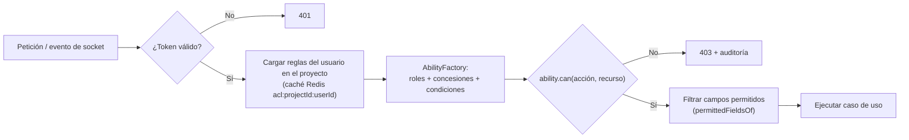

# 09 · Seguridad y permisos granulares

## 1. Controles de seguridad

| Área | Control |
|---|---|
| Contraseñas | argon2id (memoria 64 MiB, 3 iteraciones); mínimo 12 caracteres; verificación contra listas de contraseñas filtradas (k-anonimato); historial de las últimas 5. |
| Access token | JWT firmado con **EdDSA** (Ed25519), 15 min, `kid` para rotación de llaves; *claims* mínimos: `sub`, `sid`, `jti`, `iat`, `exp`. Se guarda solo en memoria del SPA. |
| Refresh token | Opaco (256 bits aleatorios), almacenado **hasheado** (SHA-256); rotación en cada uso; familia revocada al detectar reutilización; cookie `HttpOnly; Secure; SameSite=Strict; Path=/api/v1/auth`; vida 14 días, deslizante con máximo absoluto de 30. |
| CSRF | Cookie `SameSite=Strict` + cabecera `X-CSRF-Token` (*double submit*) en `/auth/refresh` y `/auth/logout`. |
| 2FA | TOTP (RFC 6238) con `otplib`; secreto cifrado AES-256-GCM; 10 códigos de recuperación hasheados; exigible por política de proyecto. |
| Fuerza bruta | `@nestjs/throttler` con almacenamiento Redis por IP y por cuenta; bloqueo progresivo (5 intentos → 15 min, se duplica). Respuesta idéntica para usuario inexistente y contraseña errónea. |
| Sesiones | Listado de dispositivos, cierre individual o global; revocación inmediata vía *denylist* de `jti` en Redis. Alerta por correo en inicio de sesión desde dispositivo nuevo. |
| Transporte | TLS 1.2+ (preferente 1.3), HSTS, WSS para sockets. |
| Cabeceras | `helmet`: CSP estricta con *nonce*, `frame-ancestors 'none'`, `Referrer-Policy`, `Permissions-Policy` (cámara solo en la ruta de conteo). |
| CORS | Lista blanca de orígenes; credenciales solo para el origen del SPA. |
| Validación de entrada | `ValidationPipe` global con `whitelist`, `forbidNonWhitelisted`, `transform`; límites de tamaño de cuerpo; sanitización de operadores `$` en consultas. |
| Archivos | Límite por tipo (datos: 200 MB en *streaming*; imágenes: 10 MB); detección de tipo real por *magic bytes*; nombres generados; descarga solo por URL firmada con expiración; análisis antivirus opcional (ClamAV) en el worker. |
| Conexiones a BD externas | Credenciales cifradas AES-256-GCM con llave maestra fuera de la BD (variable de entorno / KMS); solo consultas `SELECT` validadas por *parser*; usuario de solo lectura recomendado; *timeout* y límite de filas; lista de hosts permitidos para evitar SSRF. |
| Tiempo real | Token validado en el *handshake*; autorización por evento y por sala; límite de eventos por socket. |
| Datos sensibles importados | Muestras del asistente procesadas solo en el navegador; archivos de carga eliminados tras importarse (retención 0 días por defecto); cifrado en reposo (disco cifrado o cifrado de almacenamiento de MongoDB) y TLS en tránsito, también en el modo servidor local. |
| Auditoría | `audit_logs` para eventos de seguridad (login, 2FA, cambios de contraseña, sesiones) y de permisos (roles, miembros, vínculos, invitaciones, exportaciones). Retención configurable. |
| Secretos | Nunca en el repositorio; `.env` solo para desarrollo; validación tipada de configuración al arrancar (`AppConfig` con class-validator). |
| Dependencias | `npm audit` y Dependabot en CI; *lockfile* obligatorio. |
| Referencia | OWASP ASVS 4.0 nivel 2 como lista de verificación de la fase de endurecimiento. |

## 2. Modelo de autorización

Autorización **RBAC + ABAC** con CASL:

- **Rol** = conjunto de `Permission { action, subject, condition, fields }` a nivel de proyecto.
- **Condición** (ABAC) = restricción sobre atributos del recurso; p. ej. un inventariador solo
  puede `COUNT` los `COUNT_ENTRY` de productos **asignados a él**, un analista solo puede
  `DELETE` las cargas que **él creó**.
- **Campos** = restricción de campos visibles/editables (p. ej. ocultar `expectedQuantity` y
  `unitCost` al inventariador en modo ciego).
- **Concesión por recurso** (`ResourceGrant`) = permiso sobre un recurso puntual (compartir una
  sola plantilla con un lector externo al proyecto).
- El propietario tiene `MANAGE` sobre todo; solo él puede transferir la propiedad o eliminar el
  proyecto. Nadie puede conceder permisos que no posee (**no escalamiento**).

## 3. Roles predefinidos

### 3.1 Proyectos de Reportes

| Permiso (acción × recurso) | Propietario | Administrador | Analista de datos | Diseñador | Lector |
|---|:-:|:-:|:-:|:-:|:-:|
| Gestionar proyecto (renombrar, archivar) | ✔ | ✔ | | | |
| Eliminar / transferir proyecto | ✔ | | | | |
| Gestionar miembros, roles, vínculos, invitaciones | ✔ | ✔ | | | |
| Estructura organizacional (CRUD) | ✔ | ✔ | ✔ | | |
| Perfiles de importación y conexiones (CRUD) | ✔ | ✔ | ✔ | | |
| Cargar datos (`EXECUTE DATA_LOAD`) | ✔ | ✔ | ✔ | | |
| Eliminar cargas | ✔ | ✔ | propias | | |
| Colecciones, clasificaciones, consolidaciones, pipelines (CRUD) | ✔ | ✔ | ✔ | leer | |
| Ejecutar consolidaciones / pipelines | ✔ | ✔ | ✔ | | |
| Plantillas (CRUD) | ✔ | ✔ | | ✔ | |
| Publicar plantillas | ✔ | ✔ | | ✔ | |
| Ver informes y cambiar parámetros | ✔ | ✔ | ✔ | ✔ | ✔ |
| Exportar PDF | ✔ | ✔ | ✔ | ✔ | configurable |
| Canal de chat del proyecto | ✔ | ✔ | ✔ | ✔ | ✔ |

### 3.2 Proyectos de Inventarios

| Permiso (acción × recurso) | Propietario | Administrador | Supervisor | Inventariador | Auditor |
|---|:-:|:-:|:-:|:-:|:-:|
| Gestionar proyecto, miembros, roles, vínculos | ✔ | ✔ | | | |
| Perfiles de fuente y conexiones | ✔ | ✔ | | | |
| Crear / configurar tomas | ✔ | ✔ | | | |
| Cargar productos | ✔ | ✔ | | | |
| Asignar (manual / automática) y reasignar | ✔ | ✔ | ✔ | | |
| Abrir / pausar / cerrar rondas | ✔ | ✔ | ✔ | | |
| Contar (`COUNT COUNT_ENTRY`) | | | | asignados | |
| Corregir conteos | ✔ | ✔ | ✔ | propios en ronda abierta | |
| Ver existencia teórica y costo | ✔ | ✔ | ✔ | según visibilidad | ✔ |
| Adjuntar evidencias | | | ✔ | ✔ | |
| Ver progreso y evidencias de todos | ✔ | ✔ | ✔ | | ✔ |
| Cerrar toma y exportar resultados | ✔ | ✔ | ✔ | | leer |

> Los roles personalizados se crean combinando cualquier permiso de la matriz; las casillas
> "propias", "asignados" y "según visibilidad" son **condiciones** CASL, no roles distintos.

## 4. Compartición

| Mecanismo | Reglas |
|---|---|
| Vínculo | Token de 256 bits mostrado **una sola vez**; guarda solo su hash. Configurable: rol, expiración, máximo de usos, dominio de correo permitido. Requiere iniciar sesión o registrarse. Revocable. |
| Correo | Invitación a un correo concreto con rol; expira en 7 días; si el correo no tiene cuenta, el registro la acepta automáticamente al verificar el correo. |
| Recurso puntual | `ResourceGrant` sobre una plantilla, clasificación o toma con acciones limitadas y expiración opcional. |
