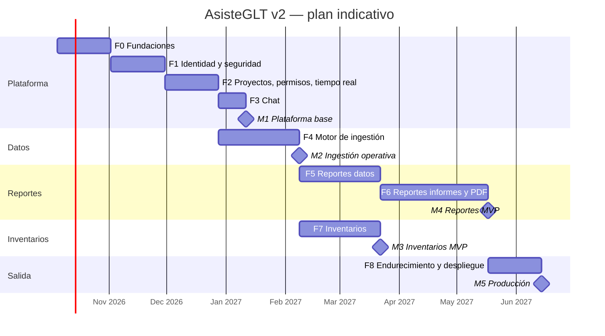

# 10 · Plan de trabajo inicial

## 1. Estrategia

1. **Fundaciones primero**: tipado estricto, reglas de lint, *kernel* POO y CI antes de cualquier
   funcionalidad; así las restricciones del cliente se cumplen desde el primer commit.
2. **Plataforma común** (IAM, proyectos, permisos, tiempo real, archivos, chat) antes de los módulos.
3. El **motor de ingestión** se construye una sola vez y lo consumen Reportes e Inventarios.
4. A partir de la ingestión, **dos líneas en paralelo**: Reportes (datos → informes) e Inventarios.
5. Cada fase termina con un entregable desplegable en el entorno de pruebas.

## 2. Cronograma indicativo

Supuesto: sprints de 2 semanas y un equipo de 3–4 desarrolladores full-stack que se divide en dos
líneas a partir de la fase 5. Las fechas son referenciales y se recalculan al cerrar la fase 0.

## 3. Fases, entregables y criterios de aceptación

### F0 · Fundaciones (2 sprints)

| Entregables | Criterios de aceptación |
|---|---|
| Monorepo Nx con `apps/web`, `apps/api`, `apps/worker` y librerías de [02-arquitectura §4](02-arquitectura.md). | `nx affected -t lint typecheck test build` pasa en CI. |
| `tsconfig` y ESLint de [08-convenciones](08-convenciones-tipado-poo.md) + reglas propias (`primeng-controls-only`). | Un PR de prueba con `any`, `undefined`, `?:`, `?.` o `<button>` nativo **falla** el CI. |
| `libs/shared/kernel`: `Entity`, `AggregateRoot`, `ValueObject`, `EntityId`, `Nullable`, `Optional`, `Result`, `DomainError`, `Decimal`, `Money`, `Period`, `Clock`, `ReadonlyDictionary`, `Collections`. | Cobertura ≥ 90 % del kernel. |
| `docker-compose`: MongoDB replica set, Redis 8, Mailpit. | `docker compose up` + `nx serve api/web` levantan todo en local. |
| Configuración tipada (`AppConfig` validado al arrancar), logs JSON con *correlation id*, `DomainErrorFilter`. | La API no arranca con variables faltantes o inválidas. |
| Shell Angular con PrimeNG 22, preset de tema, modo oscuro, localización `es`, `Toast`/`ConfirmDialog` globales. | Lighthouse accesibilidad ≥ 90 en el shell. |
| Pipeline CI (GitHub Actions): lint, typecheck, pruebas, build, `npm audit`. | Obligatorio para fusionar a `main`. |

### F1 · Identidad y seguridad (2 sprints) — RF-AUT-01…07

| Entregables | Criterios de aceptación |
|---|---|
| Registro, verificación de correo, login, logout, recuperación de contraseña. | E2E Playwright del flujo completo con Mailpit. |
| Access/refresh tokens con rotación y detección de reutilización. | Reutilizar un refresh token revoca la sesión (prueba de integración). |
| 2FA TOTP con códigos de recuperación. | Login con 2FA; recuperación con código de respaldo. |
| Perfil, avatar, sesiones activas, cierre remoto. | Cerrar una sesión invalida su access token en < 1 s. |
| Throttling, bloqueo progresivo, auditoría, alertas de nuevo dispositivo. | 6.º intento fallido bloquea; queda registro en `audit_logs`. |

### F2 · Proyectos, permisos, tiempo real y archivos (2 sprints) — RF-PRY-01…05

| Entregables | Criterios de aceptación |
|---|---|
| CRUD de proyectos por módulo; miembros; roles predefinidos y personalizados. | Matrices de [09-seguridad](09-seguridad-permisos.md) cubiertas por pruebas de autorización. |
| CASL en backend (guards + gateways) y reglas empaquetadas en el SPA (`*appCan`). | Un usuario sin permiso recibe 403 y no ve la acción en la UI. |
| Vínculos para compartir e invitaciones por correo. | Vínculo expirado o agotado es rechazado; invitación a correo sin cuenta funciona tras el registro. |
| Infraestructura Socket.IO (auth de *handshake*, salas, Redis adapter, eventos tipados). | Dos réplicas de la API entregan eventos a clientes conectados a cualquiera de ellas. |
| `FileStorage` (GridFS) con URLs firmadas; notificaciones in-app y correo. | Descarga sin firma válida → 403. |

### F3 · Chat (1 sprint) — RF-CHT-01…04

| Entregables | Criterios de aceptación |
|---|---|
| Canal global, directos 1:1, canal por proyecto. | Mensaje visible para el destinatario en < 1 s. |
| Presencia, "escribiendo…", leídos, contadores de no leídos, historial paginado por cursor. | 10 000 mensajes se navegan con *scroll* virtual fluido. |

### F4 · Motor de ingestión (3 sprints) — RF-REP-02…05, RF-INV-01

| Entregables | Criterios de aceptación |
|---|---|
| Perfiles: ancho fijo, delimitado, hoja de cálculo (.xlsx; .xls/.ods por conversión), base de datos. | Cada tipo tiene pruebas con archivos reales del cliente (ver §5). |
| Asistente de ancho fijo (regla de caracteres) y asistente tabular. | El analista define un perfil de 10 columnas sin editar JSON. |
| Reglas de fila, *parsers* tipados (decimal configurable, negativos con paréntesis/sufijo, fechas), identificadores obligatorios. | Saltos de página, líneas en blanco y encabezados repetidos se descartan; incidencias con línea y motivo. |
| Conexiones SQL Server, PostgreSQL, MySQL, MongoDB con credenciales cifradas y solo `SELECT`. | Consulta con `UPDATE`/`DELETE` es rechazada; *timeout* respetado. |
| `ImportJob` en BullMQ con progreso en tiempo real y umbral de rechazos. | Archivo de 1 000 000 de líneas se importa sin superar 512 MB de memoria en el worker. |

### F5 · Reportes: datos (3 sprints) — RF-REP-01, 06…11

| Entregables | Criterios de aceptación |
|---|---|
| Estructura organizacional con validación de `EntityScope`. | No se puede cargar con moneda no habilitada en el país. |
| Cargas etiquetadas por período y alcance con versionado. | Recargar el mismo alcance y período deja la versión anterior `SUPERSEDED` de forma atómica. |
| Colecciones complementarias (plantilla "Tipo de cambio"). | Captura manual e importación; búsqueda por clave y período. |
| Clasificaciones con reglas, árbol drag & drop, cobertura y membresías materializadas. | Reporte de no clasificados y doble clasificación; recálculo automático tras nueva carga. |
| Consolidación misma moneda (compañía / empresa / sucursal). | Suma de 3 compañías = suma manual verificada con `Decimal`. |
| Pipelines: filtros de texto, asignación condicional, campos calculados, acumulados, conversión de moneda, filas sintéticas, cuadre. | Caso contable de referencia (saldo = saldo anterior + debe − haber; resultado del ejercicio) reproduce el resultado esperado. |
| `libs/shared/formula-engine` (lexer, parser, AST, evaluador, dependencias, funciones). | Pruebas basadas en propiedades; detección de referencias circulares. |

### F6 · Reportes: informes y PDF (4 sprints) — RF-REP-12…17

| Entregables | Criterios de aceptación |
|---|---|
| Modelo de plantilla, páginas (Carta, Oficio, Legal, A4, personalizada), encabezado/pie. | Plantilla de 5 páginas con formatos mixtos. |
| Diseñador: lienzo, paleta, propiedades, deshacer/rehacer, bloqueo por elemento y presencia. | Dos diseñadores editan la misma plantilla sin sobrescribirse. |
| Tabla matricial (filas/columnas por filtros, fórmulas, totales, referencias entre páginas). | Balance general y estado de resultados de referencia con EBITDA calculado. |
| Tabla dinámica (`TreeTable`), gráficos (`Chart`), KPI, textos con fechas dinámicas, imágenes, formas. | Cambiar el período actualiza todos los elementos y textos. |
| Formato numérico y condicional (negativos en rojo, paréntesis, escala). | Coincidencia visual con el diseño de referencia del cliente. |
| Motor de consultas con caché Redis e invalidación por versión de datos. | Informe típico (≈ 500 celdas) < 2 s sin caché y < 300 ms con caché. |
| Exportación PDF con Chromium sobre la ruta de impresión. | Prueba visual de regresión: PDF vs previsualización. |

### F7 · Inventarios (3 sprints, en paralelo con F5–F6) — RF-INV-01…11

| Entregables | Criterios de aceptación |
|---|---|
| Tomas: parámetros, carga de productos (motor F4), participantes, visibilidad de campos. | En modo ciego el inventariador no recibe `expectedQuantity` ni `unitCost` (ni en la respuesta de la API). |
| Estrategias: manual por rangos, zonas contiguas, clúster espacial; reasignación dinámica. | Con 4 usuarios y 2 000 productos en 20 pasillos, ningún pasillo queda compartido y la carga difiere < 10 %. |
| Conteo guiado móvil con bloqueo de producto, novedades, comentarios y fotos; cola local de reenvío. | Dos usuarios nunca cuentan el mismo producto en la misma ronda. |
| Monitoreo en vivo del supervisor, evidencias, rondas de reconteo sobre diferencias. | Ronda 2 contiene exactamente los productos fuera de tolerancia + no encontrados + dañados. |
| Cierre con resultados valorizados y exportación. | Totales valorizados cuadran con `Decimal`. |

### F8 · Endurecimiento y despliegue (2 sprints)

| Entregables | Criterios de aceptación |
|---|---|
| Revisión OWASP ASVS L2 y pruebas de penetración básicas. | Sin hallazgos altos abiertos. |
| Pruebas de carga (k6): API, sockets, importaciones, informes. | Cumple RNF-06 y RNF-07. |
| Observabilidad (OpenTelemetry, métricas, alertas), respaldos de MongoDB y Redis. | Restauración de respaldo probada. |
| Despliegue productivo (Kubernetes o Docker Compose) con TLS. | Despliegue repetible desde CI. |
| Manuales de usuario y de operación. | Revisados por el cliente. |

## 4. Definición de terminado (DoD)

- Cumple las reglas de [08-convenciones](08-convenciones-tipado-poo.md) (lint y typecheck en verde).
- Pruebas unitarias y de integración del cambio; cobertura ≥ 80 % en dominio y aplicación.
- Autorización verificada (prueba de 403) para cada endpoint y evento nuevo.
- UI construida solo con PrimeNG, responsive y en español.
- Contratos actualizados en `libs/shared/contracts`; documentación de `docs/` actualizada si cambia
  el modelo.
- Revisión de código aprobada y despliegue en el entorno de pruebas.

## 5. Riesgos

| # | Riesgo | Prob. | Impacto | Mitigación |
|---|---|:-:|:-:|---|
| R-01 | Complejidad del motor de fórmulas y de la tabla matricial. | Alta | Alto | Librería aislada y sin dependencias; pruebas basadas en propiedades; empezar en F5 antes del diseñador. |
| R-02 | PrimeNG no tiene componente de tabla dinámica ni de diseñador de páginas. | Alta | Medio | Componentes compuestos sobre `TreeTable`, `Table`, `pDraggable`/`pDroppable`; funcionalidades acotadas en v1. |
| R-03 | Fidelidad del PDF frente a la previsualización. | Media | Alto | Misma ruta de renderizado para ambos; pruebas visuales de regresión. |
| R-04 | Volumen de `data_records` degrada consultas. | Media | Alto | Índices compuestos, agregaciones por tabla, caché, datos sintéticos de carga desde F4; plan de *sharding*. |
| R-05 | Archivos de origen muy heterogéneos (codificaciones, formatos de número). | Alta | Medio | **Solicitar al cliente un banco de archivos reales** antes de F4; asistente con previsualización. |
| R-06 | Conectividad deficiente en almacenes. | Media | Alto | Cola local de reenvío en v1; evaluar PWA offline (P-04). |
| R-07 | Tipos `any` en librerías de terceros (PrimeNG, Mongoose, Socket.IO). | Alta | Bajo | Adaptadores y *decoders* en las fronteras; reglas `no-unsafe-*`. |
| R-08 | Seguridad de conexiones a BD externas (SSRF, inyección). | Media | Alto | Solo `SELECT` validado, lista blanca de hosts, credenciales cifradas, usuario de solo lectura. |
| R-09 | Alcance amplio frente a tiempos. | Alta | Alto | MVP por módulo priorizando RF "Alta"; RF "Media" como incremento posterior. |
| R-10 | Errores de redondeo en cálculos contables. | Baja | Alto | `Decimal` extremo a extremo (`Decimal128` en BD), pruebas de cuadre. |

## 6. Próximos pasos inmediatos

1. Revisar este análisis con el cliente y responder las **preguntas abiertas** de
   [01-analisis §9](01-analisis-requerimientos.md#9-preguntas-abiertas-para-el-cliente).
2. Obtener un **banco de archivos de ejemplo** (texto de ancho fijo, CSV, Excel) y, si es posible,
   acceso de solo lectura a una BD de prueba del sistema contable/inventario del cliente.
3. Obtener un **informe de referencia** (p. ej. balance general + estado de resultados + EBITDA)
   para usarlo como criterio de aceptación de F5–F6.
4. Iniciar **F0**: generar el monorepo Nx, configurar TypeScript/ESLint estrictos y el *kernel*.
