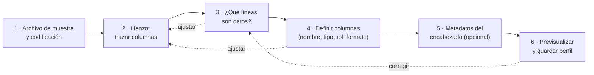
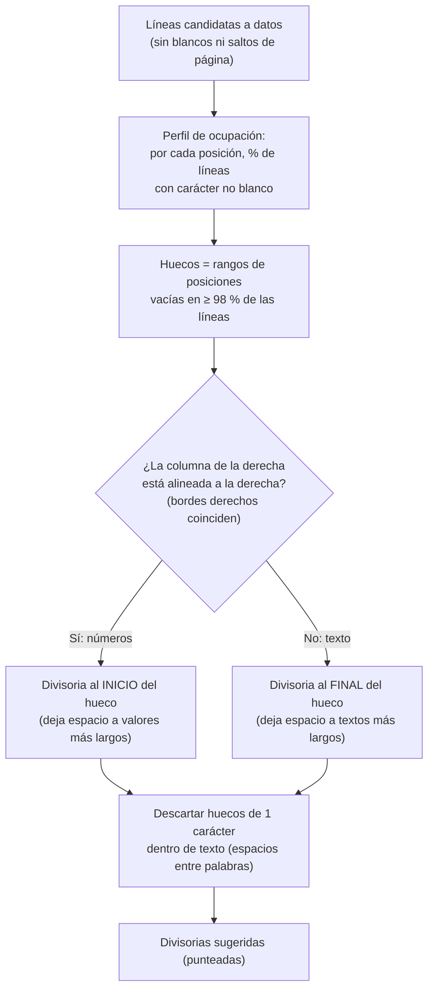
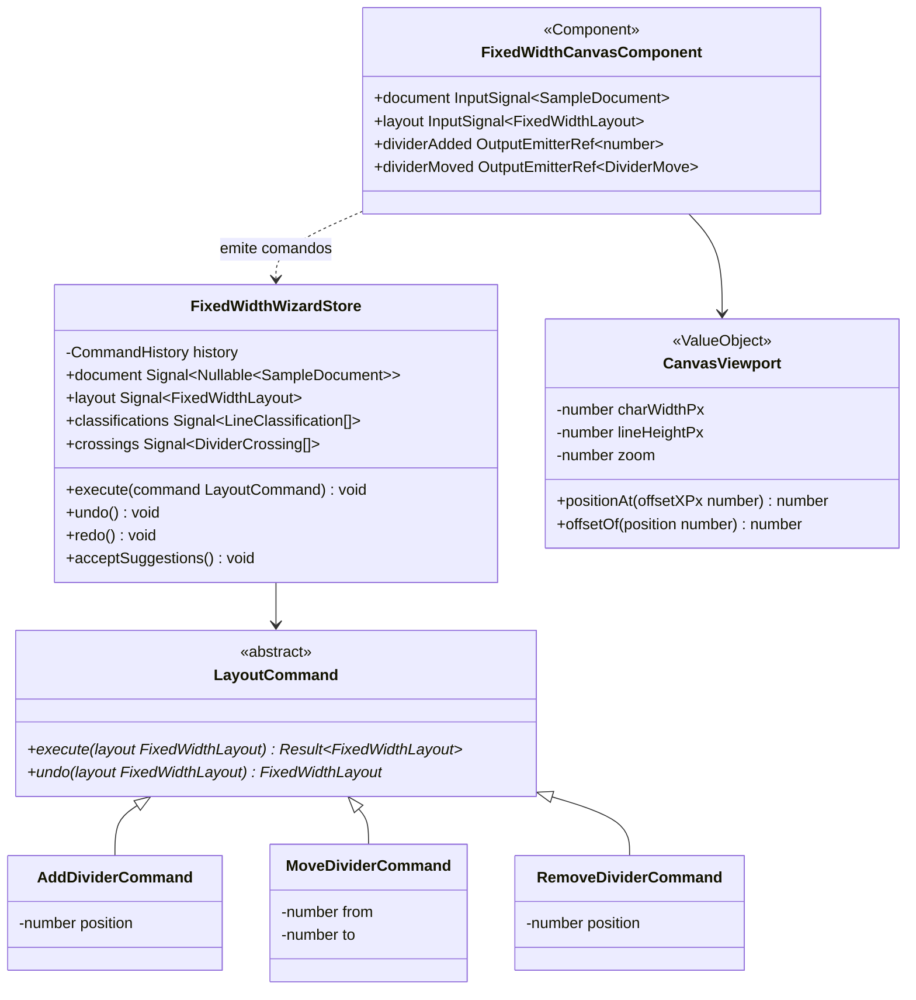
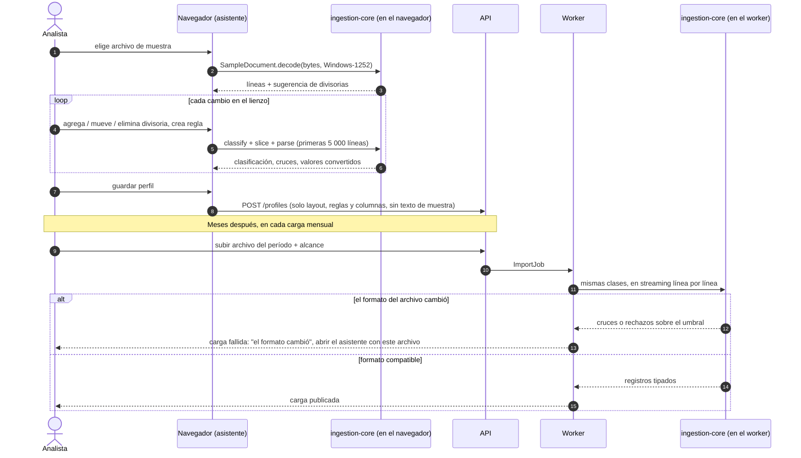

# 11 · Importación de texto de ancho fijo: asistente con lienzo

> Detalle de RF-REP-02, RF-REP-03 y RF-REP-05. Todos los ejemplos usan **datos ficticios**.

## 1. El problema

Muchos sistemas contables exportan sus reportes "impresos a archivo". Al abrirlos, cada línea es
**una sola cadena de texto**: no hay comas ni tabuladores que separen columnas, por lo que una
lectura ingenua produce una única columna con muchas filas. Además, estos archivos suelen tener:

| Característica | Consecuencia para la importación |
|---|---|
| Bloque de **encabezado repetido en cada página** (empresa, fecha de emisión, usuario, título, rango de fechas, moneda, títulos de columna). | Hay que ignorar esas líneas cada vez que reaparecen, aunque cambien la fecha, la hora o el número de página. |
| **Código jerárquico** con puntos (`1.001.002.0000`) y **nombre con sangría** (las cuentas de detalle tienen más espacios). | Conviven cuentas de mayor y de detalle: sumarlas todas duplica montos. |
| **Números alineados a la derecha**, separador de miles `,`, decimal `.`, cero como `.00`, negativos con `-` inicial. | El ancho variable queda a la izquierda del número; la columna debe cubrir el valor más largo posible. |
| **Celdas en blanco** cuando no hubo movimiento. | Un vacío en una columna numérica significa `0`, no un error. |
| Codificación **Windows-1252 / ISO-8859-1** (acentos y ñ). | Si se lee como UTF-8 aparecen caracteres `�`. |
| Líneas de ~140 caracteres y posibles saltos de página (`\f`). | El lienzo necesita desplazamiento horizontal y vertical. |

## 2. La solución: un lienzo con líneas divisorias

El asistente muestra el archivo **tal cual**, en fuente monoespaciada (cada carácter ocupa una
celda de la misma anchura), con una **regla de posiciones** arriba. El usuario hace clic en la
regla o en el texto para **agregar líneas divisorias verticales**; las franjas entre divisorias
son las columnas. Cada línea del archivo se clasifica en vivo (dato, ignorada o rechazada) y se
muestra en una **canaleta** a la izquierda.

Maqueta (datos ficticios):

```text
             1        10        20        30        40        50        60        70        80
             ┊....┊....┊....┊....┊....┊....┊....┊....┊....┊....┊....┊....┊....┊....┊....┊....┊
             │ codigo          │ nombre                  │  saldo_ant.│       debe│      haber│
─────────────┼─────────────────┼─────────────────────────┼────────────┼───────────┼───────────┤
 ⊘ encabezado│ EMPRESA DEMO, S.│ A.                      │            │     Página│:    1     │
 ⊘ encabezado│ Emisión:  05/03/│26  09:15:02             │            │           │           │
 ⊘ encabezado│ No. de Cuenta   │ Nombre de la Cuenta     │  Saldo Ant.│       DEBE│      HABER│
 ✔ dato      │ 1.000.000.0000  │ ACTIVO                  │   5,200.00 │   1,300.00│     450.00│
 ✔ dato      │ 1.001.001.0000  │ CAJA Y BANCOS           │   5,200.00 │   1,300.00│     450.00│
 ✔ dato      │ 1.001.001.0003  │    Caja chica           │     200.00 │           │      50.00│
 ✔ dato      │ 1.001.001.0007  │    Banco Demo cuenta 1  │   5,000.00 │   1,300.00│     400.00│
 ⊘ en blanco │                 │                         │            │           │           │
 ⊘ encabezado│ EMPRESA DEMO, S.│ A.                      │            │     Página│:    2     │
 ✖ rechazada │ 2.001.00        │ PROVEEDORES             │    -980.00 │           │           │
             └─ código no cumple la máscara 9.999.999.9999
```

- `│` son las divisorias que colocó el usuario (o que el sistema sugirió y el usuario aceptó).
- Las líneas de encabezado "cortadas" por las divisorias no importan: están **ignoradas**.
- La línea rechazada muestra el motivo debajo, sin detener el asistente.

## 3. Flujo del asistente



Se implementa con `Stepper` de PrimeNG; el lienzo permanece visible en los pasos 2 a 4 para
que cada cambio se vea de inmediato sobre el texto.

### Paso 1 · Archivo de muestra y codificación

| Elemento | Detalle | PrimeNG |
|---|---|---|
| Selección de archivo | `.txt`, `.prn`, `.lst`, `.dat` u otra extensión configurable. | `FileUpload` (modo básico, sin subir al servidor) |
| Lectura **en el navegador** | `FileReader` + `TextDecoder`; la muestra **no se envía al servidor**. | — |
| Codificación | Detección automática (UTF-8 válido → UTF-8; si no, Windows-1252) con cambio manual y vista previa inmediata; se resaltan los caracteres `�`. | `Select`, `Message` |
| Tabuladores | Expandir a N espacios (por defecto 8) para no desalinear columnas. | `InputNumber` |
| Estadísticas | Total de líneas, longitud máxima, saltos de página detectados. | `Tag` |

### Paso 2 · Lienzo: trazar columnas

| Acción | Gesto | Resultado |
|---|---|---|
| Agregar divisoria | Clic en la regla o en el texto | Divisoria en el límite de carácter más cercano. |
| Mover divisoria | Arrastrar; o seleccionar y usar `←` `→` (`Shift` = 5 posiciones) | Se ajusta a la cuadrícula de caracteres; no puede cruzar a otra divisoria. |
| Eliminar divisoria | Doble clic, tecla `Supr` o menú contextual | Las dos columnas vecinas se unen. |
| Aceptar sugerencias | Botón "Sugerir columnas" | Aparecen divisorias punteadas; se aceptan una a una o todas. |
| Nombrar columna | Clic en la franja | Abre el editor de la columna (paso 4) en un `Popover`. |
| Posición exacta | Tabla lateral de columnas | Inicio y ancho editables con `InputNumber`, sincronizados con el lienzo. |
| Zoom y navegación | Control de zoom; desplazamiento horizontal/vertical | La regla y la canaleta quedan fijas. |
| Deshacer / rehacer | `Ctrl+Z` / `Ctrl+Y` y botones | Historial de comandos. |
| Filtrar vista | "Solo datos", "solo rechazadas", "todas" | Útil para revisar los problemas. |

Indicadores visuales en vivo:

- **Franjas** de columna con colores alternos (tokens del tema, válidos en modo claro/oscuro).
- **Divisoria en rojo** cuando corta un valor en alguna línea de datos (por ejemplo, deja
  `1,30` a un lado y `0.00` al otro); al pasar el cursor se listan las líneas afectadas.
- **Texto fuera de columnas** (a la derecha de la última divisoria) resaltado como advertencia.

Componentes: `Toolbar` (sugerir, deshacer, zoom con `Slider`, filtro con `SelectButton`),
`Splitter` (lienzo | tabla de columnas), `Table` + `InputNumber` (posiciones), `ContextMenu`,
`Popover`, `Tooltip`, `Scroller` (virtualización de líneas). La superficie del lienzo es un
componente propio de dibujo (ver §8).

### Paso 3 · ¿Qué líneas son datos?

Cada línea pasa por una **cadena de reglas en orden**; la primera regla de exclusión que coincide
la marca como ignorada. Las que sobreviven se validan como datos.

| Regla | Cómo se crea | Ejemplo |
|---|---|---|
| Ignorar líneas en blanco | Activada por defecto | — |
| Ignorar saltos de página | Activada por defecto | `\f` |
| Ignorar las primeras N líneas | `InputNumber` | Portada del reporte |
| **Ignorar líneas como esta** | Seleccionar una línea en el lienzo → el sistema propone "comienza con", "contiene" o una máscara | "comienza con `Emisión:`" |
| **Bloque de encabezado de página** | Seleccionar las líneas del primer encabezado → se ignora cada vez que reaparece, tolerando fecha, hora y número de página variables (se comparan con máscara) | Todas las líneas del encabezado |
| **Máscara del identificador** (la más robusta) | Clic en un valor de la columna código → se genera la máscara; editable | `9.999.999.9999` |
| Identificadores requeridos | Automático para columnas de rol identificador | Código vacío → rechazada |

Máscaras: `9` = dígito, `A` = letra, `X` = letra o dígito, `*` = cualquier carácter; el resto
son literales. Una línea que no es ignorada pero **no cumple** la máscara se **rechaza con motivo**
(no se descarta en silencio), para no perder datos por un error de configuración.

Componentes: `Listbox` ordenable de reglas (`OrderList`), `Dialog` para crear la regla,
`InputText` para la máscara, `MeterGroup` con el conteo datos / ignoradas / rechazadas.

### Paso 4 · Definir columnas

| Campo | Opciones |
|---|---|
| Nombre | Texto libre (`codigo`, `nombre`, `saldo_anterior`, `debe`, `haber`, `saldo_actual`). |
| Tipo de dato | Texto, entero, decimal, fecha, booleano. |
| Rol | Código, nombre, id, saldo anterior, debe, haber, saldo, valor, atributo, fecha. |
| Requerida / omitir | Las identificadoras son requeridas; se pueden omitir columnas que no interesan. |
| Formato numérico | Separador de miles y decimal; negativo con `-` inicial, `-` final, paréntesis o sufijo `CR`; **vacío = 0** (por defecto en montos). |
| Recorte | Quitar espacios; opción "conservar sangría" para derivar el nivel (ver abajo). |
| Formato de fecha | Patrón (`dd/MM/yy`, `yyyyMMdd`…). |

Bajo el editor se muestran las primeras 200 líneas de datos **ya convertidas** (`Table`), con las
celdas inválidas en rojo y el motivo en `Tooltip`.

**Atributos derivados** (evitan el doble conteo de cuentas de mayor y de detalle):

| Atributo | Cálculo | Uso |
|---|---|---|
| `nivel` | Número de segmentos significativos del código (`1.001.000.0000` → 2) **o** cantidad de espacios de sangría del nombre. | Filtrar por nivel en informes y clasificaciones. |
| `es_detalle` | Verdadero si el código no tiene segmentos en cero al final (último nivel) o si la línea siguiente no es hija. | Consolidar y clasificar solo detalle; validar que la suma del detalle = cuenta de mayor. |

### Paso 5 · Metadatos del encabezado (opcional)

El usuario puede seleccionar una región dentro de una línea de encabezado (p. ej. el rango de
fechas o la moneda) y asociarla a **período sugerido** o **moneda sugerida** con un patrón
(`Del dd de MMMM yy al dd de MMMM yy`). Al cargar un archivo, el sistema compara ese valor con el
período y la moneda elegidos en la carga y **advierte si no coinciden** (evita subir enero como
febrero o quetzales como dólares).

### Paso 6 · Previsualizar y guardar

- Resumen: líneas leídas, datos, ignoradas por regla y rechazadas por motivo.
- Validación de cuadre opcional (suma de debe = suma de haber; saldo anterior + debe − haber =
  saldo actual por línea) mostrada como advertencia.
- Al guardar se crea una **nueva versión del perfil** con: divisorias, columnas, reglas, máscaras
  y metadatos. **No se guarda ninguna línea del archivo de muestra.**

## 4. Sugerencia automática de columnas



La colocación según alineación maximiza la tolerancia a archivos futuros con valores más
largos. Como cada valor se recorta al leerse, la posición exacta dentro del hueco no altera el
resultado de la muestra actual.

## 5. Validaciones en vivo

| Validación | Severidad | Mensaje |
|---|---|---|
| Divisoria corta un valor (hay caracteres no blancos a ambos lados en la misma línea de datos) | Error | "La divisoria 58 corta `12,500.00` en 3 líneas" |
| Columna vacía en todas las líneas de datos | Advertencia | "La columna `c7` no tiene datos; ¿omitirla?" |
| Identificador vacío | Error (línea rechazada) | "Código vacío" |
| Valor no convertible al tipo | Error (línea rechazada) | "`1.300,00` no es decimal con el formato configurado" |
| Texto a la derecha de la última divisoria | Advertencia | "Hay texto después de la posición 132" |
| Encabezado de página no reconocido en una página | Advertencia | "La línea 88 parece encabezado pero no coincide con el bloque" |
| Más de X % de líneas rechazadas | Bloquea guardar | "Revise la máscara o las divisorias" |

## 6. Modelo de clases

La lógica de corte, reglas, máscaras y conversión vive en una librería **compartida**
`libs/shared/ingestion-core` (TypeScript puro). El navegador la usa para la previsualización y
el worker para la importación real: **lo que el usuario ve es exactamente lo que se importa**.

```mermaid
classDiagram
    class FixedWidthLayout {
        <<ValueObject>>
        -ColumnDivider[] dividers
        -number lineLength
        +empty(lineLength number)$ FixedWidthLayout
        +addDivider(position number) Result~FixedWidthLayout~
        +moveDivider(from number, to number) Result~FixedWidthLayout~
        +removeDivider(position number) FixedWidthLayout
        +bands() ColumnBand[]
        +slice(line TextLine) string[]
    }
    class ColumnDivider {
        <<ValueObject>>
        -number position
        +at(position number)$ Result~ColumnDivider~
    }
    class ColumnBand {
        <<ValueObject>>
        -number start
        -number end
        +width() number
        +extract(line TextLine) string
        +isCrossedBy(line TextLine, divider ColumnDivider) boolean
    }
    class SampleDocument {
        -TextLine[] lines
        -TextEncoding encoding
        +decode(bytes Uint8Array, encoding TextEncoding, tabSize number)$ SampleDocument
        +maxLineLength() number
        +line(index number) Optional~TextLine~
    }
    class TextLine {
        <<ValueObject>>
        -number number
        -string text
        -boolean pageBreak
        +charAt(position number) string
        +isBlank() boolean
    }
    class LineClassifier {
        -LineRule[] rules
        -TextMask identifierMask
        +classify(line TextLine, layout FixedWidthLayout) LineClassification
    }
    class LineClassification {
        <<abstract>>
    }
    class DataLine
    class IgnoredLine {
        -string ruleName
    }
    class RejectedLine {
        -RowIssue[] issues
    }
    class LineRule {
        <<abstract>>
        +matches(line TextLine)* boolean
        +describe()* string
    }
    class BlankLineRule
    class PageBreakRule
    class LeadingLinesRule
    class TextPatternRule {
        -TextOperator operator
        -string text
    }
    class PageHeaderBlockRule {
        -TextMask[] headerLines
    }
    class TextMask {
        <<ValueObject>>
        -string pattern
        +fromSample(value string)$ TextMask
        +matches(value string) boolean
    }
    class BoundarySuggester {
        -number occupancyThreshold
        +suggest(document SampleDocument, classifier LineClassifier) ColumnDivider[]
    }
    class CrossingDetector {
        +detect(document SampleDocument, layout FixedWidthLayout) DividerCrossing[]
    }
    class HeaderFieldExtractor {
        -HeaderRegion region
        -DatePattern pattern
        +extractPeriod(document SampleDocument) Optional~Period~
    }
    class DerivedLevelCalculator {
        <<abstract>>
        +levelOf(record MappedRecord)* number
    }
    class CodeSegmentsLevel
    class IndentationLevel

    FixedWidthLayout "1" *-- "0..*" ColumnDivider
    FixedWidthLayout ..> ColumnBand : deriva
    SampleDocument "1" *-- "1..*" TextLine
    LineClassifier "1" *-- "0..*" LineRule
    LineClassifier *-- TextMask
    LineClassifier ..> LineClassification
    LineClassification <|-- DataLine
    LineClassification <|-- IgnoredLine
    LineClassification <|-- RejectedLine
    LineRule <|-- BlankLineRule
    LineRule <|-- PageBreakRule
    LineRule <|-- LeadingLinesRule
    LineRule <|-- TextPatternRule
    LineRule <|-- PageHeaderBlockRule
    PageHeaderBlockRule *-- TextMask
    BoundarySuggester ..> SampleDocument
    CrossingDetector ..> FixedWidthLayout
    DerivedLevelCalculator <|-- CodeSegmentsLevel
    DerivedLevelCalculator <|-- IndentationLevel
```



Del lado del frontend:



## 7. Secuencia: de la muestra a la carga real



## 8. Implementación del lienzo

- **Superficie**: componente propio `FixedWidthCanvasComponent` que dibuja el texto en una
  cuadrícula monoespaciada; la anchura de carácter se mide una vez (`CanvasViewport`) y convierte
  píxeles ↔ posición. Es una superficie de dibujo, no un control de formulario, por eso está en la
  lista de excepciones de la regla `primeng-controls-only`; todos los controles alrededor
  (botones, tablas, menús, diálogos) son PrimeNG.
- **Virtualización**: `Scroller` de PrimeNG renderiza solo las líneas visibles; la regla y la
  canaleta quedan fijas. Las divisorias son una capa superpuesta que se mueve con eventos de
  puntero y teclado (accesible con `role="slider"` y `aria-valuenow`).
- **Muestra**: el asistente carga el archivo completo en memoria del navegador si pesa menos de
  20 MB; si pesa más, usa las primeras 5 000 líneas más páginas aleatorias para detectar
  variaciones.
- **Estilos**: SCSS del componente con variables CSS del tema PrimeNG (`--p-primary-color`,
  `--p-content-border-color`, `--p-red-500`…), por lo que funciona en modo claro y oscuro.

## 9. Confidencialidad de los datos

- La muestra se decodifica y analiza **en el navegador**; no se envía al servidor hasta que el
  usuario ejecuta una carga real.
- El perfil guarda únicamente posiciones, reglas, máscaras y nombres de columna.
- Los archivos de carga se eliminan del almacenamiento después de importarse (retención
  configurable, 0 días por defecto) y los registros quedan protegidos por los permisos del proyecto.
- Los incidentes de filas rechazadas guardan un fragmento de la línea solo para usuarios con
  permiso de lectura sobre la carga, y se pueden desactivar por proyecto.
