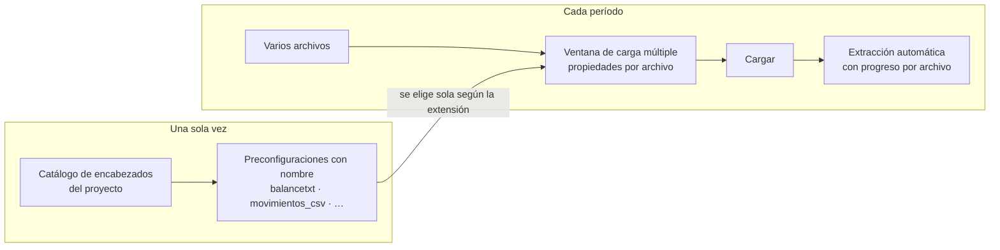
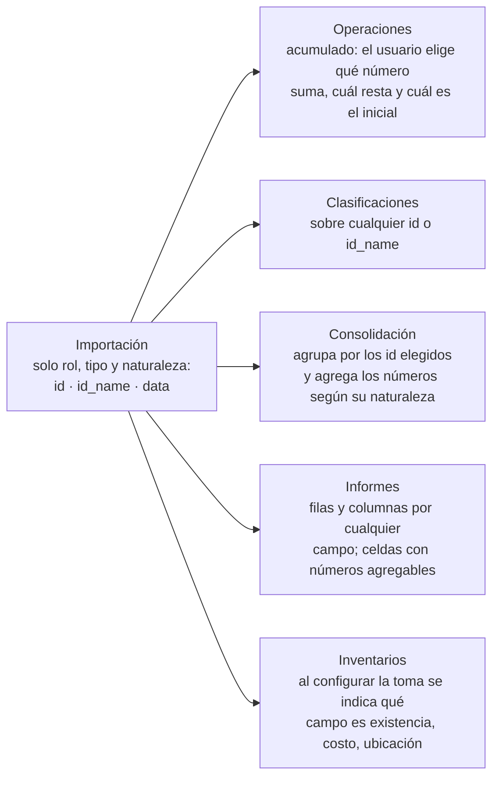
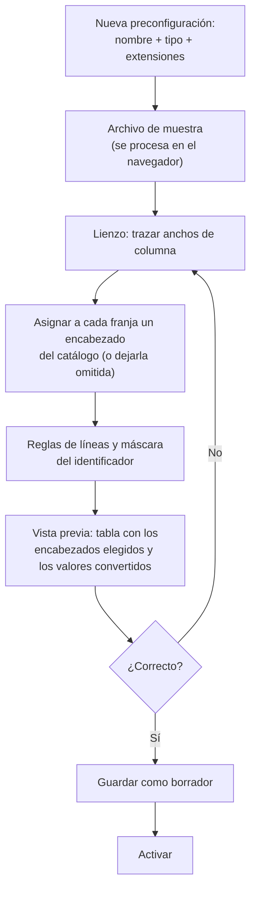
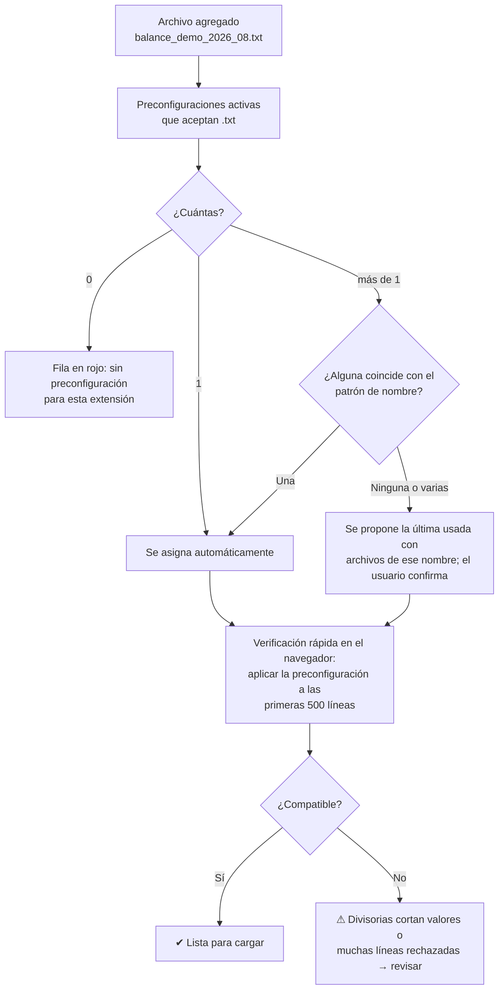
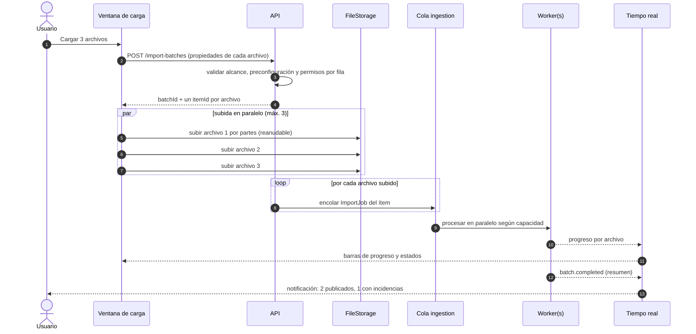
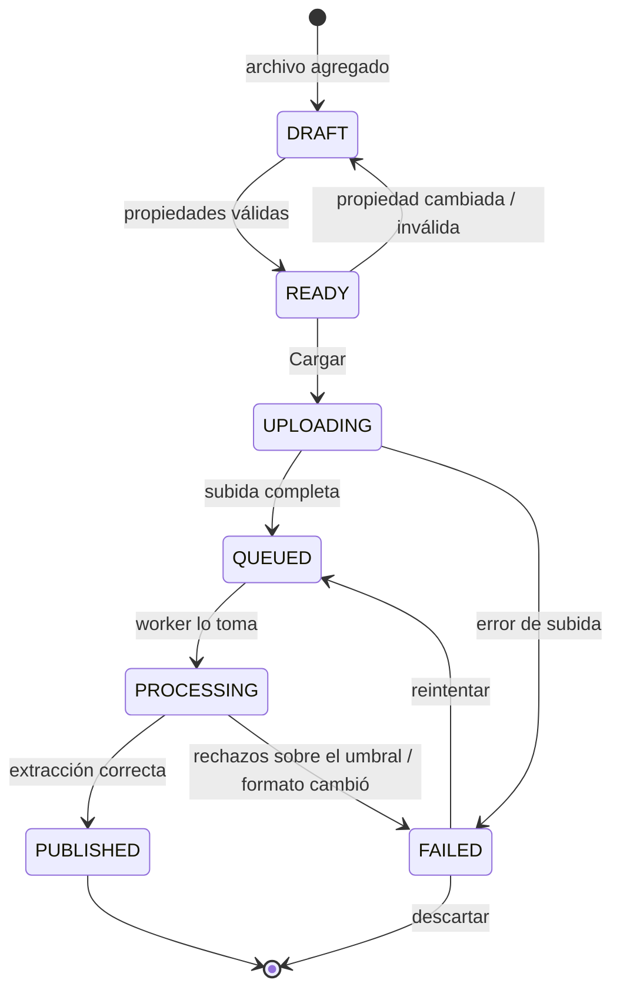
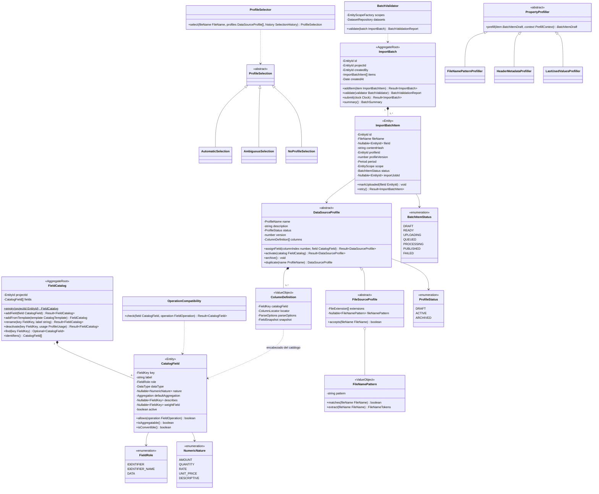

# 12 · Preconfiguraciones con nombre y carga múltiple de archivos

> Detalle de RF-REP-02, RF-REP-06, RF-REP-18 y RF-REP-19. Complementa
> [11-importacion-ancho-fijo](11-importacion-ancho-fijo.md). Ejemplos con **datos ficticios**.

## 1. Idea general

El trabajo se divide en dos momentos:

| Momento | Quién y cuándo | Qué hace |
|---|---|---|
| **Preconfigurar** (una vez) | Analista, al preparar el área de trabajo | Crea preconfiguraciones con nombre (p. ej. `balancetxt`) para cada tipo de archivo: extensión, lectura del archivo de muestra, anchos de columna, encabezado de cada columna elegido de una lista previa, identificadores y vista previa. |
| **Cargar** (cada período) | Cualquier usuario con permiso | Arrastra varios archivos a la vez, revisa o ajusta las propiedades de cada uno (preconfiguración, período, organización, país, moneda, compañía…) y presiona **Cargar**. Luego solo espera: la extracción es automática. |



## 2. Catálogo de encabezados (lista previa)

El módulo de Reportes sirve para **cualquier tipo de reporte** (contable, ventas directas,
cobranza, producción…), por eso la importación **no conoce conceptos de negocio** como debe,
haber o saldo. Cada encabezado es un nombre libre que escribe el usuario y se describe con tres
propiedades: **rol**, **tipo de dato** y, si es numérico, **naturaleza**.

### 2.1 Rol

| Rol | Alias | Para qué sirve | Tipos permitidos |
|---|---|---|---|
| **Identificador** | `id` | Identifica el registro; puede haber varios (identificador compuesto: producto + tienda). Obligatorio y sin vacíos. | Texto (recomendado) o número entero |
| **Nombre del identificador** | `id_name` | Describe a un identificador concreto (se elige a cuál). | Texto |
| **Dato** | `data` | Cualquier otra columna. | Texto, número entero, número decimal, fecha, sí/no |

### 2.2 Tipo de dato

| Tipo | Cómo se lee al importar | Qué se puede hacer |
|---|---|---|
| **Texto** | Tal cual (recortado). | Filtrar (igual, contiene, inicia, termina), agrupar, clasificar, usar como fila/columna. |
| **Número entero** | Con el formato numérico de la preconfiguración; vacío = 0. | Según su naturaleza (§2.3). |
| **Número decimal** | Con separadores configurables y negativos (`-`, paréntesis, `CR`); vacío = 0. | Según su naturaleza (§2.3). |
| **Fecha** | Con el patrón de fecha configurado. | Filtrar por rango, agrupar por día/mes/año, diferencia en días. |
| **Sí / No** | Con los valores configurados (`S/N`, `1/0`, `Sí/No`). | Filtrar y contar. |

> **Recomendación**: los códigos que "parecen números" (cuentas, productos, teléfonos, facturas)
> se declaran **Texto**. Así se conservan los ceros a la izquierda y nunca se suman por error.

### 2.3 Naturaleza de los números

El tipo solo no basta: *Monto de venta*, *Precio unitario* y *% de margen* son todos números,
pero solo el primero se puede sumar con sentido. Por eso cada dato numérico declara su
**naturaleza**, que fija cómo se agrega y si se convierte de moneda:

| Naturaleza | Ejemplos | Agregación por defecto | Conversión de moneda |
|---|---|---|---|
| **Monto** (dinero) | Debe, Haber, Saldo, Monto de venta | Suma | ✔ Se convierte |
| **Cantidad** | Unidades vendidas, existencia | Suma | ✖ |
| **Tasa / porcentaje** | % de margen, tasa de interés | Promedio ponderado por otro campo, o no agregable | ✖ |
| **Precio / valor unitario** | Precio unitario, costo unitario | Promedio ponderado por una cantidad, o no agregable | ✔ Se convierte |
| **Número descriptivo** | Año de fabricación, número de cuotas | No agregable (solo filtrar/agrupar) | ✖ |

La agregación por defecto se puede cambiar por Suma, Promedio, Mínimo, Máximo, Último o
No agregable, **dentro de lo que permite la naturaleza**. Por ejemplo, una tasa nunca permite Suma.

### 2.4 Ejemplos

| Encabezado | Rol | Tipo | Naturaleza |
|---|---|---|---|
| *Proyecto contable* | | | |
| Código de cuenta | `id` | Texto | — |
| Nombre de cuenta | `id_name` → Código de cuenta | Texto | — |
| Saldo anterior / Debe / Haber / Saldo actual | `data` | Decimal | Monto |
| Centro de costo | `data` | Texto | — |
| *Proyecto de ventas directas* | | | |
| Código de producto | `id` | Texto | — |
| Descripción del producto | `id_name` → Código de producto | Texto | — |
| Código de tienda | `id` | Texto | — |
| Vendedor | `data` | Texto | — |
| Fecha de venta | `data` | Fecha | — |
| Unidades vendidas | `data` | Entero | Cantidad |
| Precio unitario | `data` | Decimal | Precio unitario (ponderado por *Unidades vendidas*) |
| Monto de venta | `data` | Decimal | Monto |
| % de descuento | `data` | Decimal | Tasa (ponderada por *Monto de venta*) |

### 2.5 Reglas del catálogo

- **No hay claves que escribir**: el sistema asigna a cada encabezado un identificador interno
  invisible; renombrar un encabezado no rompe informes, clasificaciones ni cargas anteriores.
- El catálogo puede empezar **vacío** o desde una plantilla opcional (*Contable*, *Ventas*); las
  plantillas son solo listas precargadas.
- Cada preconfiguración usa **al menos un `id`**; un encabezado no se repite dentro de la misma
  preconfiguración.
- El **tipo y la naturaleza no se pueden cambiar** si el encabezado ya tiene datos cargados (se
  romperían cálculos existentes); se crea un encabezado nuevo y se desactiva el anterior. El nombre
  sí se puede cambiar siempre.

Pantalla: `Table` con edición en celda — `InputText` (nombre), `Select` (rol), `Select`
("nombre de…" para `id_name`), `Select` (tipo), `Select` (naturaleza, visible solo para números),
`Select` (agregación, filtrado por naturaleza) — `SplitButton` "Agregar desde plantilla" y
`ConfirmDialog` al desactivar.

### 2.6 Cómo se evita operar texto con números

La protección está en **tres capas**, para que un error sea imposible y no solo improbable:

| Capa | Qué hace | Ejemplo |
|---|---|---|
| **Interfaz** | Cada selector muestra solo los campos compatibles. | En "campos a sumar" de una consolidación solo aparecen números agregables; en "agrupar por", solo identificadores, textos y fechas. |
| **Dominio (al guardar)** | Las clases validan la configuración y devuelven un error si no es compatible. | `ConsolidationDefinition.addSummedField(Vendedor)` → `Fail(FIELD_NOT_AGGREGATABLE)`. |
| **Motor de fórmulas (al escribir)** | Verificación de tipos antes de ejecutar. | `=[Vendedor] + [Monto de venta]` → "No se puede sumar Texto con Número decimal"; `=SUMA([% de descuento])` → "Una tasa no se puede sumar; use PROMEDIO.PONDERADO". |

| Operación | Texto | Número (Monto/Cantidad) | Tasa / Precio unitario | Número descriptivo | Fecha | Sí/No |
|---|:-:|:-:|:-:|:-:|:-:|:-:|
| Agrupar / filtrar / fila o columna de informe | ✔ | ✔ | ✔ | ✔ | ✔ | ✔ |
| Clasificar (reglas de texto) | ✔ | ✖ | ✖ | ✖ | ✖ | ✖ |
| Sumar en consolidación y totales | ✖ | ✔ | ✖ (ponderado) | ✖ | ✖ | ✖ (contar) |
| Acumular (saldo inicial + aumenta − disminuye) | ✖ | ✔ | ✖ | ✖ | ✖ | ✖ |
| Aritmética en fórmulas | ✖ | ✔ | ✔ | ✔ | Diferencia de días | ✖ |
| Conversión de moneda | ✖ | Solo Monto | Solo Precio unitario | ✖ | ✖ | ✖ |

### 2.7 ¿Dónde queda el significado de negocio?

El significado se asigna **donde se usa**, no al importar. Así, un mismo archivo puede servir a
varios procesos y un proyecto de ventas nunca ve opciones contables:



| Uso | Contable | Ventas directas |
|---|---|---|
| Acumulado | *Saldo actual* = *Saldo anterior* + *Debe* − *Haber* | *Unidades del año* = Σ *Unidades vendidas* desde enero |
| Validación | Σ *Debe* = Σ *Haber* | Σ *Monto de venta* = total de control del archivo |
| Clasificación | Por *Código de cuenta* (activo, pasivo…) | Por *Código de producto* (línea, familia…) |
| Consolidación | Por *Código de cuenta*, suma de *Saldo actual* | Por *Código de producto*, suma de *Monto de venta* |

## 3. Preconfiguraciones con nombre

### 3.1 Datos de una preconfiguración

| Dato | Ejemplo | Regla |
|---|---|---|
| Nombre | `balancetxt` | Único en el proyecto. |
| Descripción | "Balance de saldos mensual del sistema contable" | Opcional (texto vacío permitido). |
| Tipo de fuente | Texto de ancho fijo | Ancho fijo, delimitado, hoja de cálculo o BD. |
| Extensiones | `.txt`, `.prn` | Al menos una; sin distinguir mayúsculas. |
| Patrón de nombre de archivo | `balance_*.txt` | Opcional; desempata cuando varias preconfiguraciones aceptan la misma extensión. |
| Lectura | Codificación, divisorias, reglas de líneas, máscara del identificador | Definidas con el asistente de [11](11-importacion-ancho-fijo.md). |
| Columnas | Franja 1 → *Código de cuenta*, franja 2 → *Nombre de cuenta*, franja 3 → *Saldo anterior*… (o *Código de producto*, *Unidades vendidas*… en ventas) | El encabezado se **elige del catálogo** (`Select` con búsqueda) y trae su rol, tipo y naturaleza; las franjas sin encabezado se omiten. |
| Estado | Borrador / Activa / Archivada | Solo las **activas** aparecen al cargar. |
| Versión | v3 | Cada cambio guardado en una activa crea una versión nueva; las cargas registran la versión usada. |

Acciones: crear, editar (abre el asistente), **duplicar** (para variantes del mismo reporte),
probar con otro archivo, activar, archivar.

### 3.2 Flujo de creación



La **vista previa** es una `Table` cuyas columnas son exactamente los encabezados elegidos
(*Código de cuenta*, *Nombre de cuenta*, *Saldo anterior*…), con las celdas inválidas en rojo, más
el resumen de líneas de datos, ignoradas y rechazadas.

### 3.3 Selección automática al cargar



## 4. Ventana de carga múltiple

### 4.1 Maqueta

```text
┌─ Cargar datos ─────────────────────────────────────────────────────────────────────────────────┐
│ ┌──────────────────────────────────────────────────────────────────────────────────────────┐   │
│ │   Arrastra aquí tus archivos o haz clic para seleccionarlos (.txt .prn .csv .xlsx)         │   │
│ └──────────────────────────────────────────────────────────────────────────────────────────┘   │
│ [☐] seleccionados: 2   [Aplicar a seleccionados…]  [Copiar fila anterior]  [Quitar]            │
│                                                                                                │
│ ☐ Archivo                    Preconfig.     Período   Organización  País   Moneda Compañía  Empresa  Sucursal Estado │
│ ☑ balance_demo_2026_08.txt   balancetxt ▾   08/2026 ▾ Grupo Demo ▾  GT ▾   GTQ ▾  Demo A ▾  —  ▾     —  ▾     ✔ Lista │
│ ☑ balance_demo2_2026_08.txt  balancetxt ▾   08/2026 ▾ Grupo Demo ▾  GT ▾   GTQ ▾  Demo B ▾  —  ▾     —  ▾     ✔ Lista │
│ ☐ balance_usd_2026_08.txt    balancetxt ▾   08/2026 ▾ Grupo Demo ▾  GT ▾   USD ▾  Demo A ▾  —  ▾     —  ▾     ⚠ Reemplaza v2 │
│ ☐ inventario.xlsx            (ninguna)  ▾   —       ▾ —          ▾  —  ▾   —   ▾  —      ▾  —  ▾     —  ▾     ✖ Sin preconfig. │
│                                                                                                │
│ 3 listos · 1 con advertencia · 1 con error                          [Cancelar]  [Cargar 3 archivos] │
└────────────────────────────────────────────────────────────────────────────────────────────────┘
```

### 4.2 Propiedades por archivo

| Propiedad | Requerida | Componente | Cómo se completa sola |
|---|:-:|---|---|
| Preconfiguración | ✔ | `Select` filtrado por extensión | Selección automática (§3.3). |
| Período (mes/año) | ✔ | `DatePicker` en vista mes | Patrón del nombre de archivo o metadatos del encabezado del archivo (p. ej. "Del 01 de agosto…"). |
| Organización | ✔ | `Select` | Única organización del proyecto o última usada. |
| País | ✔ | `Select` filtrado por organización | Último usado con esa preconfiguración. |
| Moneda | ✔ | `Select` con las monedas habilitadas en el país | Metadatos del encabezado (línea de moneda) o última usada. |
| Compañía | ✔ | `Select` filtrado por país | Patrón del nombre de archivo (`balance_{compania}_…`) o última usada. |
| Empresa | Si existe | `Select` filtrado por compañía | Idem. |
| Sucursal | Si existe | `Select` filtrado por empresa | Idem. |

Los selectores son **en cascada**: cambiar el país limpia moneda y compañía si ya no son válidas.
Todo valor propuesto automáticamente se muestra con un ícono indicando su origen y siempre es
editable.

### 4.3 Edición rápida de muchos archivos

| Acción | Resultado |
|---|---|
| **Aplicar a seleccionados** | `Dialog` con las mismas propiedades; solo se aplican las que el usuario llena. |
| **Copiar fila anterior** | Copia las propiedades de la fila de arriba a las seleccionadas. |
| **Patrón de nombres** | Si los archivos siguen una convención (`balance_{compania}_{anio}_{mes}.txt`), la preconfiguración puede declararla y las propiedades se llenan solas. |
| **Recordar** | Por cada preconfiguración se recuerdan los últimos valores usados por nombre de archivo. |

### 4.4 Validaciones antes de cargar

| Validación | Resultado |
|---|---|
| Falta una propiedad requerida | ✖ la fila no se puede cargar. |
| Moneda no habilitada en el país, compañía de otro país, empresa de otra compañía | ✖ con el motivo. |
| Extensión no aceptada por la preconfiguración | ✖ |
| Verificación rápida incompatible (divisorias que cortan valores, muchos rechazos) | ⚠ con opción "Abrir en el asistente". |
| Período o moneda del encabezado del archivo distintos a los elegidos | ⚠ "El archivo dice julio 2026 y elegiste agosto 2026". |
| Dos filas con la misma preconfiguración, período y alcance | ✖ duplicado dentro del lote. |
| Ya existe una carga para ese alcance y período | ⚠ "Reemplazará la versión v2 del 03/08/2026"; se confirma una sola vez para todo el lote. |
| Archivo idéntico (mismo hash) ya cargado para ese alcance | ⚠ "Este archivo ya fue cargado". |

El botón **Cargar N archivos** solo cuenta las filas sin errores; las filas con error se quedan
en la ventana para corregirlas o quitarlas.

### 4.5 Después de presionar "Cargar"



- Cada archivo es **independiente**: si uno falla, los demás se publican igual.
- El usuario puede **cerrar la ventana**: el lote sigue en el servidor y al terminar recibe una
  notificación (in-app y, si hay correo, por correo) con el resumen.
- En la pantalla **Cargas** se ve el historial de lotes; cada archivo fallido tiene
  "Ver incidencias" y "Abrir en el asistente con este archivo".
- Reintentar un archivo fallido reutiliza sus propiedades: no hay que volver a llenarlas.

Componentes: `FileUpload` (múltiple, `customUpload`), `Table` con selección por `Checkbox` y
edición en celda (`Select`, `DatePicker`), `Tag` de estado con `Tooltip` del motivo, `Dialog`
(aplicar a seleccionados), `ConfirmDialog` (reemplazos), `ProgressBar` por fila,
`MeterGroup` del lote, `Toast` al finalizar.

### 4.6 Estados de cada archivo del lote



## 5. Modelo de clases



- `FieldKey` es un identificador interno generado (no lo escribe el usuario).
- `OperationCompatibility` es la única fuente de la matriz de §2.6; la usan la interfaz (para
  filtrar selectores), el dominio (al guardar) y el motor de fórmulas (verificación de tipos).
- `ColumnDefinition.snapshot` guarda el rol, el tipo y la naturaleza del encabezado **al activar la
  versión**: renombrar o ajustar el catálogo después no altera cómo se leen las cargas de esa
  versión.
- Los *prefillers* forman una cadena (**Chain of Responsibility**): patrón de nombre →
  metadatos del encabezado → últimos valores usados; cada uno solo llena lo que sigue vacío.
- `ProfileSelection` usa subclases en lugar de `null`: la interfaz decide qué mostrar según el
  tipo (**sin `undefined` ni banderas sueltas**).

## 6. Datos (MongoDB)

| Colección | Campos clave | Índices |
|---|---|---|
| `field_catalogs` | `projectId`, `fields[]{key (generada), label, role, dataType, nature, defaultAggregation, describes, weightField, active}` | `{projectId:1}` único |
| `data_source_profiles` | además: `name`, `description`, `status`, `extensions[]`, `fileNamePattern`, `columns[].catalogField`, `columns[].snapshot` | `{projectId:1, name:1}` único, `{projectId:1, status:1, extensions:1}` |
| `import_batches` | `projectId`, `createdBy`, `createdAt`, `items[]{fileName, fileId, contentHash, profileId, profileVersion, period, scope, status, importJobId}` | `{projectId:1, createdAt:-1}`, `{'items.contentHash':1}` |
| `profile_selection_history` | `projectId`, `profileId`, `fileNameKey`, `lastValues{period, scope}` | `{projectId:1, profileId:1, fileNameKey:1}` único |

## 7. Permisos

| Acción | Permiso |
|---|---|
| Editar el catálogo de encabezados | `MANAGE DATA_SOURCE_PROFILE` (Administrador y Analista de datos por defecto) |
| Crear, editar, activar preconfiguraciones | `CREATE/UPDATE DATA_SOURCE_PROFILE` |
| Crear lotes y cargar | `EXECUTE DATA_LOAD` (se valida por cada archivo y su compañía) |
| Confirmar reemplazo de versiones existentes | `UPDATE DATA_LOAD` |
