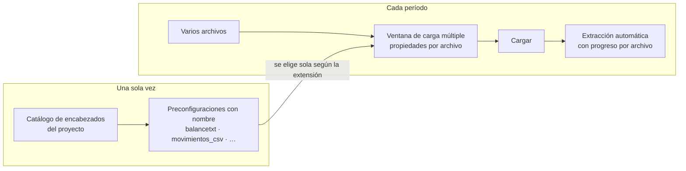
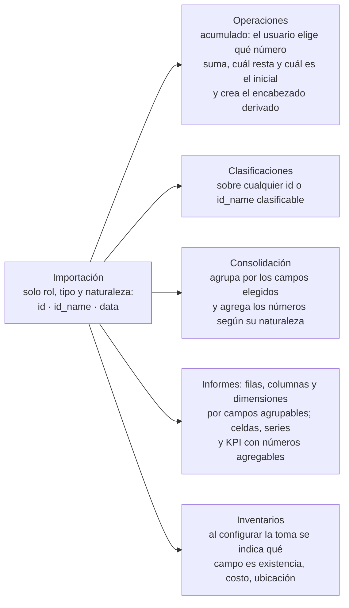
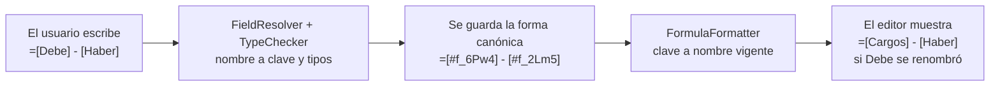
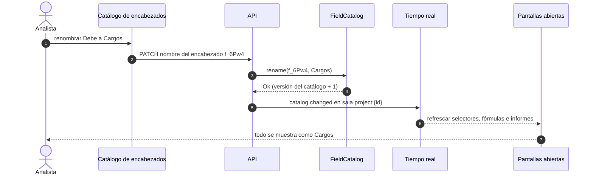
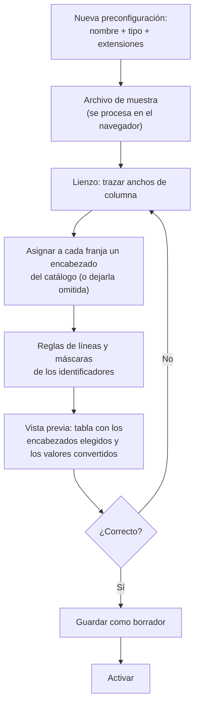
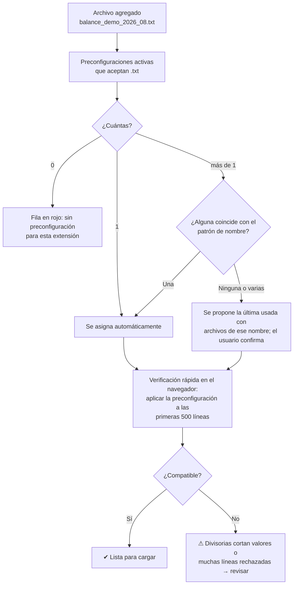
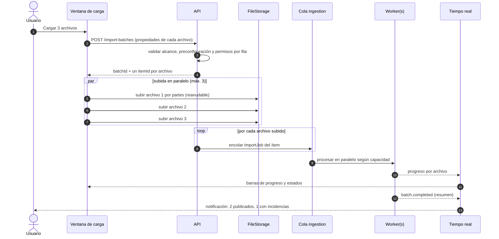
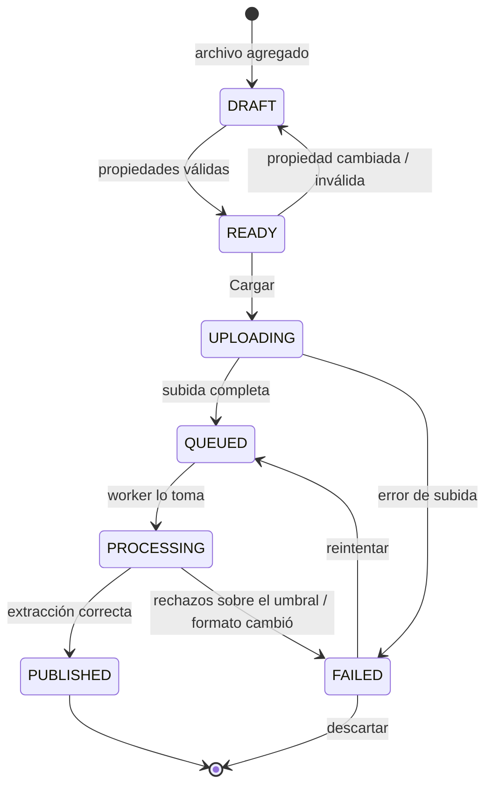

# 12 · Preconfiguraciones con nombre y carga múltiple de archivos

> Detalle de RF-REP-02, RF-REP-06, RF-REP-18, RF-REP-19 y RF-REP-20. Complementa
> [11-importacion-ancho-fijo](11-importacion-ancho-fijo.md). Ejemplos con **datos ficticios**.
>
> **¿Los encabezados son dinámicos?** Sí. Cada proyecto pone a sus encabezados el nombre que
> quiera (*Debe*, *Haber*, *Saldo*, *Cargos*, *Monto de venta*…) y los usa **siempre por ese
> nombre** en operaciones, clasificaciones, consolidación, fórmulas, informes e inventarios. La
> respuesta completa, con ejemplos, está en
> [§2.8 Usar los encabezados por su nombre](#28-usar-los-encabezados-por-su-nombre).

## 1. Idea general

El trabajo se divide en dos momentos:

| Momento | Quién y cuándo | Qué hace |
|---|---|---|
| **Preconfigurar** (una vez) | Analista, al preparar el área de trabajo | Crea preconfiguraciones con nombre (p. ej. `balancetxt`) para cada tipo de archivo: extensión, lectura del archivo de muestra, anchos de columna, encabezado de cada columna elegido de una lista previa, identificadores y vista previa. |
| **Cargar** (cada período) | Cualquier usuario con permiso | Arrastra varios archivos a la vez, revisa o ajusta las propiedades de cada uno (preconfiguración, período, organización, país, moneda, compañía…) y presiona **Cargar**. Luego solo espera: la extracción es automática. |



## 2. Catálogo de encabezados (lista previa)

El módulo de Reportes sirve para **cualquier tipo de reporte** (contable, ventas directas,
cobranza, producción…), por eso la importación **no conoce conceptos de negocio** como debe,
haber o saldo. Cada encabezado es un nombre libre que escribe el usuario y se describe con tres
propiedades: **rol**, **tipo de dato** y, si es numérico, **naturaleza**. Ese nombre es único entre
los encabezados activos del proyecto (comparación normalizada) y es el que se elige y se escribe en todas las partes posteriores (§2.8); el sistema
lo respalda con una clave interna invisible, de modo que el nombre se puede cambiar sin romper nada.

### 2.1 Rol

| Rol | Alias | Para qué sirve | Tipos permitidos |
|---|---|---|---|
| **Identificador** | `id` (`IDENTIFIER`) | Identifica el registro; puede haber varios (identificador compuesto: producto + tienda). Obligatorio: un vacío rechaza la línea. | Texto (recomendado) o número entero |
| **Nombre del identificador** | `id_name` (`IDENTIFIER_NAME`) | Describe a un identificador concreto (se elige a cuál con `describes`, que debe apuntar a un encabezado de rol `id`). | Texto |
| **Dato** | `data` (`DATA`) | Cualquier otra columna. | Texto, número entero, número decimal, fecha, sí/no |

Un `id` de tipo número entero tiene **naturaleza fija Número descriptivo** (`DESCRIPTIVE`): nunca
se suma ni se promedia, y se puede clasificar por su representación de texto (p. ej. el código
`1101` se clasifica igual que el texto «1101»).

### 2.2 Tipo de dato

| Tipo | Cómo se lee al importar | Qué se puede hacer |
|---|---|---|
| **Texto** | Tal cual (recortado). | Filtrar (igual, contiene, inicia, termina), agrupar, clasificar (si su rol es `id` o `id_name`), usar como fila/columna. |
| **Número entero** | Con el formato numérico de la preconfiguración; los vacíos según §2.3.1. | Según su naturaleza (§2.3). |
| **Número decimal** | Con separadores configurables y negativos (`-`, paréntesis, `CR`); los vacíos según §2.3.1. | Según su naturaleza (§2.3). |
| **Fecha** | Con el patrón de fecha configurado. | Filtrar por rango, agrupar por día/mes/año, diferencia en días. |
| **Sí / No** | Con los valores de sí/no de la columna (`ParseOptions.booleanValues`: el texto que significa sí y el que significa no, p. ej. `S/N`, `1/0`, `Sí/No`), sin distinguir mayúsculas. Cualquier otro valor rechaza la línea. | Filtrar, agrupar y contar. |

> **Recomendación**: los códigos que "parecen números" (cuentas, productos, teléfonos, facturas)
> se declaran **Texto**. Así se conservan los ceros a la izquierda y nunca se suman por error.

### 2.3 Naturaleza de los números

El tipo solo no basta: *Monto de venta*, *Precio unitario* y *% de margen* son todos números,
pero solo el primero se puede sumar con sentido. Por eso cada dato numérico declara su
**naturaleza**, que fija cómo se agrega y si se convierte de moneda:

| Naturaleza | Ejemplos | Agregación por defecto | Conversión de moneda |
|---|---|---|---|
| **Monto** (dinero, `AMOUNT`) | Debe, Haber, Saldo, Monto de venta | Suma (`SUM`) | ✔ Se convierte |
| **Cantidad** (`QUANTITY`) | Unidades vendidas, existencia | Suma (`SUM`) | ✖ |
| **Tasa / porcentaje** (`RATE`) | % de margen, tasa de interés | Promedio ponderado por otro campo (`WEIGHTED_AVERAGE` con `weightField`), o no agregable (`NONE`) | ✖ |
| **Precio / valor unitario** (`UNIT_PRICE`) | Precio unitario, costo unitario | Promedio ponderado por una cantidad (`WEIGHTED_AVERAGE` con `weightField`), o no agregable (`NONE`) | ✔ Se convierte |
| **Número descriptivo** (`DESCRIPTIVE`) | Año de fabricación, número de cuotas, un `id` entero | No agregable (`NONE`; solo filtrar/agrupar) | ✖ |

La agregación por defecto (`Aggregation`: `SUM`, `AVERAGE`, `WEIGHTED_AVERAGE`, `MIN`, `MAX`,
`LAST`, `COUNT`, `NONE`) se puede cambiar por Suma, Promedio, Promedio ponderado, Mínimo, Máximo,
Último o No agregable, **dentro de lo que permite la naturaleza**. Por ejemplo, una tasa nunca
permite Suma. **Contar** (`COUNT`) se permite sobre cualquier encabezado, de cualquier tipo.

El campo de ponderación (`weightField`, «ponderado por») debe ser un encabezado **activo** de
naturaleza Monto o Cantidad, nunca una Tasa: *% de descuento* se pondera por *Monto de venta* y
*Precio unitario* por *Unidades vendidas*.

#### 2.3.1 Vacíos al importar

| Encabezado | Una celda vacía significa |
|---|---|
| Rol `id` (cualquier tipo) | Error: la línea se rechaza. |
| `data` de naturaleza Monto o Cantidad | **Cero** por defecto; configurable por columna: «cero» o «sin valor». |
| `data` de naturaleza Tasa, Precio unitario o Número descriptivo | «Sin valor» (`EmptyValue`): no participa en promedios ni conteos. |

Así, un *Precio unitario* vacío no baja el precio promedio ni una *% de descuento* vacía cuenta
como un descuento de 0 %.

### 2.4 Ejemplos

| Encabezado | Rol | Tipo | Naturaleza |
|---|---|---|---|
| *Proyecto contable* | | | |
| Código de cuenta | `id` | Texto | — |
| Nombre de cuenta | `id_name` → Código de cuenta | Texto | — |
| Saldo anterior / Debe / Haber / Saldo actual | `data` | Decimal | Monto |
| Centro de costo | `data` | Texto | — |
| *Proyecto de ventas directas* | | | |
| Código de producto | `id` | Texto | — |
| Descripción del producto | `id_name` → Código de producto | Texto | — |
| Código de tienda | `id` | Texto | — |
| Vendedor | `data` | Texto | — |
| Fecha de venta | `data` | Fecha | — |
| Unidades vendidas | `data` | Entero | Cantidad |
| Precio unitario | `data` | Decimal | Precio unitario (ponderado por *Unidades vendidas*) |
| Monto de venta | `data` | Decimal | Monto |
| % de descuento | `data` | Decimal | Tasa (ponderada por *Monto de venta*) |

Todos los anteriores son encabezados **importados** (`IMPORTED`): se asignan a columnas de las
preconfiguraciones. Los resultados de operaciones también son encabezados del catálogo, de origen
**derivado** (`DERIVED`), con nombre, tipo y naturaleza propios:

| Encabezado derivado | Lo produce | Rol | Tipo | Naturaleza |
|---|---|---|---|---|
| *Proyecto contable* | | | | |
| Saldo | Paso de acumulado: *Saldo anterior* + *Debe* − *Haber* | `data` | Decimal | Monto |
| Nivel de cuenta | Atributo derivado de la importación (segmentos del *Código de cuenta*) | `data` | Entero | Número descriptivo |
| Es cuenta de detalle | Atributo derivado de la importación | `data` | Sí/No | — |
| *Proyecto de ventas directas* | | | | |
| Unidades del año | Paso de acumulado: Σ *Unidades vendidas* desde enero | `data` | Entero | Cantidad |
| Monto de venta (USD) | Paso de conversión de moneda sobre *Monto de venta* | `data` | Decimal | Monto |
| Precio promedio | Campo calculado: `=[Monto de venta] / [Unidades vendidas]` | `data` | Decimal | Precio unitario |

### 2.5 Reglas del catálogo

- **Nombre libre y obligatorio**: de 1 a 80 caracteres y **sin `[` ni `]`** (por eso nunca hay que
  escapar nada al citarlo en una fórmula). Lo valida el objeto de valor `FieldLabel`; un nombre
  inválido devuelve `Fail(INVALID_FIELD_LABEL)`.
- **Nombre único entre los encabezados activos del proyecto**, importados y derivados. La
  comparación es normalizada: no distingue mayúsculas ni tildes, recorta los espacios de los
  extremos y colapsa los espacios internos repetidos (*Debe*, *DEBE* y « debe » son el mismo
  nombre; *Débito* y *Debito* también). `FieldCatalog.addField`, `rename` y `addFromTemplate`
  devuelven `Result<FieldCatalog>` con `Fail(DUPLICATE_FIELD_LABEL)` ante un choque; al agregar
  desde una plantilla, los nombres repetidos se omiten y se informan.
- **No hay claves que escribir**: el sistema asigna a cada encabezado una clave interna
  (`FieldKey`, p. ej. `f_6Pw4`) invisible para el usuario. **Toda referencia guardada** a un
  encabezado (preconfiguraciones, pasos de operaciones, consolidaciones, clasificaciones,
  colecciones, elementos de informe, fórmulas, mapeos y visibilidad de inventario, claves de
  `data_records`) usa esa clave, **nunca el nombre**. El nombre solo existe en el catálogo y se
  resuelve al mostrar; renombrar un encabezado es una sola actualización del catálogo, sin migrar
  nada ni republicar plantillas, y no rompe informes, clasificaciones, fórmulas ni cargas
  anteriores.
- **Origen** (`FieldOrigin`): **importado** (`IMPORTED`), que se asigna a columnas de
  preconfiguraciones, o **derivado** (`DERIVED`), destino de un paso de operaciones (campo
  calculado, acumulado, asignación condicional, conversión de moneda, fila sintética) o de un
  atributo derivado de la importación. Un derivado se crea desde el propio paso con
  **«Nuevo encabezado…»**: nombre libre y único, rol `data`, y tipo y naturaleza inferidos por el
  paso o por el `TypeChecker` y confirmados por el usuario (p. ej. el acumulado de un Monto es un
  Monto). Un derivado no se puede asignar a columnas de preconfiguraciones
  (`Fail(DERIVED_FIELD_NOT_ASSIGNABLE)`), pero aparece por su nombre en todos los selectores
  posteriores.
- El catálogo puede empezar **vacío** o desde una plantilla opcional (*Contable*, *Ventas*); las
  plantillas son solo listas precargadas.
- Cada preconfiguración usa **al menos un `id`**; un encabezado no se repite dentro de la misma
  preconfiguración.
- El **tipo y la naturaleza no se pueden cambiar** si el encabezado ya tiene datos cargados **o
  usos** (se romperían cálculos existentes); en ese caso se **reemplaza** por un encabezado nuevo
  (ver abajo). Sin datos ni usos se pueden ajustar libremente. El nombre sí se puede cambiar
  siempre.
- **Usos**: el puerto abstracto `FieldUsageIndex` (colección `field_usages`, §6) sabe dónde se usa
  cada encabezado; cada repositorio lo actualiza en la misma transacción que guarda su definición.
  La pantalla muestra «Usado en N» con el detalle por nombre.
- **Desactivar** (`FieldCatalog.deactivate`): si el encabezado tiene usos devuelve
  `Fail(FIELD_IN_USE)` con la lista (mostrada por nombre), salvo confirmación explícita; en ese
  caso las definiciones afectadas quedarán con `FIELD_INACTIVE` al publicar o calcular. Al
  desactivar, el nombre queda libre y el encabezado se muestra como «Debe (inactivo)». Como las
  referencias guardan la clave, reutilizar ese nombre en otro encabezado **nunca** redirige
  referencias antiguas.
- **Reemplazar** (`FieldCatalog.replace`): para cambiar tipo o naturaleza de un encabezado con datos
  o usos. Valida la compatibilidad del nuevo encabezado en cada uso, el nuevo toma el nombre, el
  anterior pasa a inactivo con `supersededBy` y se crean versiones nuevas de las definiciones
  afectadas, reapuntadas a la clave nueva. Al leer períodos anteriores, la clave antigua se trata
  como alias de la nueva cuando son compatibles, así la historia no queda partida.
- **Concurrencia**: `FieldCatalog` lleva un número de versión (concurrencia optimista); la misma
  versión (`catalogVersion`) forma parte de la clave de caché de los informes.

Pantalla: `Table` con edición en celda — `InputText` (nombre, con validación de unicidad y
`Message` del error), `Select` (rol), `Select` ("nombre de…" para `id_name`), `Select` (tipo),
`Select` (naturaleza, visible solo para números), `Select` (agregación, filtrado por naturaleza),
`Select` ("ponderado por", solo Montos y Cantidades activos) — tipo y naturaleza deshabilitados si
hay datos o usos, `Tag` «Usado en N» con `Popover` del detalle, `SplitButton` "Agregar desde
plantilla" y `ConfirmDialog` al desactivar o reemplazar.

### 2.6 Cómo se evita operar texto con números

La protección está en **tres capas**, para que un error sea imposible y no solo improbable:

| Capa | Qué hace | Ejemplo |
|---|---|---|
| **Interfaz** | Cada selector (`CatalogFieldSelectComponent`) muestra, por su nombre vigente, solo los encabezados activos, compatibles con la operación y presentes en la fuente. | En "valores" de una consolidación solo aparecen números agregables; en "agrupar por", solo textos, números descriptivos, fechas y sí/no (nunca montos ni tasas). |
| **Dominio (al guardar)** | Las clases validan la configuración con `OperationCompatibility` y devuelven un error si no es compatible. | `ConsolidationDefinition.addValueField(Vendedor)` → `Fail(FIELD_NOT_AGGREGATABLE)`. |
| **Motor de fórmulas (al escribir)** | Verificación de tipos (`TypeChecker`) antes de ejecutar. | `=[Vendedor] + [Monto de venta]` → "No se puede sumar Texto con Número decimal"; `=SUMA([% de descuento])` → "Una tasa no se puede sumar; use PROMEDIO.PONDERADO". |

La matriz considera **rol, tipo y naturaleza**. Cada operación que elige un encabezado tiene un
valor del enum `FieldOperation`:

| Operación | `FieldOperation` | Texto | Monto / Cantidad | Tasa / Precio unitario | Número descriptivo | Fecha | Sí/No |
|---|---|:-:|:-:|:-:|:-:|:-:|:-:|
| Filtrar | `FILTER` | ✔ | ✔ | ✔ | ✔ | ✔ | ✔ |
| Agrupar / fila o columna / dimensión de tabla dinámica / categoría de gráfico | `GROUP_BY`, `PIVOT_DIMENSION`, `CHART_CATEGORY` | ✔ | ✖ | ✖ | ✔ | ✔ (día/mes/año) | ✔ |
| Clasificar (solo rol `id` o `id_name`) | `CLASSIFY` | ✔ | ✖ | ✖ | ✔ (solo `id` entero) | ✖ | ✖ |
| Medida de celda / serie de gráfico / KPI / valor de consolidación | `REPORT_MEASURE`, `CHART_SERIES`, `KPI_VALUE`, `CONSOLIDATION_VALUE` | ✖ | ✔ (suma) | ✔ (promedio ponderado) | ✖ | ✖ | ✖ |
| Acumular: valor inicial + aumenta − disminuye | `ACCUMULATE_OPENING`, `ACCUMULATE_INCREASE`, `ACCUMULATE_DECREASE` | ✖ | ✔ (los tres campos de la misma naturaleza) | ✖ | ✖ | ✖ | ✖ |
| Aritmética en fórmulas | `FORMULA_ARITHMETIC` | ✖ | ✔ | ✔ | ✔ | Fecha − Fecha = días | ✖ |
| Conversión de moneda | `CURRENCY_CONVERT` | ✖ | Solo Monto | Solo Precio unitario | ✖ | ✖ | ✖ |
| Factor de conversión | `CONVERSION_RATE` | ✖ | ✖ | Solo un campo Tasa de una colección | ✖ | ✖ | ✖ |
| Ponderación («ponderado por») | `WEIGHT_FOR` | ✖ | ✔ | ✖ | ✖ | ✖ | ✖ |

**Contar** (`COUNT`) está siempre permitido, sobre cualquier encabezado. Además:

- **Destino de un cálculo** (`COMPUTED_TARGET`: campo calculado, asignación condicional,
  acumulado, conversión de moneda): el tipo y la naturaleza del resultado deben coincidir con los
  del encabezado destino (`TARGET_TYPE_MISMATCH`).
- **«Nombre de…»** (`DESCRIBES_TARGET`): el `describes` de un `id_name` debe apuntar a un `id`.
- **Inventario** (`INVENTORY_SKU`, `INVENTORY_DESCRIPTION`, `INVENTORY_QUANTITY`,
  `INVENTORY_UNIT_COST`, `INVENTORY_UNIT`, `INVENTORY_LOCATION`, `INVENTORY_COORDINATE`): SKU =
  `id` de tipo Texto; descripción = Texto (`id_name` o `data`); existencia = Cantidad; costo
  unitario = Precio unitario (opcional); unidad = Texto (opcional); ubicación = Texto;
  coordenadas = Número descriptivo.

**Disponibilidad en la fuente.** El catálogo es de todo el proyecto, pero cada conjunto de datos
solo contiene los encabezados de sus preconfiguraciones (más los derivados de pasos anteriores).
`FieldAvailability.check(source, key)` devuelve `Fail(FIELD_NOT_IN_SOURCE)` si el encabezado no
está en la fuente; si está solo en algunas de las preconfiguraciones de la fuente, el selector lo
muestra con una advertencia. En un pipeline, el esquema disponible (`FieldSchema`) es el de la
fuente más lo producido por los pasos anteriores.

Errores que comparten interfaz, dominio y motor de fórmulas: `FIELD_NOT_GROUPABLE`,
`FIELD_NOT_AGGREGATABLE`, `FIELD_NOT_CLASSIFIABLE`, `FIELD_NOT_CONVERTIBLE`,
`OPERATOR_NOT_ALLOWED_FOR_TYPE`, `VALUE_TYPE_MISMATCH`, `TARGET_TYPE_MISMATCH`,
`FIELD_NOT_IN_SOURCE`, `FIELD_INACTIVE`, `FIELD_NOT_FOUND`, `UNKNOWN_FIELD`.

### 2.7 ¿Dónde queda el significado de negocio?

El significado se asigna **donde se usa**, no al importar. Así, un mismo archivo puede servir a
varios procesos y un proyecto de ventas nunca ve opciones contables:



En todos estos usos el encabezado se elige o se escribe **por su nombre** (§2.8).

| Uso | Contable | Ventas directas |
|---|---|---|
| Acumulado | Encabezado derivado *Saldo* = *Saldo anterior* + *Debe* − *Haber* | Encabezado derivado *Unidades del año* = Σ *Unidades vendidas* desde enero |
| Validación (definida por el usuario) | `SUMA([Debe]) = SUMA([Haber])` | `SUMA([Monto de venta]) = METADATO("Total de control")` (valor de control leído del pie del archivo) |
| Clasificación | Por *Código de cuenta* (activo, pasivo…) | Por *Código de producto* (línea, familia…) |
| Consolidación | Por *Código de cuenta*, agrega *Saldo actual* (Monto → suma) | Por *Código de producto* + *Código de tienda*, agrega *Monto de venta* y *Unidades vendidas* (suma) y *Precio unitario* (promedio ponderado) |
| Informe | Columnas *Saldo anterior* · *Debe* · *Haber* · *Saldo actual* | Filas por *Código de tienda*, celdas *Monto de venta*, fila `=[Monto de venta] / [Unidades vendidas]` |

### 2.8 Usar los encabezados por su nombre

**Respuesta corta: sí, los encabezados son dinámicos.** Cada proyecto decide cómo se llaman y,
una vez creados en el catálogo, se usan **siempre por ese nombre** en todas las partes
posteriores: operaciones, validaciones, clasificaciones, consolidación, colecciones, fórmulas,
informes, gráficos, KPI e inventarios. No hay nombres reservados ni conceptos fijos: *Debe*,
*Haber* y *Saldo* son nombres que eligió un proyecto contable; otro proyecto puede llamarlos
*Cargos*, *Abonos* y *Saldo final*, y un proyecto de ventas usará *Monto de venta* o
*Unidades vendidas*. Lo que el sistema sí controla es **qué se puede hacer** con cada encabezado,
según su rol, tipo y naturaleza (§2.6), nunca según su nombre.

Reglas del nombre (detalle en §2.5):

- Libre y obligatorio, de 1 a 80 caracteres, sin `[` ni `]`.
- Único entre los encabezados activos del proyecto, importados y derivados; sin distinguir
  mayúsculas, tildes ni espacios sobrantes (*Debe* = *DEBE* = « debe »).
- Se puede cambiar **siempre**; nada de lo construido con él se rompe (§2.8.5).

#### 2.8.1 Un ejemplo de principio a fin

| Paso | Proyecto contable | Proyecto de ventas directas |
|---|---|---|
| 1. Catálogo | Crea *Código de cuenta* (`id`, Texto), *Nombre de cuenta* (`id_name` → *Código de cuenta*), *Saldo anterior*, *Debe* y *Haber* (`data`, Decimal, Monto). | Crea *Código de producto* y *Código de tienda* (`id`, Texto), *Vendedor* (Texto), *Unidades vendidas* (Entero, Cantidad), *Precio unitario* (Decimal, Precio unitario ponderado por *Unidades vendidas*), *Monto de venta* (Decimal, Monto) y *% de descuento* (Decimal, Tasa ponderada por *Monto de venta*). |
| 2. Preconfiguración | En `balancetxt` elige para cada franja su encabezado del `Select`: franja 3 → *Saldo anterior*, franja 4 → *Debe*, franja 5 → *Haber*. | En `ventas_csv` asigna cada columna del archivo a *Código de producto*, *Código de tienda*, *Unidades vendidas*… |
| 3. Validación de cuadre | Escribe `SUMA([Debe]) = SUMA([Haber])`. | Escribe `SUMA([Monto de venta]) = METADATO("Total de control")`. |
| 4. Clasificación | «Clasificar por» *Código de cuenta*. | «Clasificar por» *Código de producto*. |
| 5. Consolidación (sobre los datos cargados) | Agrupa por *Código de cuenta*; valores *Saldo anterior*, *Debe* y *Haber* (suma). | Agrupa por *Código de producto* + *Código de tienda*; valores *Monto de venta* y *Unidades vendidas* (suma) y *Precio unitario* (promedio ponderado). *Vendedor* no se ofrece como valor. |
| 6. Operaciones (sobre la etapa consolidada) | Paso de acumulado: valor inicial *Saldo anterior*, aumenta *Debe*, disminuye *Haber*; con «Nuevo encabezado…» crea el derivado *Saldo* (Monto). | Campo calculado `=[Monto de venta] / [Unidades vendidas]`; con «Nuevo encabezado…» crea *Precio promedio* (el `TypeChecker` propone Precio unitario). |
| 7. Informe | Lee la etapa transformada: columnas de medida *Saldo anterior* · *Debe* · *Haber* · *Saldo*; filas por clasificación; KPI `=SUMA([Debe]) - SUMA([Haber])`. | Lee la etapa transformada para las filas por *Código de tienda*, columnas mes y acumulado, celdas *Monto de venta*, fila `=[Monto de venta] / [Unidades vendidas]` y el gráfico con series *Monto de venta* y *Unidades vendidas*; lee los datos cargados para la tabla dinámica *Vendedor* × mes y los KPI `=SUMA([Monto de venta])` y `=PROMEDIO.PONDERADO([% de descuento]; [Monto de venta])`, porque la consolidación no conserva *Vendedor* ni *% de descuento*. |
| 8. Renombrar | *Debe* → *Cargos*: la validación se lee `SUMA([Cargos]) = SUMA([Haber])`, el acumulado dice «aumenta *Cargos*», la columna del informe se titula *Cargos* (también en períodos anteriores) y el KPI se lee `=SUMA([Cargos]) - SUMA([Haber])`. | *Monto de venta* → *Venta neta*: la fila del informe se lee `=[Venta neta] / [Unidades vendidas]` y el gráfico muestra la serie *Venta neta*. |

En el paso 8 **no se edita nada más**: ni la preconfiguración, ni el pipeline, ni la plantilla
del informe (que no se republica), y los resultados numéricos no cambian.

#### 2.8.2 Dónde se usa cada encabezado

En las pantallas se elige con un selector (`CatalogFieldSelectComponent`) o se escribe entre
corchetes en una fórmula (`FormulaInputComponent`). En los dos casos se ve y se busca por el
**nombre vigente**, y el sistema guarda la **clave**.

| Dónde | Cómo se usa | Qué encabezados ofrece (`FieldOperation`) | Qué se guarda |
|---|---|---|---|
| Preconfiguración: columnas | `Select` con búsqueda por cada franja o columna | Importados activos aún no asignados en esa preconfiguración | `ColumnDefinition.catalogField` + `FieldSnapshot` |
| Preconfiguración: máscaras | Clic en un valor de una columna identificadora | Encabezados `id` de la preconfiguración (una máscara opcional por cada uno) | `IdentifierMask.field` |
| Preconfiguración: validaciones de cuadre | Fórmula, p. ej. `[Saldo anterior] + [Debe] - [Haber] = [Saldo actual]` | Encabezados de la preconfiguración y `METADATO("…")` | `ProfileBalanceCheck` (fórmulas en forma canónica) |
| Preconfiguración: atributos derivados | Selector de origen y «Nuevo encabezado…» como destino | Origen: un `id` (segmentos del código) o un `id_name` (sangría del nombre); destino: un encabezado derivado (p. ej. *Nivel de cuenta*) | `DerivedAttribute.source` y `target` |
| Operaciones: filtros | Selector + operador + valor del tipo del encabezado | `FILTER` | Especificaciones (`NumberFieldSpecification`…) con la clave |
| Operaciones: campo calculado, asignación condicional, fila sintética | Fórmula por registro + selector de destino | `FORMULA_ARITHMETIC`, `COMPUTED_TARGET` | `CompiledFormula` canónica y `target` |
| Operaciones: acumulado | Tres selectores (inicial, aumenta, disminuye) + destino | `ACCUMULATE_OPENING`, `ACCUMULATE_INCREASE`, `ACCUMULATE_DECREASE`, `COMPUTED_TARGET` | `AccumulationStep` |
| Operaciones: conversión de moneda | Selector del valor, de la tasa de la colección y del destino | `CURRENCY_CONVERT`, `CONVERSION_RATE`, `COMPUTED_TARGET` | `ConversionRule` |
| Operaciones: validación de igualdad | Dos fórmulas | `FORMULA_ARITHMETIC` | `EqualityCheckStep` |
| Clasificaciones | «Clasificar por» | `CLASSIFY` (solo `id` o `id_name`) | Clave del encabezado clasificado |
| Consolidación | «Agrupar por» y «Valores» | `GROUP_BY`, `CONSOLIDATION_VALUE` | `groupBy[]`, `valueFields[]` |
| Colecciones complementarias | Campos con nombre propio; en fórmulas `COLECCION("Tipo de cambio"; [Tasa de cierre]; …)` | Campos de la colección | `collectionId` + clave del campo |
| Informes: filas, columnas y dimensiones | Selector de dimensión | `GROUP_BY`, `PIVOT_DIMENSION` | `FieldDimension.field` |
| Informes: medidas por columna o fila | Selector + agregación (columnas *Saldo anterior* · *Debe* · *Haber* · *Saldo actual*) | `REPORT_MEASURE` | `MeasureAxisMember.field`; título con `FieldAxisLabel` |
| Informes: valor de la tabla | Selector «Valor» | `REPORT_MEASURE` | `DataBinding.valueField` |
| Gráficos | Selector de categoría y de series | `CHART_CATEGORY`, `CHART_SERIES` | `ChartElement.category` (`FieldDimension.field`), `ChartSeries.field` y su etiqueta (`FieldAxisLabel`, que muestra el nombre vigente) |
| KPI y celdas o filas de fórmula | Fórmula agregada | `KPI_VALUE`, `FORMULA_ARITHMETIC` | `CompiledFormula` canónica |
| Filtros y parámetros del informe | Selector + operador + valores tipados | `FILTER` | `DimensionFilter` |
| Inventarios | Paso «Mapeo de campos» (un selector por papel) y `MultiSelect` de campos visibles | `INVENTORY_SKU`, `INVENTORY_DESCRIPTION`, `INVENTORY_QUANTITY`, `INVENTORY_UNIT_COST`, `INVENTORY_UNIT`, `INVENTORY_LOCATION`, `INVENTORY_COORDINATE` | `InventoryFieldMapping`, visibilidad por clave |

Cada selector lista solo encabezados **activos, compatibles y presentes en la fuente**, agrupados
por rol y con un `Tag` de tipo y naturaleza; un encabezado inactivo que ya estaba elegido aparece
con el `Tag` «inactivo». Donde el destino es un encabezado derivado, el selector ofrece
«Nuevo encabezado…».

#### 2.8.3 Escribir fórmulas con nombres

- **Sintaxis**: `[Nombre del encabezado]`; los corchetes son obligatorios, así una referencia
  nunca se confunde con una función (`SUMA`) ni con una celda (`F3`). Como los nombres no admiten
  `[` ni `]`, nunca hay que escapar nada. La comparación es la misma que la de unicidad:
  `[debe]` y `[Debe]` son el mismo encabezado.
- **Editor**: al teclear `[` el `FormulaInputComponent` sugiere los encabezados compatibles por su
  nombre vigente, con su tipo y naturaleza; el error de tipo aparece en un `Message` antes de
  guardar.
- **Resolución**: `FieldResolver` traduce nombre ↔ clave sobre el catálogo, los derivados en
  alcance y, dentro de `COLECCION`, los campos de la colección. El compilador genera un nodo
  `FieldReference` con la clave.
- **Qué vale `[X]`** depende del contexto:

| Contexto | Dónde | `[X]` significa |
|---|---|---|
| Por registro (`RecordEvaluationContext`) | Campo calculado, asignación condicional, fila sintética, identidad por línea (validación de cuadre por línea) | El valor del encabezado en ese registro. No se permiten funciones de agregación. |
| Agregado (`AggregateEvaluationContext`) | Celdas, ejes de fórmula, KPI, validación de igualdad sobre el dataset, validación de totales de la importación | La agregación por defecto del encabezado bajo los filtros de la celda. `SUMA([X])`, `PROMEDIO([X])`… la hacen explícita y exigen que sea agregable. |

Las referencias a celdas (`F3`, `Pagina2.EBITDA!C4`) solo son válidas en informes. Funciones
disponibles: `SUMA`, `PROMEDIO`, `PROMEDIO.PONDERADO([campo]; [peso])` (con un solo argumento usa
el «ponderado por» del encabezado), `MIN`, `MAX`, `ULTIMO`, `CONTAR`, `SI`, `DIVIDIR`, `PERIODO`,
`CLASIF("Clasificación"; "Nodo"; [campo])`, `COLECCION("Colección"; [Campo de valor]; clave…;
PERIODO())` y `METADATO("Total de control")`.

| Fórmula | Resultado |
|---|---|
| `=[Debe] - [Haber]` | Monto |
| `=[Saldo anterior] + [Debe] - [Haber]` | Monto |
| `=SUMA([Monto de venta])` | Monto |
| `=[Monto de venta] / [Unidades vendidas]` | Precio unitario (Monto ÷ Cantidad) |
| `=PROMEDIO.PONDERADO([% de descuento]; [Monto de venta])` | Tasa |
| `=[Unidades vendidas] * [Precio unitario]` (por registro) | Monto (Cantidad × Precio unitario) |
| `=[Vendedor] + [Monto de venta]` | Error: «No se puede sumar Texto con Número decimal» |
| `=SUMA([% de descuento])` | Error: «Una tasa no se puede sumar; use PROMEDIO.PONDERADO» |
| `=[Unidades vendidas] + [Monto de venta]` | Error: no se suman Cantidad y Monto |

El `TypeChecker` calcula el tipo resultante: Monto ± Monto = Monto; Cantidad ± Cantidad =
Cantidad; Monto ± Cantidad = error; Monto × Tasa = Monto; Monto ÷ Tasa = Monto; Monto ÷ Cantidad = Precio unitario;
Cantidad × Precio unitario = Monto; Monto ÷ Monto = Tasa; número × literal = misma naturaleza;
Fecha − Fecha = Número descriptivo (días); Texto en aritmética = error.

#### 2.8.4 Cómo se guarda

El usuario siempre ve nombres; lo guardado siempre son claves:

- **Selectores**: guardan la `FieldKey` del encabezado elegido (`f_6Pw4`), nunca el texto *Debe*.
- **Fórmulas**: se guardan en **forma canónica**, con claves en lugar de nombres (y `#id` para
  colecciones y nodos de clasificación). El compilador produce un `CompiledFormula` con
  `canonicalSource`, el árbol (`root`), las celdas de las que depende (`cellDependencies`) y los
  encabezados de los que depende (`fieldDependencies`). Al abrirla, `FormulaFormatter` la vuelve a
  mostrar con los nombres vigentes; al guardarla, el compilador traduce otra vez nombre a clave.
- **Datos importados**: los valores de `data_records` se guardan bajo la clave de cada encabezado.
- **Informes calculados**: `ComputedReport` transporta claves; los nombres se resuelven con el
  catálogo vigente al mostrar. La caché usa
  `rpt:{templateId}:{version}:{paramsHash}:{dataVersion}:{catalogVersion}`.

| Lo que escribe el usuario | Lo que se guarda | Lo que se muestra tras renombrar *Debe* → *Cargos* |
|---|---|---|
| `=[Debe] - [Haber]` | `=[#f_6Pw4] - [#f_2Lm5]` | `=[Cargos] - [Haber]` |
| `SUMA([Debe]) = SUMA([Haber])` | `SUMA([#f_6Pw4]) = SUMA([#f_2Lm5])` | `SUMA([Cargos]) = SUMA([Haber])` |
| Columna de medida *Debe* | `MeasureAxisMember { field: f_6Pw4 }` | Columna titulada *Cargos* |



#### 2.8.5 Renombrar, desactivar y reemplazar

| Acción | Qué hace el sistema | Qué ve el usuario |
|---|---|---|
| **Renombrar** (*Debe* → *Cargos*) | `FieldCatalog.rename` valida el nombre nuevo (`DUPLICATE_FIELD_LABEL`, `INVALID_FIELD_LABEL`) y actualiza **solo el catálogo**: no migra datos, no crea versiones de preconfiguraciones, pipelines ni plantillas. Sube la versión del catálogo (invalida la caché de informes) y emite `catalog.changed`. | Selectores, fórmulas, títulos de columnas, series y filtros muestran *Cargos*, también en informes de períodos anteriores y en pantallas abiertas. Los números no cambian. |
| **Desactivar** (*Debe*) | `FieldCatalog.deactivate` consulta los usos (`FieldUsageIndex`); si los hay devuelve `Fail(FIELD_IN_USE)` con la lista, salvo confirmación explícita. El nombre queda libre. | `ConfirmDialog` con los usos por nombre («Preconfiguración `balancetxt`, Informe *Balance mensual*…»). Después el encabezado se ve como «Debe (inactivo)»; las definiciones que lo usan dan `FIELD_INACTIVE` al publicar o calcular. Si luego se crea otro encabezado llamado *Debe*, las referencias antiguas **no** pasan a él. |
| **Reemplazar** (cambiar tipo o naturaleza de un encabezado con datos o usos) | `FieldCatalog.replace` valida la compatibilidad del nuevo encabezado en cada uso; el nuevo toma el nombre, el anterior queda inactivo con `supersededBy` y se crean versiones nuevas de las definiciones afectadas, reapuntadas a la clave nueva. Para períodos anteriores, la clave antigua es alias de la nueva cuando son compatibles. | El encabezado conserva su nombre (p. ej. *Unidades vendidas* pasa de Número descriptivo a Cantidad) y los informes muestran la historia completa. Si algún uso es incompatible, el reemplazo no se hace y se indica cuál. |



#### 2.8.6 Errores al usar un encabezado por su nombre

| Situación | Error | Mensaje de ejemplo |
|---|---|---|
| El nombre ya lo usa otro encabezado activo | `DUPLICATE_FIELD_LABEL` | «Ya existe un encabezado activo llamado *Debe*». |
| Nombre vacío, de más de 80 caracteres o con `[` o `]` | `INVALID_FIELD_LABEL` | «El nombre no puede contener corchetes». |
| La fórmula cita un nombre que no existe | `UNKNOWN_FIELD` | «No existe el encabezado [Debitos]». |
| Se cita un encabezado desactivado | `FIELD_INACTIVE` | «*Debe (inactivo)* está desactivado; elija otro encabezado». |
| El encabezado no está en la fuente elegida | `FIELD_NOT_IN_SOURCE` | «*Saldo anterior* no está en `movimientos_csv`». |
| Una plantilla apunta a una clave que ya no existe | `FIELD_NOT_FOUND` | «La columna 3 de *Balance mensual* usa un encabezado inexistente». |
| Un uso ya no es compatible al publicar o calcular | `FIELD_INCOMPATIBLE` | «La serie *Vendedor* del gráfico 2 no es numérica». |
| Agrupar por un monto o una tasa | `FIELD_NOT_GROUPABLE` | «*Monto de venta* no se puede usar para agrupar». |
| Usar como valor algo no agregable | `FIELD_NOT_AGGREGATABLE` | «*Vendedor* no se puede sumar ni promediar». |
| Clasificar por algo que no es `id` o `id_name` clasificable | `FIELD_NOT_CLASSIFIABLE` | «*Fecha de venta* no se puede clasificar». |
| El resultado no coincide con el destino | `TARGET_TYPE_MISMATCH` | «El resultado es Precio unitario y *Saldo* es Monto». |
| Desactivar un encabezado en uso sin confirmar | `FIELD_IN_USE` | «*Debe* se usa en 4 definiciones». |
| Asignar un derivado a una columna de preconfiguración | `DERIVED_FIELD_NOT_ASSIGNABLE` | «*Saldo* se calcula; no se puede leer de un archivo». |

## 3. Preconfiguraciones con nombre

### 3.1 Datos de una preconfiguración

| Dato | Ejemplo | Regla |
|---|---|---|
| Nombre | `balancetxt` | Único en el proyecto. |
| Descripción | "Balance de saldos mensual del sistema contable" | Opcional (texto vacío permitido). |
| Tipo de fuente | Texto de ancho fijo | Ancho fijo, delimitado, hoja de cálculo o BD. |
| Extensiones | `.txt`, `.prn` | Al menos una; sin distinguir mayúsculas. |
| Patrón de nombre de archivo | `balance_*.txt` | Opcional; desempata cuando varias preconfiguraciones aceptan la misma extensión. |
| Lectura | Codificación, divisorias, reglas de líneas, máscaras de los identificadores (una opcional por cada encabezado `id`) | Definidas con el asistente de [11](11-importacion-ancho-fijo.md). |
| Columnas | Franja 1 → *Código de cuenta*, franja 2 → *Nombre de cuenta*, franja 3 → *Saldo anterior*… (o *Código de producto*, *Unidades vendidas*… en ventas) | El encabezado se **elige del catálogo** por su nombre (`Select` con búsqueda; solo importados activos no asignados aún) y trae su rol, tipo y naturaleza, de solo lectura. La columna guarda la clave del encabezado, no el nombre: se muestra siempre con el nombre vigente. Las franjas omitidas no generan columna. Si un `id_name` describe a un `id` que no está en la preconfiguración → `DESCRIBED_IDENTIFIER_MISSING` («La columna «Nombre de cuenta» describe a «Código de cuenta», que no está en esta preconfiguración»). |
| Validaciones de cuadre | `SUMA([Debe]) = SUMA([Haber])`, `[Saldo anterior] + [Debe] - [Haber] = [Saldo actual]` (por línea), `SUMA([Monto de venta]) = METADATO("Total de control")` | Opcionales y definidas por el usuario con fórmulas sobre los encabezados por su nombre (`ProfileBalanceCheck`: alcance total o por línea, tolerancia); generan advertencias, nunca están fijas a debe/haber. |
| Atributos derivados | *Nivel de cuenta* desde los segmentos del *Código de cuenta*; *Es cuenta de detalle* | Opcionales (`DerivedAttribute`); el destino es un encabezado derivado del catálogo. |
| Metadatos del archivo | Período, moneda o un valor de control con nombre (*Total de control*) leídos del encabezado o del pie del archivo | Opcionales (`FileMetadataExtractor`); el valor de control se cita con `METADATO("…")`. |
| Estado | Borrador / Activa / Archivada | Solo las **activas** aparecen al cargar. |
| Versión | v3 | Cada cambio guardado en una activa crea una versión nueva; las cargas registran la versión usada. Renombrar un encabezado del catálogo **no** crea versión nueva (la columna guarda la clave). |

Acciones: crear, editar (abre el asistente), **duplicar** (para variantes del mismo reporte),
probar con otro archivo, activar, archivar.

### 3.2 Flujo de creación



La **vista previa** es una `Table` cuyas columnas son exactamente los encabezados elegidos
(*Código de cuenta*, *Nombre de cuenta*, *Saldo anterior*…), con las celdas inválidas en rojo, más
el resumen de líneas de datos, ignoradas y rechazadas.

### 3.3 Selección automática al cargar



## 4. Ventana de carga múltiple

### 4.1 Maqueta

```text
┌─ Cargar datos ─────────────────────────────────────────────────────────────────────────────────┐
│ ┌──────────────────────────────────────────────────────────────────────────────────────────┐   │
│ │   Arrastra aquí tus archivos o haz clic para seleccionarlos (.txt .prn .csv .xlsx)         │   │
│ └──────────────────────────────────────────────────────────────────────────────────────────┘   │
│ [☐] seleccionados: 2   [Aplicar a seleccionados…]  [Copiar fila anterior]  [Quitar]            │
│                                                                                                │
│ ☐ Archivo                    Preconfig.     Período   Organización  País   Moneda Compañía  Empresa  Sucursal Estado │
│ ☑ balance_demo_2026_08.txt   balancetxt ▾   08/2026 ▾ Grupo Demo ▾  GT ▾   GTQ ▾  Demo A ▾  —  ▾     —  ▾     ✔ Lista │
│ ☑ balance_demo2_2026_08.txt  balancetxt ▾   08/2026 ▾ Grupo Demo ▾  GT ▾   GTQ ▾  Demo B ▾  —  ▾     —  ▾     ✔ Lista │
│ ☐ balance_usd_2026_08.txt    balancetxt ▾   08/2026 ▾ Grupo Demo ▾  GT ▾   USD ▾  Demo A ▾  —  ▾     —  ▾     ⚠ Reemplaza v2 │
│ ☐ inventario.xlsx            (ninguna)  ▾   —       ▾ —          ▾  —  ▾   —   ▾  —      ▾  —  ▾     —  ▾     ✖ Sin preconfig. │
│                                                                                                │
│ 3 listos · 1 con advertencia · 1 con error                          [Cancelar]  [Cargar 3 archivos] │
└────────────────────────────────────────────────────────────────────────────────────────────────┘
```

### 4.2 Propiedades por archivo

| Propiedad | Requerida | Componente | Cómo se completa sola |
|---|:-:|---|---|
| Preconfiguración | ✔ | `Select` filtrado por extensión | Selección automática (§3.3). |
| Período (mes/año) | ✔ | `DatePicker` en vista mes | Patrón del nombre de archivo o metadatos del archivo, de su encabezado o pie (p. ej. "Del 01 de agosto…"). |
| Organización | ✔ | `Select` | Única organización del proyecto o última usada. |
| País | ✔ | `Select` filtrado por organización | Último usado con esa preconfiguración. |
| Moneda | ✔ | `Select` con las monedas habilitadas en el país | Metadatos del archivo (línea de moneda) o última usada. |
| Compañía | ✔ | `Select` filtrado por país | Patrón del nombre de archivo (`balance_{compania}_…`) o última usada. |
| Empresa | Si existe | `Select` filtrado por compañía | Idem. |
| Sucursal | Si existe | `Select` filtrado por empresa | Idem. |

Los selectores son **en cascada**: cambiar el país limpia moneda y compañía si ya no son válidas.
Todo valor propuesto automáticamente se muestra con un ícono indicando su origen y siempre es
editable.

### 4.3 Edición rápida de muchos archivos

| Acción | Resultado |
|---|---|
| **Aplicar a seleccionados** | `Dialog` con las mismas propiedades; solo se aplican las que el usuario llena. |
| **Copiar fila anterior** | Copia las propiedades de la fila de arriba a las seleccionadas. |
| **Patrón de nombres** | Si los archivos siguen una convención (`balance_{compania}_{anio}_{mes}.txt`), la preconfiguración puede declararla y las propiedades se llenan solas. |
| **Recordar** | Por cada preconfiguración se recuerdan los últimos valores usados por nombre de archivo. |

### 4.4 Validaciones antes de cargar

| Validación | Resultado |
|---|---|
| Falta una propiedad requerida | ✖ la fila no se puede cargar. |
| Moneda no habilitada en el país, compañía de otro país, empresa de otra compañía | ✖ con el motivo. |
| Extensión no aceptada por la preconfiguración | ✖ |
| Verificación rápida incompatible (divisorias que cortan valores, muchos rechazos) | ⚠ con opción "Abrir en el asistente". |
| Período o moneda de los metadatos del archivo distintos a los elegidos | ⚠ "El archivo dice julio 2026 y elegiste agosto 2026". |
| Dos filas con la misma preconfiguración, período y alcance | ✖ duplicado dentro del lote. |
| Ya existe una carga para ese alcance y período | ⚠ "Reemplazará la versión v2 del 03/08/2026"; se confirma una sola vez para todo el lote. |
| Archivo idéntico (mismo hash) ya cargado para ese alcance | ⚠ "Este archivo ya fue cargado". |

El botón **Cargar N archivos** solo cuenta las filas sin errores; las filas con error se quedan
en la ventana para corregirlas o quitarlas.

### 4.5 Después de presionar "Cargar"



- Cada archivo es **independiente**: si uno falla, los demás se publican igual.
- El usuario puede **cerrar la ventana**: el lote sigue en el servidor y al terminar recibe una
  notificación (in-app y, si hay correo, por correo) con el resumen.
- En la pantalla **Cargas** se ve el historial de lotes; cada archivo fallido tiene
  "Ver incidencias" y "Abrir en el asistente con este archivo".
- Reintentar un archivo fallido reutiliza sus propiedades: no hay que volver a llenarlas.

Componentes: `FileUpload` (múltiple, `customUpload`), `Table` con selección por `Checkbox` y
edición en celda (`Select`, `DatePicker`), `Tag` de estado con `Tooltip` del motivo, `Dialog`
(aplicar a seleccionados), `ConfirmDialog` (reemplazos), `ProgressBar` por fila,
`MeterGroup` del lote, `Toast` al finalizar.

### 4.6 Estados de cada archivo del lote



## 5. Modelo de clases

```mermaid
classDiagram
    class FieldCatalog {
        <<AggregateRoot>>
        -EntityId projectId
        -number version
        -CatalogField[] fields
        +empty(projectId EntityId)$ FieldCatalog
        +addField(field CatalogField) Result~FieldCatalog~
        +addFromTemplate(template CatalogTemplate) Result~FieldCatalog~
        +rename(key FieldKey, label FieldLabel) Result~FieldCatalog~
        +deactivate(key FieldKey, usages FieldUsageReport) Result~FieldCatalog~
        +replace(oldKey FieldKey, replacement CatalogField, usages FieldUsageReport) Result~FieldReplacement~
        +find(key FieldKey) Optional~CatalogField~
        +findByLabel(label FieldLabel) Optional~CatalogField~
        +identifiers() CatalogField[]
    }
    class CatalogField {
        <<Entity>>
        -FieldKey key
        -FieldLabel label
        -FieldOrigin origin
        -Nullable~FieldProducer~ producedBy
        -FieldRole role
        -DataType dataType
        -Nullable~NumericNature~ nature
        -Aggregation defaultAggregation
        -Nullable~FieldKey~ describes
        -Nullable~FieldKey~ weightField
        -Nullable~FieldKey~ supersededBy
        -boolean active
        +allows(operation FieldOperation) boolean
        +isAggregatable() boolean
        +isConvertible() boolean
    }
    class FieldProducer {
        <<ValueObject>>
        -ProducerKind ownerKind
        -EntityId ownerId
        -Nullable~EntityId~ stepId
    }
    class ProducerKind {
        <<enumeration>>
        PIPELINE
        PROFILE
    }
    class FieldLabel {
        <<ValueObject>>
        -string value
        -string normalized
        +create(raw string)$ Result~FieldLabel~
        +equals(other FieldLabel) boolean
    }
    class FieldOrigin {
        <<enumeration>>
        IMPORTED
        DERIVED
    }
    class Aggregation {
        <<enumeration>>
        SUM
        AVERAGE
        WEIGHTED_AVERAGE
        MIN
        MAX
        LAST
        COUNT
        NONE
    }
    class FieldOperation {
        <<enumeration>>
        FILTER
        GROUP_BY
        PIVOT_DIMENSION
        CHART_CATEGORY
        CLASSIFY
        REPORT_MEASURE
        CHART_SERIES
        KPI_VALUE
        CONSOLIDATION_VALUE
        ACCUMULATE_INCREASE
        ACCUMULATE_DECREASE
        ACCUMULATE_OPENING
        FORMULA_ARITHMETIC
        CURRENCY_CONVERT
        CONVERSION_RATE
        COMPUTED_TARGET
        WEIGHT_FOR
        DESCRIBES_TARGET
        INVENTORY_SKU
        INVENTORY_DESCRIPTION
        INVENTORY_QUANTITY
        INVENTORY_UNIT_COST
        INVENTORY_UNIT
        INVENTORY_LOCATION
        INVENTORY_COORDINATE
    }
    class FieldUsageIndex {
        <<abstract>>
        +usagesOf(key FieldKey)* Promise~FieldUsageReport~
    }
    class FieldUsageReport {
        <<ValueObject>>
        -FieldKey field
        +isEmpty() boolean
    }
    class FieldReplacement {
        <<ValueObject>>
        -FieldCatalog catalog
        -FieldKey oldKey
        -FieldKey newKey
    }
    class FieldResolver {
        <<abstract>>
    }
    class FieldAvailability {
        +check(source DatasetSelector, key FieldKey) Result~FieldKey~
    }
    class ConsolidationDefinition {
        -FieldKey[] groupBy
        -FieldKey[] valueFields
        +addGroupBy(field CatalogField, compatibility OperationCompatibility) Result~ConsolidationDefinition~
        +addValueField(field CatalogField, compatibility OperationCompatibility) Result~ConsolidationDefinition~
    }
    class FieldRole {
        <<enumeration>>
        IDENTIFIER
        IDENTIFIER_NAME
        DATA
    }
    class NumericNature {
        <<enumeration>>
        AMOUNT
        QUANTITY
        RATE
        UNIT_PRICE
        DESCRIPTIVE
    }
    class OperationCompatibility {
        +check(field CatalogField, operation FieldOperation) Result~CatalogField~
    }
    class DataSourceProfile {
        <<abstract>>
        -ProfileName name
        -string description
        -ProfileStatus status
        -number version
        -ColumnDefinition[] columns
        -IdentifierMask[] identifierMasks
        -ProfileBalanceCheck[] balanceChecks
        -DerivedAttribute[] derivedAttributes
        -FileMetadataExtractor[] metadata
        +assignField(locator ColumnLocator, field CatalogField) Result~DataSourceProfile~
        +unassign(key FieldKey) void
        +activate(catalog FieldCatalog) Result~DataSourceProfile~
        +validateConfiguration(catalog FieldCatalog) ValidationReport
        +archive() void
        +duplicate(name ProfileName) DataSourceProfile
    }
    class FileSourceProfile {
        <<abstract>>
        -FileExtension[] extensions
        -Nullable~FileNamePattern~ fileNamePattern
        +accepts(fileName FileName) boolean
    }
    class ColumnDefinition {
        <<ValueObject>>
        -FieldKey catalogField
        -ColumnLocator locator
        -ParseOptions parseOptions
        -FieldSnapshot snapshot
        +isIdentifier() boolean
    }
    class FieldSnapshot {
        <<ValueObject>>
        -FieldRole role
        -DataType dataType
        -Nullable~NumericNature~ nature
        -Aggregation defaultAggregation
        -Nullable~FieldKey~ describes
        -EmptyHandling emptyHandling
    }
    class IdentifierMask {
        <<ValueObject>>
        -FieldKey field
        -TextMask mask
    }
    class ProfileBalanceCheck {
        <<ValueObject>>
        -CheckScope scope
        -CompiledFormula left
        -CompiledFormula right
        -Decimal tolerance
    }
    class DerivedAttribute {
        <<ValueObject>>
        -FieldKey source
        -FieldKey target
        -DerivedAttributeCalculator calculator
    }
    class FileMetadataExtractor {
        <<ValueObject>>
        -FileRegion region
        -MetadataTarget target
    }
    class ProfileStatus {
        <<enumeration>>
        DRAFT
        ACTIVE
        ARCHIVED
    }
    class FileNamePattern {
        <<ValueObject>>
        -string pattern
        +matches(fileName FileName) boolean
        +extract(fileName FileName) FileNameTokens
    }
    class ProfileSelector {
        +select(fileName FileName, profiles DataSourceProfile[], history SelectionHistory) ProfileSelection
    }
    class ProfileSelection {
        <<abstract>>
    }
    class AutomaticSelection
    class AmbiguousSelection
    class NoProfileSelection
    class ImportBatch {
        <<AggregateRoot>>
        -EntityId id
        -EntityId projectId
        -EntityId createdBy
        -ImportBatchItem[] items
        -Date createdAt
        +addItem(item ImportBatchItem) Result~ImportBatch~
        +validate(validator BatchValidator) BatchValidationReport
        +submit(clock Clock) Result~ImportBatch~
        +summary() BatchSummary
    }
    class ImportBatchItem {
        <<Entity>>
        -EntityId id
        -FileName fileName
        -Nullable~EntityId~ fileId
        -string contentHash
        -EntityId profileId
        -number profileVersion
        -Period period
        -EntityScope scope
        -BatchItemStatus status
        -Nullable~EntityId~ importJobId
        +markUploaded(fileId EntityId) void
        +retry() Result~ImportBatchItem~
    }
    class BatchItemStatus {
        <<enumeration>>
        DRAFT
        READY
        UPLOADING
        QUEUED
        PROCESSING
        PUBLISHED
        FAILED
    }
    class PropertyPrefiller {
        <<abstract>>
        +prefill(item BatchItemDraft, context PrefillContext)* BatchItemDraft
    }
    class FileNamePatternPrefiller
    class FileMetadataPrefiller
    class LastUsedValuesPrefiller
    class BatchValidator {
        -EntityScopeFactory scopes
        -DatasetRepository datasets
        +validate(batch ImportBatch) BatchValidationReport
    }

    FieldCatalog "1" *-- "0..*" CatalogField
    CatalogField *-- FieldLabel
    CatalogField --> FieldOrigin
    CatalogField *-- FieldProducer : producedBy
    FieldProducer --> ProducerKind
    CatalogField --> FieldRole
    CatalogField --> NumericNature
    CatalogField --> Aggregation
    OperationCompatibility ..> CatalogField
    OperationCompatibility ..> FieldOperation
    FieldCatalog ..> FieldUsageReport : desactivar y reemplazar
    FieldUsageIndex ..> FieldUsageReport
    FieldCatalog ..> FieldReplacement
    FieldResolver ..> FieldCatalog : nombre a clave
    FieldAvailability ..> CatalogField
    ConsolidationDefinition ..> OperationCompatibility
    DataSourceProfile <|-- FileSourceProfile
    DataSourceProfile "1" *-- "1..*" ColumnDefinition
    DataSourceProfile "1" *-- "0..*" IdentifierMask
    DataSourceProfile "1" *-- "0..*" ProfileBalanceCheck
    DataSourceProfile "1" *-- "0..*" DerivedAttribute
    DataSourceProfile "1" *-- "0..*" FileMetadataExtractor
    ColumnDefinition *-- FieldSnapshot
    ColumnDefinition ..> CatalogField : clave del encabezado
    DataSourceProfile --> ProfileStatus
    FileSourceProfile o-- FileNamePattern
    ProfileSelector ..> ProfileSelection
    ProfileSelection <|-- AutomaticSelection
    ProfileSelection <|-- AmbiguousSelection
    ProfileSelection <|-- NoProfileSelection
    ImportBatch "1" *-- "1..*" ImportBatchItem
    ImportBatchItem --> BatchItemStatus
    ImportBatchItem --> DataSourceProfile
    PropertyPrefiller <|-- FileNamePatternPrefiller
    PropertyPrefiller <|-- FileMetadataPrefiller
    PropertyPrefiller <|-- LastUsedValuesPrefiller
    BatchValidator ..> ImportBatch
```



- `FieldKey` es un identificador interno generado (no lo escribe el usuario). Toda referencia
  guardada a un encabezado usa `FieldKey`; `FieldLabel` (el nombre) solo vive en el catálogo y se
  resuelve al mostrar.
- `FieldLabel.create` valida el nombre (1 a 80 caracteres, sin `[` ni `]`, `INVALID_FIELD_LABEL`)
  y calcula su forma normalizada; `FieldCatalog` impone la unicidad entre activos
  (`DUPLICATE_FIELD_LABEL`) y `findByLabel` busca solo entre activos.
- `OperationCompatibility`, `FieldResolver` (abstracta: nombre ↔ `FieldKey`, tipo y naturaleza) y
  los enums `FieldOperation` y `Aggregation` viven en `libs/shared/field-catalog`.
  `OperationCompatibility` es la única fuente de la matriz de §2.6; la usan la interfaz (para
  filtrar selectores), el dominio (al guardar, p. ej. `ConsolidationDefinition.addValueField`) y
  el motor de fórmulas (`TypeChecker`).
- `FieldUsageIndex` es un puerto abstracto respaldado por la colección `field_usages`; la capa de
  aplicación obtiene el `FieldUsageReport` y se lo pasa a `deactivate` o `replace`, que siguen
  siendo puros.
- `ColumnDefinition` no guarda el nombre del encabezado; una franja omitida no genera
  `ColumnDefinition`, y la obligatoriedad de una columna es `snapshot.role == IDENTIFIER`.
- `ColumnDefinition.snapshot` (`FieldSnapshot`) guarda el rol, el tipo, la naturaleza, la
  agregación, `describes` y el manejo de vacíos del encabezado **al activar la versión**:
  renombrar o ajustar el catálogo después no altera cómo se leen las cargas de esa versión.
- `ProfileBalanceCheck.scope` es `TOTAL` o `PER_LINE`; sus fórmulas se guardan en forma canónica.
  Los calculadores de `DerivedAttribute` son `CodeSegmentsLevel`, `IndentationLevel` y `LeafFlag`
  (detalle en [11](11-importacion-ancho-fijo.md)).
- Errores de `DataSourceProfile`: `NO_IDENTIFIER`, `DUPLICATE_FIELD`, `INACTIVE_FIELD`,
  `DESCRIBED_IDENTIFIER_MISSING` y `DERIVED_FIELD_NOT_ASSIGNABLE`.
- Los *prefillers* forman una cadena (**Chain of Responsibility**): patrón de nombre →
  metadatos del archivo (encabezado o pie) → últimos valores usados; cada uno solo llena lo que
  sigue vacío.
- `ProfileSelection` usa subclases en lugar de `null`: la interfaz decide qué mostrar según el
  tipo (**sin `undefined` ni banderas sueltas**).

## 6. Datos (MongoDB)

| Colección | Campos clave | Índices |
|---|---|---|
| `field_catalogs` | `projectId`, `version`, `fields[]{key (generada), label, normalizedLabel, origin, producedBy, role, dataType, nature, defaultAggregation, describes, weightField, supersededBy, active}`. La unicidad de `normalizedLabel` entre activos la impone el agregado, con concurrencia optimista sobre `version`. | `{projectId:1}` único |
| `field_usages` | `projectId`, `fieldKey`, `ownerKind` (`PROFILE`, `PIPELINE`, `CONSOLIDATION`, `CLASSIFICATION`, `COLLECTION`, `TEMPLATE`, `INVENTORY_COUNT`), `ownerId`, `ownerVersion`, `operation` (`FieldOperation`). Cada repositorio lo actualiza en la misma transacción que su definición. | `{projectId:1, fieldKey:1}`, `{ownerKind:1, ownerId:1}` |
| `data_source_profiles` | además: `name`, `description`, `status`, `extensions[]`, `fileNamePattern`, `columns[].catalogField` (`FieldKey`, sin nombre), `columns[].snapshot`, `identifierMasks[]{field, mask}`, `balanceChecks[]{scope, left, right, tolerance}` (fórmulas en forma canónica), `derivedAttributes[]{source, target, calculator}`, `metadata[]{region, target}` | `{projectId:1, name:1}` único, `{projectId:1, status:1, extensions:1}` |
| `import_batches` | `projectId`, `createdBy`, `createdAt`, `items[]{fileName, fileId, contentHash, profileId, profileVersion, period, scope, status, importJobId}` | `{projectId:1, createdAt:-1}`, `{'items.contentHash':1}` |
| `profile_selection_history` | `projectId`, `profileId`, `fileNameKey`, `lastValues{period, scope}` | `{projectId:1, profileId:1, fileNameKey:1}` único |

Las demás colecciones que citan encabezados (`consolidation_definitions.groupBy[]` y `valueFields[]`,
`pipelines.steps[]`, `classifications`, `collections.fields[]{key, label, normalizedLabel, …}` y
`collection_entries.values{<FieldKey>: …}`, plantillas de informe, `inventory_counts.fieldMapping` y
`visibility`, `inventory_items.attributes{<FieldKey>: valor}`, claves de `data_records`) guardan
siempre `FieldKey` y fórmulas en forma canónica; ver [06](06-modelo-de-datos.md).

## 7. Permisos

| Acción | Permiso |
|---|---|
| Editar el catálogo de encabezados (crear, renombrar, desactivar, reemplazar) | `MANAGE DATA_SOURCE_PROFILE` (Administrador y Analista de datos por defecto) |
| Crear, editar, activar preconfiguraciones | `CREATE/UPDATE DATA_SOURCE_PROFILE` |
| Crear lotes y cargar | `EXECUTE DATA_LOAD` (se valida por cada archivo y su compañía) |
| Confirmar reemplazo de versiones existentes | `UPDATE DATA_LOAD` |
